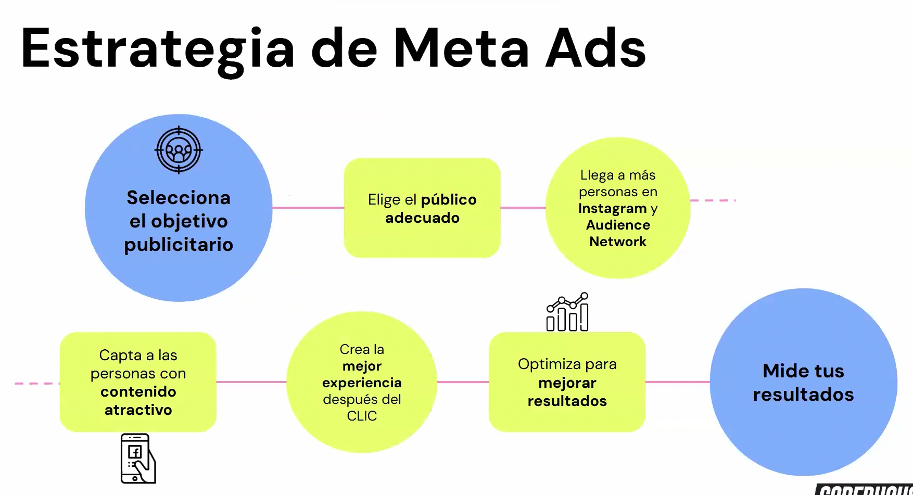
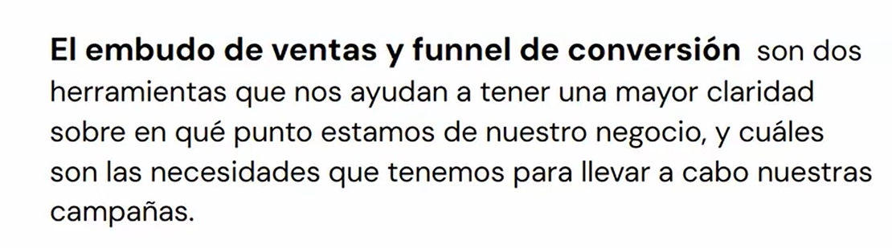
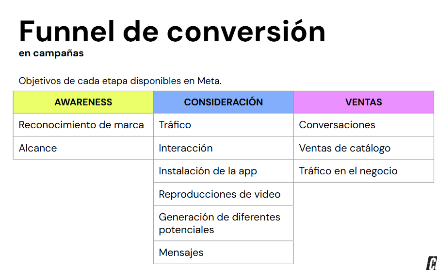

# Estrategias Clave

## Estrategias Clave para Campañas en Meta Ads

- **Selección de Objetivos Apropiados Definir Objetivos Claros y Relevantes**:
    - Establece metas concretas y medibles que alineen tus campañas con los objetivos de negocio, como aumentar las ventas, mejorar el reconocimiento de marca o fomentar la interacción. Aprovecha las métricas específicas de Meta Ads (conversiones, interacciones, alcance) para vincular tus objetivos con resultados medibles. 
- **Alineación Estratégica con el Funnel de Ventas**:
    - Adapta tus campañas a la etapa del embudo de ventas en la que se encuentra tu audiencia: Conciencia: Prioriza objetivos como alcance y reconocimiento de marca. Consideración: Genera tráfico, interacciones y visualizaciones de video. Conversión: Fomenta acciones como compras, registros o solicitudes de información.
    
    
- **Segmentación Efectiva para un Impacto Mayor Personalización Basada en Datos**:
    - Segmenta audiencias considerando datos demográficos, intereses y comportamientos para dirigir tus anuncios de manera más eficiente. Utiliza herramientas como "Audience Insights" de Meta para comprender mejor a tu público y sus motivaciones. Creación de Públicos. 
- **Personalizados y Similares**:
    - Desarrolla públicos personalizados basados en tus datos de clientes o visitantes web. Amplía tu alcance con públicos similares, enfocándote en usuarios que comparten características clave con tus clientes más valiosos.
- **Medición y Optimización de Resultados Establecer KPIs Significativos**:
    - Define indicadores clave de rendimiento (KPIs) específicos antes de lanzar tu campaña, como coste por adquisición (CPA), tasa de clics (CTR) y retorno sobre el gasto publicitario (ROAS). Usa estos indicadores como guía para evaluar el éxito y tomar decisiones informadas sobre optimización. 
- **Análisis y Pruebas Continuas**:
    - Aprovecha herramientas como Meta Ads Manager y Event Manager para monitorear datos en tiempo real, identificar patrones y ajustar estrategias. Implementa pruebas A/B para comparar diferentes versiones de anuncios, audiencias y llamadas a la acción, ajustando continuamente los elementos para maximizar el impacto
- **Adaptabilidad y Aprendizaje Continuo Ajustarse a Cambios y Tendencias**:
    - Mantén la flexibilidad para responder a cambios en el comportamiento del consumidor y las tendencias del mercado. Actualiza tus campañas regularmente basándote en datos de desempeño y nuevas oportunidades. 
- **Capacitación Constante**:
    - Participa en seminarios y cursos para mantenerte al día con las últimas herramientas, características y mejores prácticas de Meta Ads. 

## Conclusión 
> El éxito en Meta Ads depende de una planificación estratégica, segmentación inteligente y medición constante. Al combinar estas estrategias con adaptabilidad y aprendizaje continuo, podrás maximizar el impacto de tus campañas y garantizar un crecimiento sostenible
