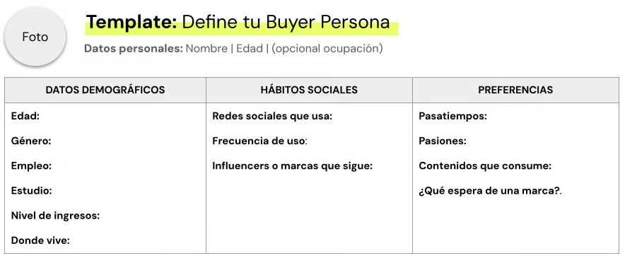
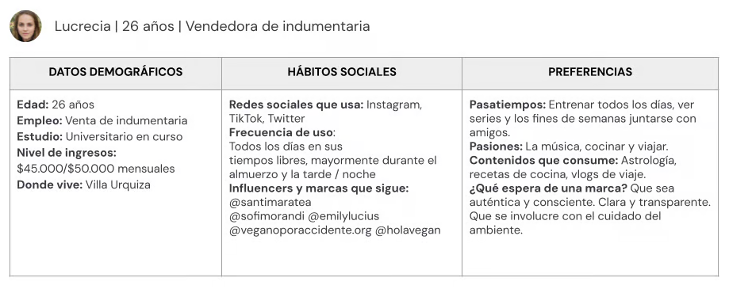
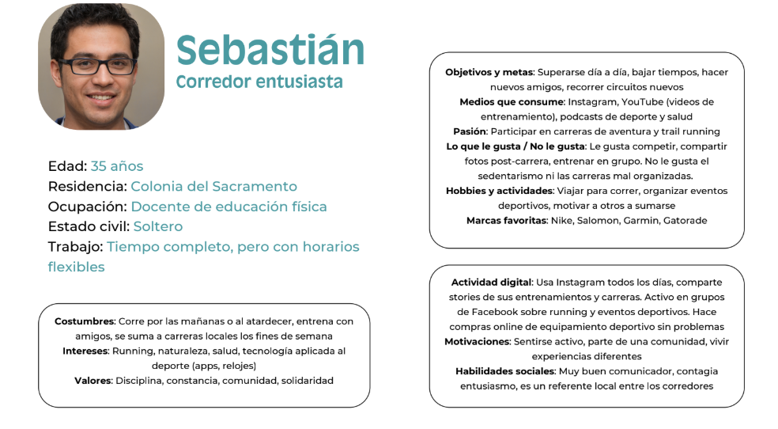
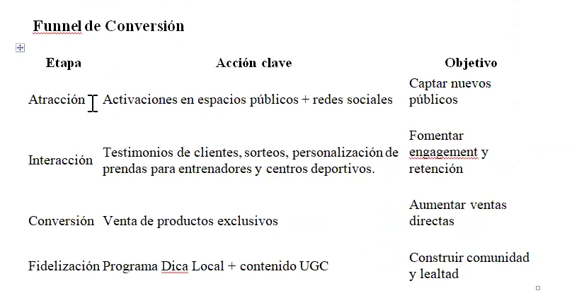

# Actividad práctica: Bocetando el Buyer Persona

## 👉​ Consigna
A partir de las características principales de tu emprendimiento, marca, negocio o idea, construye el buyer persona de tu proyecto final. Ten en cuenta la necesidad que cubre el producto o servicio que ofreces para tu cliente ideal.

**Buyer persona**: haz la descripción según los puntos que se presentan en la siguiente plantilla modelo.

### Ejemplo 

## Estrategia y definiciones tácticas
### 👉 **Consigna**
- Desarrolla la estrategia.
 - Desarrolla entre una y tres tácticas publicitarias que respondan a esa estrategia.
- Ten presente que, para el Proyecto Final, deberás definir tres campañas que viabilicen la estrategia. Utiliza esta instancia práctica para avanzar hacia ello.
- **A tener en cuenta**
    - Recuerda todo lo trabajado la clase anterior. Ten presente las características de tu negocio, emprendimiento o idea, como así también todos los aspectos definidos en tu **Buyer Persona**
    - Utiliza los templates de las siguientes páginas tal y como lo necesites según tu estrategia.

# Colonia aventura Corre 

## Definiendo la estrategia
> 🧠 Negocio, emprendimiento, marca o idea sobre la que trabajarás

| 🏷️ Nombre                      | Colonia Aventura Corre                                                                 |
|-------------------------------|----------------------------------------------------------------------------------------|
| 📍 **Ubicación**                  | Instagram: [@coloniaaventuracorre](https://instagram.com/coloniaaventuracorre)        |
| 🛍️ **Descripción**                | Eventos deportivos: carreras de trail, aventuras y MTB en entornos naturales de Colonia y alrededores. |
| 🎯 **Objetivo comercial**         | Aumentar la visibilidad del grupo y lograr más inscripciones a eventos deportivos.     |
| 🔄 **Funnel de conversión**       | Consideración                                                                          |
| 💰 P**resupuesto y estrategia**   | $3.000 a $5.000 UYU en publicidad paga |

## 🎯 Estrategia Publicitaria
| 🧭 **Objetivo Comercial**          | Aumentar la visibilidad del grupo y lograr más inscripciones a eventos deportivos de trail, aventura y MTB. |
|-------------------------------|-----------------------------------------------------------------------------------------------------------------------------------|
| 📣 **Objetivo Publicitario**       | Generar tráfico e interacciones que lleven a inscripciones desde Instagram y otras redes.                                          |
| 🎯** Segmentación de Público**     | **Edad**: 20 a 55 años **Sexo**: Todos **Idioma**: Español **Ubicación**: Colonia y departamentos cercanos (San José, Soriano, Canelones) **Intereses**: Running, ciclismo, trail, aventura, vida sana, outdoor, deportes de resistencia |
| 💸 **Presupuesto de Táctica**      | Estrategia con 2 a 3 tácticas publicitarias. Presupuesto estimado: $3.000 a $5.000 UYU/mes durante 3 meses. *(ajustable)* |

## Actividad colaborativa: Estrategia conjunta
### 👉​ Consigna
Imaginen que son el equipo de marketing y publicidad de una importante empresa internacional. El CEO de la misma les ha pedido que definan un nuevo negocio y su estrategia para catapultar su éxito.

### Deberán definir los siguientes puntos
- Negocio, emprendimiento, marca o idea sobre la que trabajarás
- Ubicación
- Descripción del producto o servicio
- Objetivo comercial
- Funnel de conversión
- Presupuesto y período de estrategia

# 🏁 Estrategia de Negocio: Colonia Aventura Corre

## 🧠 Negocio / Emprendimiento / Marca
**Colonia Aventura Corre** es una organización deportiva que diseña, organiza y promueve eventos de trail running, MTB y carreras de aventura en entornos naturales de Uruguay. Buscamos fomentar el deporte, el turismo activo y la vida saludable.

## 📍 Ubicación
Colonia del Sacramento, Uruguay.  
Con presencia física en la ciudad y alcance digital a nivel nacional.

## 🏞️ Descripción del Producto / Servicio
Organizamos **eventos deportivos al aire libre**, como:
- Carreras de trail running
- Competencias de mountain bike (MTB)
- Desafíos de aventura multidisciplinarios

Cada evento se realiza en entornos naturales y paisajes únicos del interior uruguayo, promoviendo la conexión con la naturaleza y el espíritu deportivo. Brindamos una experiencia integral que incluye inscripciones online, cobertura fotográfica, premiación, hidratación, y difusión en redes.

## 🎯 Objetivo Comercial
Aumentar la visibilidad de la marca y lograr un crecimiento del 30% en las inscripciones a los eventos deportivos en los próximos 6 meses.

## 🧭 Funnel de Conversión
Actualmente la marca se encuentra entre las etapas de **consideración** y **decisión**:

- **ToFu (Top of Funnel)**: Publicidad en redes sociales y presencia en comunidades deportivas.
- **MoFu (Middle of Funnel)**: Contenido educativo, testimonios, fotos y videos de eventos pasados.
- **BoFu (Bottom of Funnel)**: Formularios de inscripción y contacto vía WhatsApp, e-mail o Instagram.

| 🧩 Etapa        | 🎯 Acción Clave                                                                 | 🥅 Objetivo |
|----------------|----------------------------------------------------------------------------------|------------|
| 🧲 Atracción    | Publicidad paga en Meta Ads (Facebook e Instagram), videos de eventos anteriores, reels virales | Aumentar el alcance y el reconocimiento de marca |
| 💬 Interacción  | Contenido educativo en redes (tips de entrenamiento, nutrición), encuestas, lives, respuestas a comentarios | Generar interés y conversación con la comunidad |
| 🛒 Conversión    | Formularios instantáneos en campañas de leads, links de inscripción, llamados a la acción claros | Obtener datos de contacto e inscripciones efectivas |
| 🔁 Fidelización | Envío de fotos post-evento, agradecimientos personalizados, sorteos para participantes frecuentes | Construir comunidad y lograr participación recurrente |

## 💰 Presupuesto y Período de Estrategia

- **Presupuesto mensual estimado**: $3.000 a $5.000 UYU en publicidad paga (Meta Ads y Google Ads).  
- **Período de ejecución**: 6 meses (desde septiembre 2025 a febrero 2026), cubriendo primavera-verano, la temporada más activa.

📌 En este período se trabajará con campañas de:
- Leads (captación de datos)
- Conversiones (inscripción a eventos)
- Reconocimiento de marca (awareness en nuevas zonas del país)