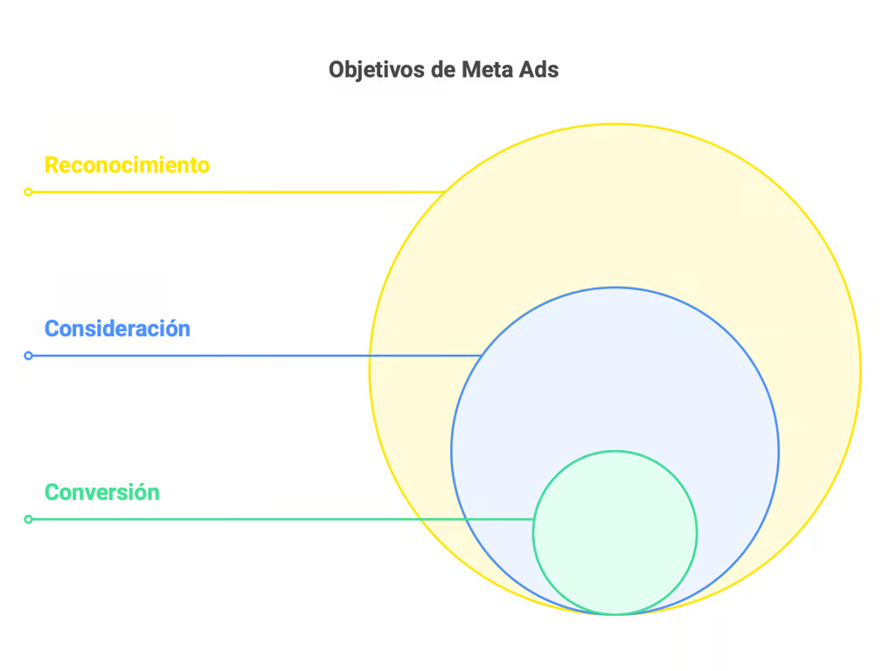

# Introducción a Meta Ads

Meta Ads es la plataforma publicitaria de Meta que permite a las empresas crear y gestionar campañas en Facebook, Instagram, Messenger y Audience Network. Es una herramienta esencial para cualquier negocio que quiera aumentar su presencia digital, segmentar audiencias con precisión y optimizar el uso del presupuesto publicitario.

## ¿Por qué es importante Meta Ads? 
- **Meta Ads se destaca por su capacidad de**: 
    - Llegar a audiencias relevantes utilizando datos demográficos, intereses y comportamientos. 
    - Ofrecer múltiples formatos de anuncios para adaptarse a diferentes objetivos, como alcance, interacción o conversiones. 
    - Proporcionar herramientas de análisis en tiempo real para ajustar estrategias sobre la marcha. 

- **Objetivos Principales de Meta Ads**:
    - Reconocimiento: Aumenta la visibilidad de tu marca entre una amplia audiencia. Ideal para campañas de branding. 
    - Consideración: Genera interés en tus productos o servicios fomentando interacciones, tráfico al sitio web o visualizaciones de video. 
    - Conversión: Impulsa acciones específicas, como compras, registros o leads. Es crucial para empresas que buscan resultados directos.

## Objetivos en Meta Ads

Al crear una campaña en Meta Ads, uno de los primeros pasos es seleccionar el objetivo de marketing. Esta decisión es fundamental ya que determina cómo se configurará la campaña, cómo se optimizarán los anuncios y qué resultados se priorizarán. A continuación, se describen los diferentes tipos de objetivos de marketing que se pueden elegir, destacando su importancia y cómo afectan la configuración de la campaña.

- **Reconocimiento**: Este objetivo está diseñado para aumentar la visibilidad de la marca o producto. Se enfoca en llegar a la mayor cantidad de personas posible dentro del público objetivo, maximizando el alcance y la frecuencia de las impresiones.
    - **Objetivos específicos**: Reconocimiento de marca, Alcance.
    - **Importancia**: Ideal para campañas orientadas a crear conciencia sobre una nueva marca o producto, o para mantener la presencia en el mercado.
    - **Configuración**: La plataforma optimiza la entrega de anuncios para maximizar el número de personas que recuerdan haber visto el anuncio.
- **Consideración**: El objetivo de consideración busca generar interés en el producto o servicio, fomentando interacciones más profundas con la audiencia.
    - **Objetivos específicos**: Tráfico, Interacción, Instalaciones de app, Reproducciones de video, Generación de clientes potenciales, Mensajes.
    - **Importancia**: Es crucial para empresas que desean que su audiencia tome medidas, como visitar un sitio web, descargar una app o interactuar con publicaciones.
    - **Configuración**: Meta Ads optimiza la campaña para aumentar las visitas al sitio web, la interacción con publicaciones, o las instalaciones de aplicaciones, según el objetivo seleccionado.
- **Conversión**: Este objetivo está orientado a impulsar acciones específicas y valiosas, como realizar una compra o completar un formulario.
    - **Objetivos específicos**: Conversiones, Ventas del catálogo, Tráfico en el negocio.
    - **Importancia**: Fundamental para campañas que buscan generar resultados medibles y directos, como ventas o registros.
    - **Configuración**: La campaña se optimiza para dirigir a las personas más propensas a realizar la acción deseada, utilizando herramientas como el píxel de Meta para rastrear y mejorar el rendimiento.

## Conclusión
La selección del objetivo de marketing en Meta Ads es crucial para el éxito de una campaña publicitaria. Cada objetivo guía la configuración y optimización de la campaña, asegurando que los anuncios lleguen a la audiencia correcta y cumplan con los objetivos comerciales establecidos. Por lo tanto, es esencial que los anunciantes comprendan claramente sus metas antes de seleccionar un objetivo en Meta Ads.