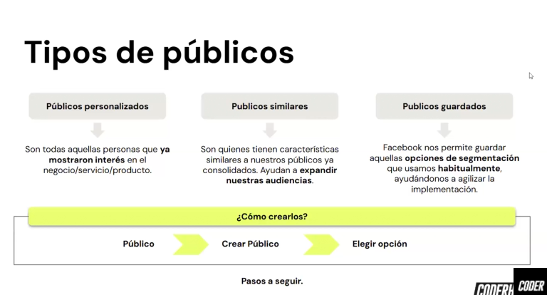

# Identificación de Audiencias
Estrategias de Públicos Avanzados Optimizar las audiencias es esencial para campañas de alto impacto. Además de los públicos básicos, Meta Ads permite trabajar con públicos personalizados y similares para llegar a usuarios más relevantes.

- **Públicos Personalizados**: 
    - Basados en datos propios, como listas de correos, interacciones en redes sociales o visitas al sitio web.
    - Ejemplo práctico que puede ayudar es crear un público personalizado cargando una lista de correos electrónicos de tus clientes actuales. Meta Ads buscará estos usuarios en sus plataformas para mostrarles tus anuncios. 
- **Públicos Similares** (Lookalike Audiences): 
    - Meta Ads analiza las características comunes de un público personalizado y encuentra usuarios nuevos que comparten esos rasgos. 
    - Ejemplo práctico: Si tienes un público personalizado de clientes frecuentes, puedes usar esta herramienta para encontrar nuevos usuarios con intereses y comportamientos similares. Optimización de 
- **Públicos Existentes**: 
    - Realiza ajustes periódicos para excluir usuarios que ya completaron una acción, como una compra, y optimiza el presupuesto en personas con mayor potencial de conversión.

## 🧠 Públicos Personalizados en Meta Ads

Este screencast está enfocado en enseñarte cómo utilizar las herramientas de segmentación de Meta para llegar al público correcto en el momento adecuado. A continuación, encontrarás un resumen de los temas abordados.

## 📤 Subida de Base de Datos de Clientes

Aprenderás a importar tu base de datos de clientes directamente en el **Administrador de Anuncios de Meta** para crear públicos personalizados.

### ✅ Requisitos del archivo:
- Formato recomendado: **.CSV**
- Columnas claras con:
  - Correos electrónicos
  - Números de teléfono (con código de país)

📌 *Consejo:* Asegurate de que los datos estén actualizados y normalizados para obtener mejores resultados de coincidencia.

## 🖱️ Público Personalizado a partir del Pixel

Vas a crear un público personalizado basado en el comportamiento de los usuarios en tu sitio web mediante el **Pixel de Meta**.

### 📌 Ejemplo práctico:
- Crear un público de personas que **abandonaron el carrito** en los últimos 30 días.
- Ideal para campañas de remarketing o recuperación de ventas.

🎯 Esto te permite impactar directamente a quienes mostraron interés real en tus productos o servicios.

## 👥 Públicos Similares (Lookalike)

Podés escalar tu audiencia creando públicos similares a tus mejores clientes actuales.

### 🔧 Cómo funciona:
- Seleccionás una audiencia fuente (por ejemplo, tus compradores).
- Meta genera un nuevo público con **características similares**.

### 📊 Rango de similitud:
- De **1% (más parecido)** a **10% (más amplio)**.
- Lo ideal es empezar por 1% para mantener la precisión.

## 🚀 ¿Para qué sirven estos públicos?

✅ Mejor segmentación  
✅ Más eficiencia publicitaria  
✅ Menor costo por conversión  
✅ Mayor posibilidad de fidelización

## 📎 Recursos Útiles

- [Meta Business – Públicos personalizados](https://www.facebook.com/business/help/744354708981227)
- [Meta Pixel – Guía oficial](https://www.facebook.com/business/help/742478679120153)

