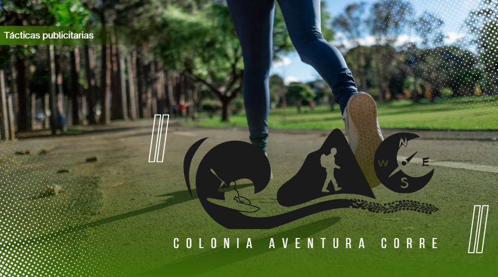

# Entrega N°1
- Objetivos generales
    - Desarrollar la capacidad de aplicar tácticas publicitarias requeridas con base a una estrategia previa.

- Objetivos específicos
    - Demostrar el manejo, dominio y entendimiento de la plataforma publicitaria Meta Ads.
    - Construir las campañas de Meta Ads que tu Proyecto Final necesite según la estrategia planteada.
    - 👉Recuerda que el PF debe tener un mínimo de tres campañas en el marco de un Plan Publicitario Media Mix.

- Formato
    - Google Docs, Google Slides, Word, PowerPoint o PDF. Debe tener el nombre “Primera-Entrega+Apellido”.

- Sugerencias 
    - Permitir comentarios en el archivo
    - Practica el storytelling: Prepara el archivo como si fuese a ser presentado a un cliente o inversionista.
    - Mantén coherencia estética con el branding de la marca que trabajas.

- Se debe entregar
    - Estrategia publicitaria que incluya:
        - Sobre el negocio, emprendimiento, marca o idea a partir del cual elaborarás el Plan de Publicidad Digital Media Mix: 
            - Nombre, descripción, necesidad que cubre, ubicación física y/o digital, objetivo comercial y etapa del funnel en que se encuentra. 
            - Adiciona período de la estrategia y presupuesto destinado.
    - Buyer persona con sus principales características: 
        - Datos personales
        - Demográficos
        - Hábitos sociales y preferencias.
    - Campaña/s de Meta Ads como necesite el proyecto, que incluya/n:
        - Táctica publicitaria: Objetivo publicitario definido en función del objetivo comercial y segmentación del público.
        - Campañas: Configuración de nivel de campaña, configuración de nivel de grupo de anuncios, configuración de anuncios, previsualización del/los anuncio/s.

## Criterios de evaluación
- Marca, emprendimiento, negocio o idea
    - Se presenta de manera detallada y completa, contemplando todos los aspectos descriptivos que permiten comprender sus características básicas, el tipo de producto o servicio ofrecido, la necesidad que busca resolver, su etapa actual en el Funnel de Conversión y su objetivo comercial. Este desarrollo óptimo de la marca, emprendimiento, negocio o idea, aumenta las probabilidades de construir una táctica publicitaria oportuna.
- Buyer Persona
    - Las características se encuentran claramente desarrolladas. Sus principales aspectos son comprensibles y permiten representar al cliente ideal de manera concisa. La relación entre su necesidad y el producto o servicio de la marca, emprendimiento, negocio o idea, es evidente. Incluye datos personales, demográficos, hábitos sociales, preferencias y, tal vez, otros aspectos complementarios como redes sociales, POV, etcétera.
- Táctica/s
    El objetivo publicitario tiene estrecha relación con lo establecido en la estrategia. Es claro que se desprende de ella y, sobre todo, del objetivo comercial. Es posible comprender de qué manera se intenta responder a la necesidad de la marca, emprendimiento, negocio o idea. El objetivo publicitario, a su vez, es un punto de partida claro para la táctica. El objetivo publicitario corresponde a la etapa del funnel en que se encuentra la marca, emprendimiento, negocio o idea. El público publicitario se ha definido en este punto en términos generales que permiten una primera aproximación al target. Se describe a partir de todas las características sugeridas (Rango de edad, sexo, idioma/s, criterios de segmentación geográfica e intereses). A la vez, se menciona el período y presupuesto de táctica, desprendido de la estrategia.
- Campaña/s Meta Ads según estrategia
    - Se incluye la evidencia del paso a paso de las configuraciones solicitadas en niveles de campaña, grupos de anuncio y anuncios. A la vez, este paso a paso se encuentra acompañado de descripciones claras y suficientes que permiten entender las decisiones tomadas. Se adjuntan los screenshots de los anuncios y se mencionan todos elemento propios del armado de la campaña, lo cual permite una comprensión total de la misma y del recorrido realizado hasta el anuncio.

# 📊 Estrategia Publicitaria – Colonia Aventura Corre

## 1. Sobre el Negocio

**Nombre:** Colonia Aventura Corre  
**Descripción:** Equipo deportivo que corre carreras a pie, en bici, aventura, y organiza eventos deportivos, principalmente carreras de trail running.  
**Necesidad que cubre:** Fomenta el deporte al aire libre y la vida saludable mediante eventos deportivos accesibles y con buen ambiente comunitario.  
**Ubicación física y digital:**  
- Colonia del Sacramento, Uruguay  
- Instagram: [@coloniaaventuracorre](https://www.instagram.com/coloniaaventuracorre)  

**Objetivo comercial:** Aumentar el número de corredores inscritos en sus eventos deportivos.  
**Etapa del funnel:** Consideración / Decisión — Generar interés activo y conversiones para inscripciones.  
**Período de estrategia:** 6 meses (septiembre 2025 - febrero 2026)  
**Presupuesto destinado:** $10,000 UYU para publicidad digital.

## 2. Buyer Persona

| 🧾 Datos Demográficos                 | 💬 Hábitos Sociales                                  | 💡 Preferencias / Motivaciones                                                          |
|-------------------------------------|----------------------------------------------------|-----------------------------------------------------------------------------------------|
| **Edad:** 25 – 40 años              | **Redes sociales que usa:** Instagram, Facebook, Strava | **Pasatiempos:** Trail running, ciclismo, trekking                                     |
| **Género:** Masculino y femenino    | **Frecuencia de uso:** Diaria, principalmente noche | **Pasiones:** Naturaleza, superación personal, vida saludable                           |
| **Empleo:** Trabajadores de oficina, freelancers, emprendedores | **Influencers/marcas que sigue:** Deportistas locales, Salomon, Columbia | **Contenidos que consume:** Videos de eventos, tips de entrenamiento, fotos post-evento |
| **Estudios:** Nivel terciario/universitario |                                                    | **Qué espera de una marca:** Organización, claridad, comunidad activa                    |
| **Nivel de ingresos:** Medio        |                                                    | **🧠 Motivaciones:** - Mantenerse activo y saludable - Conectar con la naturaleza - Superarse física y mentalmente - Sentirse parte de una comunidad |
| **Dónde vive:** Colonia y zonas cercanas |            |                                                                |

## 3. Táctica Publicitaria

- **Objetivo publicitario:** Incrementar inscripciones en eventos deportivos mediante campañas de generación de leads y conversiones en plataformas Meta Ads.  
- **Segmentación del público:**  
  - Edad: 25-40 años  
  - Sexo: Todos  
  - Ubicación: Colonia del Sacramento y alrededores (radio de 50 km)  
  - Intereses: Running, ciclismo, deportes de aventura, vida saludable, outdoor  
  - Idiomas: Español  
- **Período y presupuesto de la táctica:** 6 meses con un presupuesto total de $10,000 UYU, distribuidos en campañas de awareness, lead generation y conversiones.

## 4. Campañas Meta Ads

### Configuración general

- **Nivel de campaña:**  
  - Tipo: Campaña de generación de leads y campañas de conversiones  
  - Objetivo: Captar registros e inscripciones a eventos deportivos  

- **Nivel de grupo de anuncios:**  
  - Segmentación detallada según buyer persona  
  - Ubicaciones automáticas para optimizar alcance  
  - Presupuesto diario o total segmentado según mes  

- **Nivel de anuncio:**  
  - Creatividades con imágenes y videos de eventos pasados  
  - Copys orientados a motivar la inscripción y comunidad  
  - Llamados a la acción claros (“Inscribite hoy”, “No te pierdas la próxima carrera”)  
  - Formulario instantáneo para lead gen o enlace directo a landing page

## 5. Evidencias y Documentación

- [ ] Screenshots de configuración en Administrador de Anuncios (campaña, grupo de anuncios, anuncios)  
- [ ] Justificación de cada configuración y selección de segmentación  
- [ ] Previsualización de anuncios aprobados  

# ¡Vamos por esos corredores! 🏃‍♀️🚵‍♂️🔥
