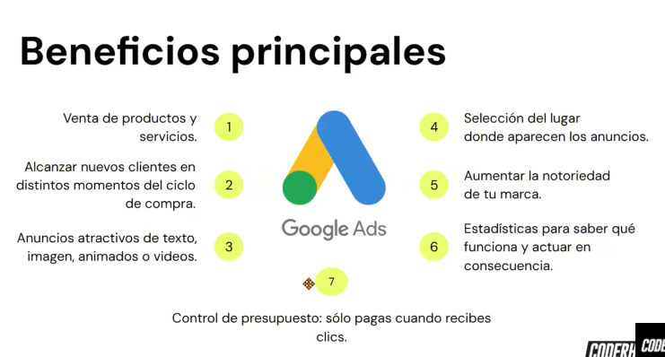
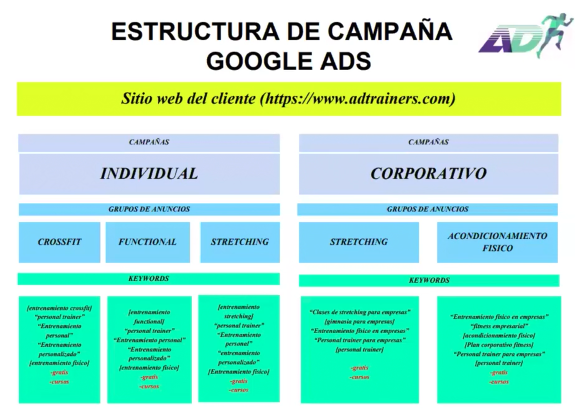
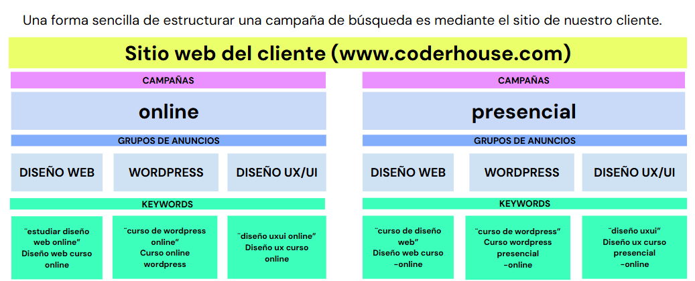
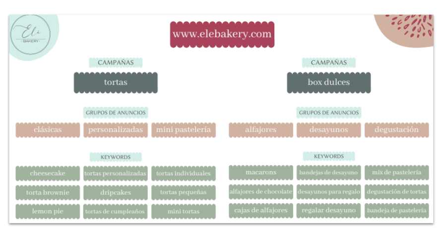
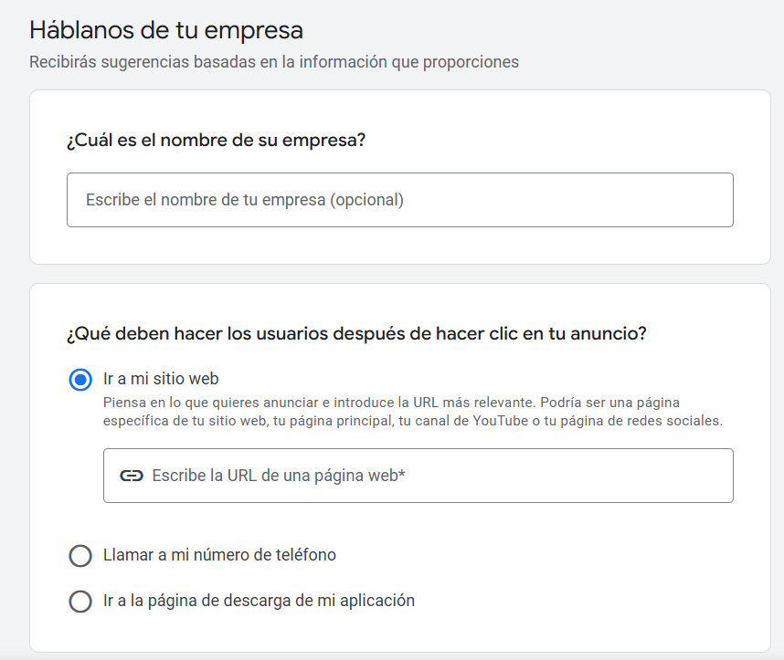
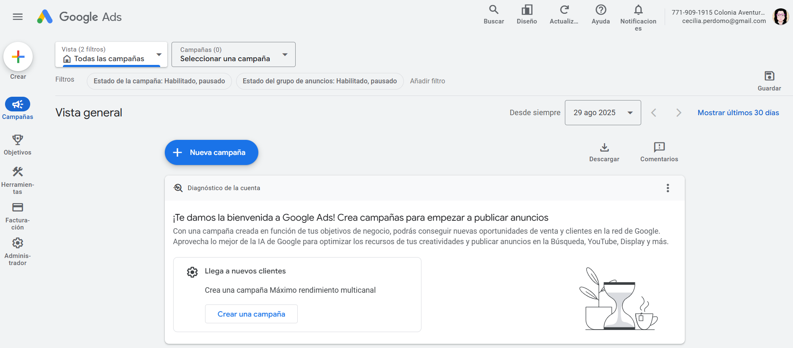
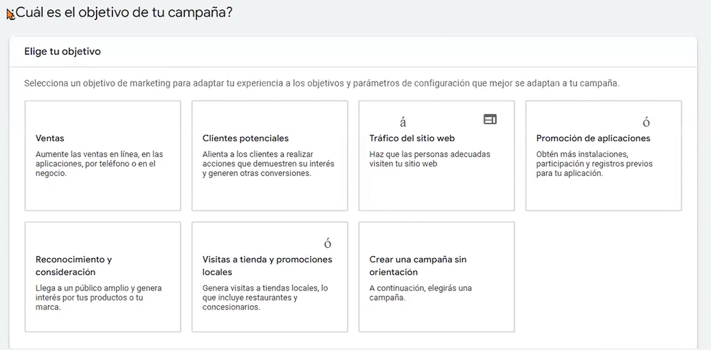
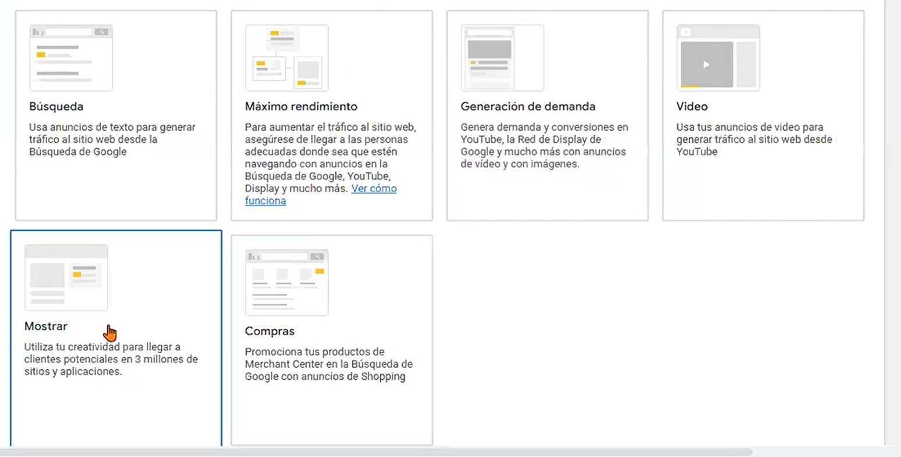
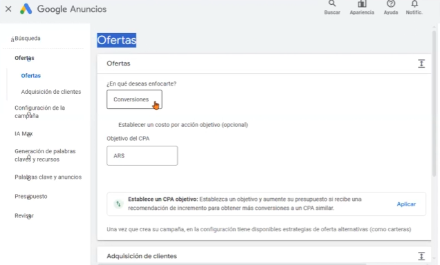
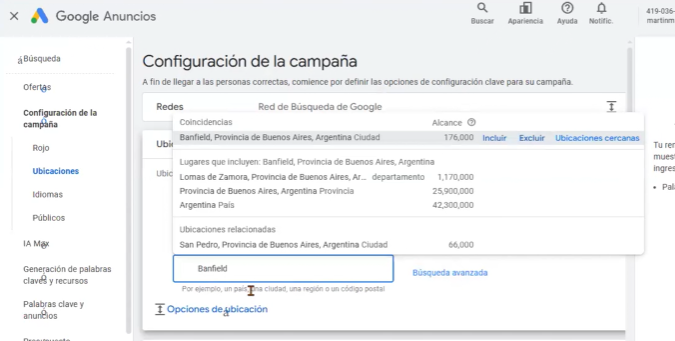

# Google Ads
Tiene en cuenta: 
- Ubicación geográfica
- Key Words
- Lenguaje e idioma

## Beneficios de Google Ads
- Diferentes plataformas que tiene activas.
- Mayor alcance, más masivo, porque tiene diferentes ubicaciones, por ej. youTube.
- Es el motor de búsqueda más grande, (ahora compite con TikTok, sobre todo con los jovenés).
- Intensión de compra o adquirir un servicio.
- Funciona mejor la segmentación que en Meta.
- Uso de IA y poder aparecer en los motores de búsqueda.

## Estructura de campaña de Google Ads

Se puede promocionar:
- Sitios webs
- Apps (para descargar)

## Planificador de Google Ads

## Objetivos de la campaña 

## Tráfico del sitio web
### Eventos de conversión
- Clientes potenciales
- Compras
- Inicio de configuración de compras
- Visitas a la página

> Cómo se trata de la primera campaña damos *visitas a la página*

### Tipo de campaña
Es la manera que quieres mostrar tu anuncio en los distintos canales de Google.

Por ejemplo:
- Búsqueda
- Si no tienes canal de youTube no son recomendadas las de:
    - Máximo rendimiento
    - Generación de demanda
    - Video
- Seleccione como debería alcanzar el objetivo:
    - nombre del sitio web
- Nombre de la campaña

## Ofertas

- En que quieres enfocarte? 
    - Clics, como es la primer campaña no se configura un limite de cuando estoy dispuesto a pagar.
- Adquisión de clientes
    - Nada
- Redes de búsqueda
    - Busquedas
    - Display: para canales de youTube
- Ubicaciones
    - Ubicaciones especificas
        - Presencia o interes: que vivan ahí o que esten interesadas 
        - Presencia: solo las que vivan ahí
    - Se puede agregar una dirección real
        - Radio a xkm
    - Se puede incluir varias zonas

- Idiomas
    - Español
    - Inglés (por la configuración que tienen en el celular o otros dispositivos)
- Segmentos de públicos
    - Nuevo segmento
    - Explorar
    - Configuración de la segmentación
        - Recomendada
    - Más parámetros de configuración
        - Rotación de anuncios
            - Anuncios de mayor rendimientos
        - Fecha de inicio y finalización
        - Programación de los anuncios
            - Cuando queres que este activo y en que momento. 
            - Por ahora no tenemos info, lo dejamos vacío
        - Opciones de url de campaña 
            - Nada
- Palabras claves (entre 25 a 50)
    - Generación de palabras claves y recursos
        - Web oficial
        - Descripcion del próducto que se ofrece
    - Palabras claves y anuncios
        - Web
        - Productos o servicios
            - obtener palabras sugeridas
                - se puede agregar más
                - no utilizar palabras patentadas (ej. mc donalds)