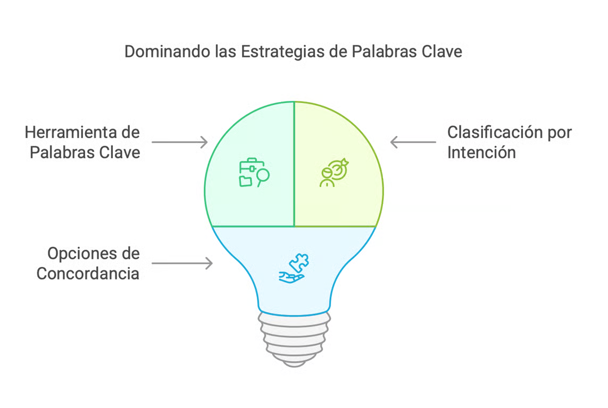

# Introducción a las Palabras Clave
Las palabras clave son uno de los elementos más importantes en las campañas de Google Ads, ya que actúan como el enlace directo entre las búsquedas que realizan los usuarios y los anuncios que se muestran en respuesta a esas búsquedas. La selección adecuada de palabras clave es esencial para asegurar que los anuncios lleguen a la audiencia correcta, en el momento adecuado y con el mensaje más relevante.

## Introducción a las Palabras Clave y Herramientas (Texto)
Las palabras clave son el núcleo de cualquier campaña en Google Ads. Elegir las palabras adecuadas asegura que tus anuncios lleguen a la audiencia correcta en el momento indicado.

### Herramientas y Ejemplos Prácticos
- **Herramienta recomendada**:
    - Utiliza **Google Keyword Planner** para descubrir términos con un volumen de búsqueda alto y competencia moderada.
- **Clasificación por intención**:
    - **Informativa**: ‘¿Qué es marketing digital?’
    - **Transaccional**: ‘Comprar zapatillas deportivas’.
- **Opciones de concordancia**:
    - **Exacta**: Solo muestra el anuncio cuando la palabra clave coincide exactamente con la búsqueda.
    - **Amplia**: Permite mostrar anuncios en búsquedas relacionadas, ampliando el alcance.

## Relevancia en el Posicionamiento de los Anuncios
El posicionamiento de los anuncios en Google Ads, es decir, en qué lugar de la página de resultados de búsqueda aparecerá el anuncio, está fuertemente influenciado por las palabras clave seleccionadas. Google utiliza un sistema de subasta para decidir el orden de los anuncios, donde varios factores entran en juego:
- **Concordancia de la palabra clave**: Google compara las palabras clave seleccionadas para una campaña con los términos de búsqueda ingresados por los usuarios. Si hay una concordancia estrecha entre estos, es más probable que el anuncio se muestre en una posición favorable.
- **Índice de calidad**: Este es un puntaje que Google asigna a cada palabra clave, basado en la relevancia del anuncio, la calidad de la página de destino y la tasa de clics esperada (CTR). Un mayor índice de calidad puede llevar a una mejor posición del anuncio a un menor costo por clic (CPC).
- **Ofertas**: El monto que un anunciante está dispuesto a pagar por clic también influye en el posicionamiento. Sin embargo, incluso si la oferta es alta, un anuncio con palabras clave mal seleccionadas y un bajo índice de calidad podría no lograr un buen posicionamiento.

## Estrategias para Optimizar Palabras Clave
- **Investigación de palabras clave**: Utilizar herramientas como el Planificador de Palabras Clave de Google para identificar términos relevantes, con un buen volumen de búsquedas y baja competencia.
- **Tipos de concordancia**: Ajustar los tipos de concordancia (amplia, de frase, exacta) para controlar mejor cuándo se muestran los anuncios.
- **Exclusión de palabras clave negativas**: Añadir palabras clave negativas para evitar que los anuncios se muestren en búsquedas irrelevantes.

## Conclusión
Las palabras clave son fundamentales para el éxito de una campaña en Google Ads. No solo determinan cuándo y dónde se muestran los anuncios, sino que también influyen directamente en el costo y en la efectividad de la campaña. Seleccionar, gestionar y optimizar correctamente las palabras clave puede marcar la diferencia entre una campaña exitosa y una que no alcance los objetivos esperados.

## Lista de Palabras Clave
Crear una lista de palabras clave efectiva es crucial para el éxito de tus campañas de Google Ads. Estas palabras clave deben estar alineadas con tu nicho de mercado y el proyecto que estás desarrollando. A continuación, te proporciono un proceso paso a paso para generar una lista inicial de 10 palabras clave relevantes:
- **Identifica tu nicho de mercado**
    - Define claramente el nicho en el que estás trabajando. 
    - Por ejemplo, si tu proyecto está relacionado con cursos en línea de diseño gráfico, tu nicho incluiría temas relacionados con la educación en línea, el diseño gráfico, y herramientas de diseño.
- **Piensa en las necesidades de tu audiencia**: 
    - Considera las necesidades y problemas que tu audiencia busca resolver. 
    - Pregúntate: ¿Qué términos utilizarían para buscar soluciones en Google? Por ejemplo, si tu audiencia está interesada en aprender diseño gráfico, podrían buscar términos como "curso de diseño gráfico en línea" o "aprender Photoshop".
- **Realiza una lluvia de ideas inicial**
    - Anota todos los términos y frases que crees que tu público objetivo podría utilizar. No te limites en esta etapa; la idea es generar tantas ideas como sea posible. Por ejemplo:
        - Curso de diseño gráfico online
        - Tutorial de Photoshop
        - Clases de Illustrator para principiantes
        - Aprender diseño UX/UI
- **Usa herramientas de investigación de palabras clave**
    - Utiliza el `Planificador de Palabras Clave de Google Ads` para validar tus ideas. 
    - Esta herramienta te ayudará a identificar el volumen de búsquedas y la competencia de cada palabra clave. 
    - Puedes descubrir nuevas palabras clave relacionadas y ajustar las que ya has listado.
- **Refina tu lista**
    - Elige las 10 palabras clave que mejor representen tu proyecto y tengan un buen balance entre volumen de búsqueda y competencia. 
    - Asegúrate de que estas palabras clave estén directamente relacionadas con tu nicho y sean específicas para atraer a tu público objetivo.
- **Ejemplos prácticos**
    - Aquí tienes una lista de ejemplo para un proyecto centrado en ofrecer cursos en línea de diseño gráfico:
        - Curso de diseño gráfico online
        - clases de diseño UX/UI
        - Aprender Photoshop desde cero
        - Curso de Illustrator avanzado
        - Diseño gráfico para principiantes
        - Tutorial de InDesign
        - Curso online de branding
        - Formación en diseño digital
        - Certificación en diseño gráfico
        - Clases de tipografía online
- **Monitorea y ajusta**
    - Una vez que tengas tu lista y comiences a usarla en tus campañas, monitorea el rendimiento de cada palabra clave. 
    - Es importante ajustar la lista conforme obtengas datos sobre qué palabras clave están funcionando mejor y cuáles necesitan ser reemplazadas.

> Siguiendo estos pasos, estarás bien encaminado para crear una lista de palabras clave que no solo sea relevante para tu proyecto, sino que también impulse el éxito de tus campañas en Google Ads.