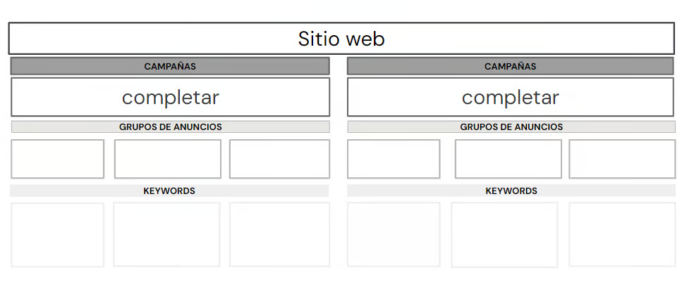

# Actividad práctica: Estructura de campañas

> ¡No sueltes la posta!

## Consigna
Crea al menos dos estructuras de campaña para tu proyecto/ emprendimiento según la estructura vista en la clase de hoy.

### Aspectos a incluir
Estructura de las campañas que incluye sitio web, campañas (tipo, título y objetivo de cada una), grupo de anuncios, cómo dividirías tu campaña y KeyWords (palabras claves relacionadas, emplear entre 10 y 20). Usa el template de la siguiente página.

### Módelo

## Campaña de Search

### Consigna
- En base a tu estrategia, si precisas una campaña de Search, realiza esta actividad.
- Configura en la plataforma de Google Ads una campaña de Search con los siguientes aspectos a incluir.
- **Aspectos a incluir**
    - Crea una una campaña de búsqueda que contenga al menos un anuncio de texto adaptable.
    - Crea dos extensiones de anuncios (por ejemplo llamada, ubicación, texto destacado).
    - Screenshots de todo el proceso de configuración.
    - Justificación de cada elección.

---

## 📣 Campaña de Meta Ads – Fase 1

### 🎯 Objetivo: Reconocimiento

> **Poner la marca frente a las personas correctas, generar curiosidad y empezar a construir comunidad desde el primer scroll.**

- **Nombre de la campaña:** Reconocimiento – Colonia Aventura Corre
- **Objetivo publicitario:** Alcance o Reconocimiento de marca
- **Público:**  
  - Edades: 18 a 50 años  
  - Ubicación: Colonia, San José, Soriano  
  - Intereses: trail running, bienestar, nuevos desafíos, vida activa, eventos deportivos  
  - Idioma: español  
- **Formato sugerido:** Reels + historias con imagen potente + copy emocional  
- **Mensaje clave:**  
  > “¿Ya conocés Colonia Aventura Corre? Acá empieza tu próximo desafío. 🏃‍♂️🌿”

## 📩 Campaña de Meta Ads – Fase 2

### 🎯 Objetivo: Tráfico (a perfil, página o formulario)

> **Sea un formulario de inscripción, un WhatsApp para sacarse dudas o una landing con toda la info, el objetivo es que den el primer paso real.**

- **Nombre de la campaña:** Inscripción Anchorena
- **Objetivo publicitario:** Tráfico
- **Destinos posibles:**  
  - Formulario de inscripción a la carrera de Anchorena 📝  
  - WhatsApp directo para consultas 📲  
  - Landing con toda la info del evento  
- **¿Cuándo usarla?:**  
  En una segunda fase, cuando ya generamos interacción y reconocimiento en redes.

## 🔍 Campaña de Search – Google Ads

### 🎯 Objetivo: Captar búsquedas activas relacionadas al evento

- **Nombre de la campaña:** Búsquedas – Anchorena Trail
- **Objetivo:** Aparecer cuando alguien busque info sobre carreras, eventos o actividades en Colonia.
- **Anuncio:** Anuncio de texto adaptable con beneficios de la carrera y llamado a la acción.
- **Extensiones del anuncio:**  
  - Extensión de llamada  
  - Extensión de ubicación  
- **Keywords sugeridas (entre 10 y 20):**
    - carrera trail colonia
    - trail running uruguay
    - carrera anchorena 2025
    - inscripción trail anchorena
    - colonia aventura corre
    - eventos deportivos uruguay
    - running colonia sacramento
    - carrera de aventura uruguay
    - trail colonia
    - anchorena correr naturaleza

- **Justificación:**  
  Apuntamos a usuarios que ya tienen intención de correr, entrenar o participar en eventos. La campaña de búsqueda complementa las campañas en Meta, reforzando presencia en múltiples canales.

## 📷 Evidencias

> Adjuntá screenshots del armado paso a paso de las campañas:  
- Nivel campaña  
- Nivel grupo de anuncios  
- Nivel anuncio  
- Previsualizaciones

Incluí también una justificación breve de cada configuración.