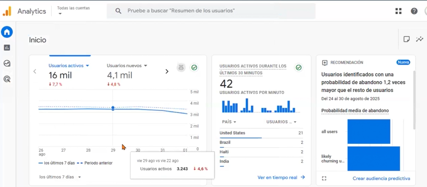
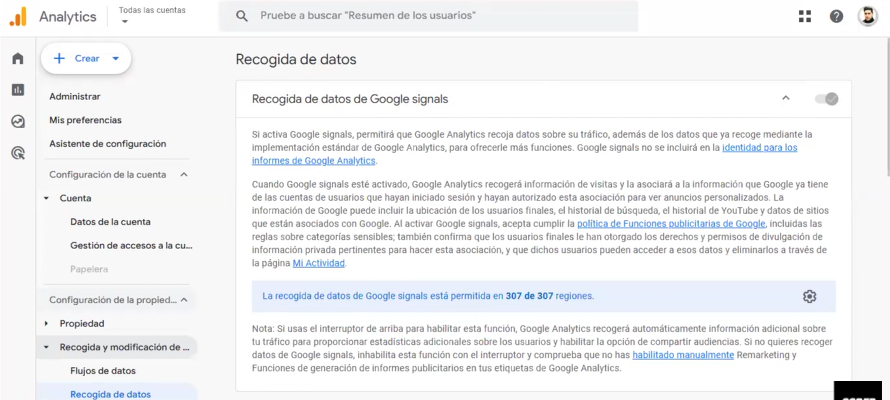
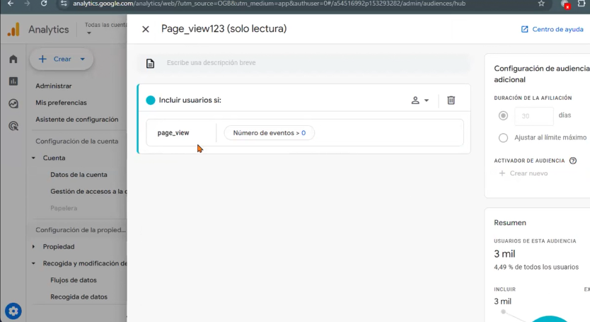
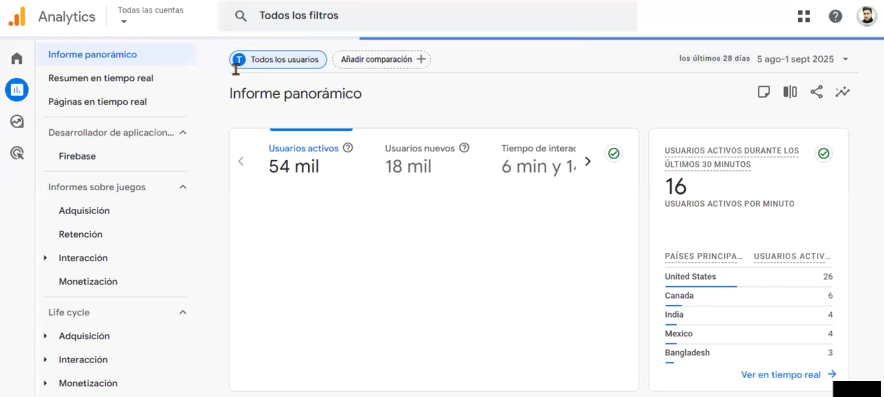
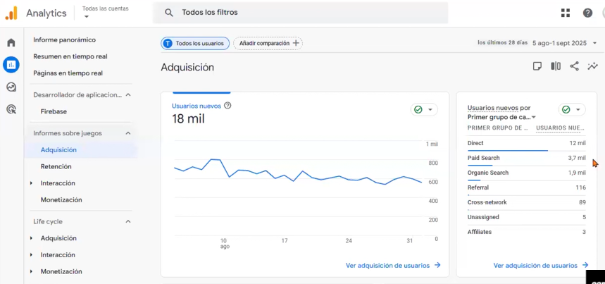
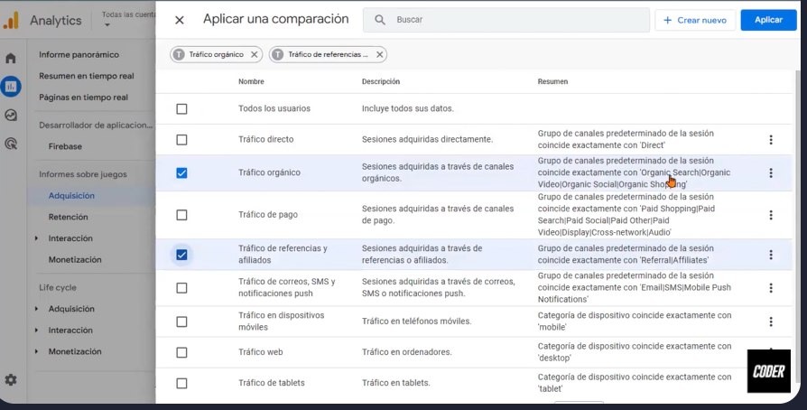
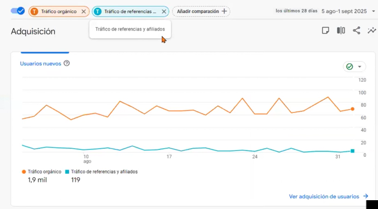

# 📈 Google Analytics
Es una herramienta y plataforma gratuita de analítica web, que permite a ls propietarios de sitios saber el grado de implicación de los usuarios con los mismos. 

- **¿Qué es?**
    - Es una herramienta y platforma de analítica web que permite a los propietarios de sitios saber el grado de implicación de los usuarios con los mismos
- **¿Para qué sirve?**
    - Los clientes de Google Analytics pueden consultar informes en los que se describe cómno interactúan los usuarios que visitan sus sitios web, con el propósito de mejorarlos. 
- **¿Cómo funciona?**
    - Google Analytics recaba información de forma anónima, es decir, informa acerca de las tendencias del sitio sin identificar a sus usuarios. 
- **¿Qué puedo saber de mis usuarios?**
    - ¿Qué tan fieles son a mi sitio web?
    - ¿Qué camapañas de marketing son las más efectivas?
    - ¿Estoy creando contenido efectivo?
    - ¿Dónde abandonan el carrito de compra los usuarios? 
    - ¿De dónde proceden?
- **Analiza tendencias, no valores**
    - Google Analytics toma muestras para realizar el análisis de la información, pero **👀 ojo**, porque:
        - Los datos de las herramientas de web analytics no son 100% precisos. 
        - Del 1% al 3% de los usuarios desahabilitan javascript.
            - Puede haber errores en JavaScript.
            - Muchos usuarios eliminan o deshabilitan cookies.
            - Un usuario puede utilizar varios ordenadores.
            - Diferentes usuarios pueden ingresar desde un mismo ordenador. 
- **Datos de interés**
    - Google Analyticas 4 es la nueva generación de propiedades de Analytics, heredadas directas de las propiedades Web+App lanzadas en 2019.
    - Para evitar confusiones: las web+App han pasado a llamarse GA4. Si ya tenías activa y configuirada una propiedad Web+App, ya tienes GA4 y no necesitas hacer nada, savlo por el hecho de que ahora se han lanzando nuevos informes con los que necesitarás familiarizarte. 
    - A partir de Abril de 2020 Google no actualiza más las propiedades tipo Universal Analytics, sólo se enfoca en Google Analytics 4.
    - Vienen cambios importantes en el mundo de la analítica y atribucón de las campañas de marketing, debido al foco en la privacidad y la guerra contra las cookies de terceros, que google se ha compormetido a eliminar de Chorme para 2024.
    - Van surgiendo alternativas a Analytics sin cookies cada vez más interesantes que son efectivas y amigables. 

--- 

--- 

|                          | Conversión          | Evento                | 
| ----------------------- | ---------------------|  ---------------------|  
| **¿Qué es?** | Una acción valiosa (ej. una compra, descarga o llamada) que se registra luego de que alguien interactúa con tu anuncio. | Un evento es cualquier acción o interacción que realiza un usuario en tu sitio web o app. | 
| **Ejemplos** | - Ver una página  - Clic en un enlance  - Completar un formulario  - Reproducir un video| - Compra finalizada  - Registro de formulario  - Clic para contactar por WhatsApp  - Solicitud de presupuesto |

--- 

## Filtros
- Son condiciones que se aplican a las propiedades de analytics para excluir o transformar los datos que se recogen en ellas.
- Sirven para disponer de datos de mejor calidad, más consolidados y enriquecidos. 
- Es una función que se arrastra de la versión anterior, sigue existiendo pero ya no se utiliza como antes.
- Es importante trasmitirlo a los estudiantes para que no comentan errores eliminando información.

--- 

--- 

--- 
