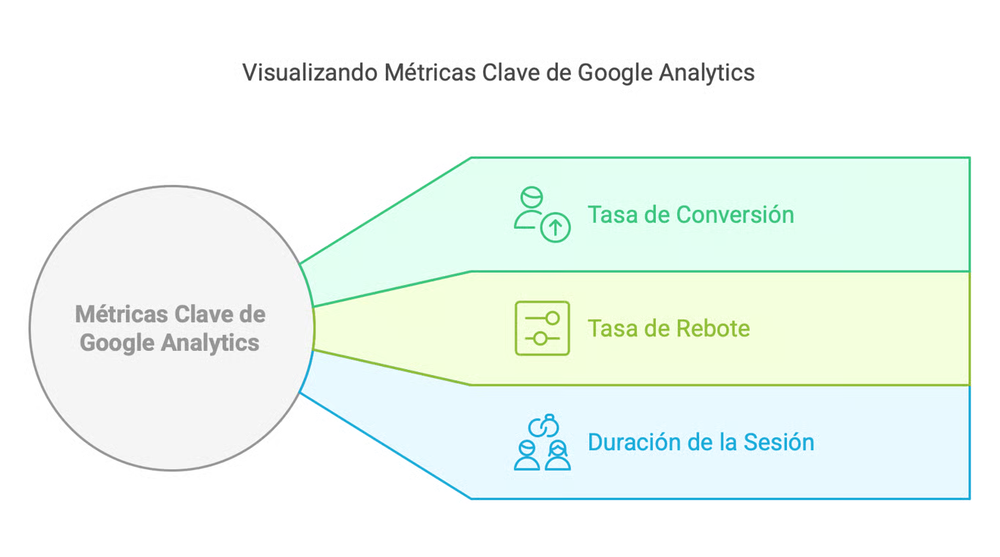

# Uso de Métricas en Campañas

## Importancia de las Métricas.
El uso de métricas en las campañas publicitarias es fundamental para comprender el rendimiento de las estrategias implementadas. Las métricas actúan como herramientas de medición que proporcionan datos cuantificables sobre diferentes aspectos de una campaña, tales como el alcance, la interacción, la conversión y el retorno de inversión (ROI). Estas métricas no solo permiten evaluar si se están alcanzando los objetivos planteados, sino que también facilitan la toma de decisiones informadas para optimizar las campañas en tiempo real.

### Beneficios de Utilizar Métricas:
- **Monitoreo del Rendimiento**: Las métricas ofrecen una visión clara sobre cómo se desempeñan las campañas en cada una de las plataformas utilizadas. Este monitoreo constante permite identificar rápidamente qué estrategias están funcionando y cuáles necesitan ajustes.
- **Optimización de Recursos**: Al entender qué acciones generan mejores resultados, es posible redistribuir el presupuesto de manera más eficiente, enfocando recursos en las tácticas que ofrecen mayor retorno.
- **Toma de Decisiones Basada en Datos**: Las métricas permiten tomar decisiones informadas, basadas en datos reales y no en suposiciones. Esto reduce el margen de error y aumenta la efectividad de las campañas.
- **Informe y Comunicación**: Los informes basados en métricas facilitan la comunicación con clientes o stakeholders, demostrando de manera transparente los resultados obtenidos y justificando las inversiones realizadas.
- **Identificación de Tendencias**: El análisis continuo de las métricas permite identificar patrones y tendencias en el comportamiento de la audiencia, lo que ayuda a anticiparse a cambios y ajustar la estrategia de manera proactiva.

En resumen, las métricas son el pilar sobre el cual se construyen campañas publicitarias exitosas, ya que permiten un entendimiento profundo del impacto de las acciones realizadas y ofrecen la posibilidad de mejorar continuamente los resultados obtenidos. Sin métricas, las campañas se gestionan a ciegas, limitando el potencial de éxito y crecimiento del negocio.

## Métricas de Google Analytics
En una campaña publicitaria, es crucial realizar un seguimiento de ciertas métricas clave en Google Analytics para evaluar el rendimiento y optimizar las estrategias. A continuación, se describen tres de las métricas más importantes:

### Tasa de Conversión
La tasa de conversión es una de las métricas más importantes en cualquier campaña publicitaria. Representa el porcentaje de usuarios que completan una acción deseada, como realizar una compra, registrarse en un formulario o descargar un recurso, en relación con el total de visitantes. Una alta tasa de conversión indica que la campaña está logrando sus objetivos, mientras que una baja tasa sugiere la necesidad de optimizar la estrategia o el contenido.

### Tasa de Rebote
La tasa de rebote se refiere al porcentaje de usuarios que abandonan el sitio web después de visitar una sola página, sin interactuar con ningún otro elemento o contenido adicional. Una alta tasa de rebote puede indicar problemas con la relevancia del contenido, la experiencia del usuario o la calidad del tráfico generado por la campaña. Monitorear esta métrica es esencial para identificar páginas que no están cumpliendo con las expectativas de los usuarios y que podrían estar afectando negativamente la efectividad de la campaña.

### Duración de la Sesión
La duración de la sesión mide el tiempo promedio que los usuarios pasan en el sitio web durante una visita. Este indicador es valioso para comprender el nivel de interés y compromiso que los visitantes tienen con el contenido. Una mayor duración de la sesión sugiere que los usuarios encuentran el contenido valioso y relevante, lo que puede llevar a una mayor probabilidad de conversión. Por otro lado, una baja duración puede ser una señal de que el contenido no está reteniendo la atención de los usuarios.

## Conclusión
Estas métricas, cuando se monitorean de manera regular y se analizan en conjunto, proporcionan una visión integral del rendimiento de una campaña publicitaria, permitiendo realizar ajustes informados para mejorar sus resultados y maximizar el retorno de inversión.