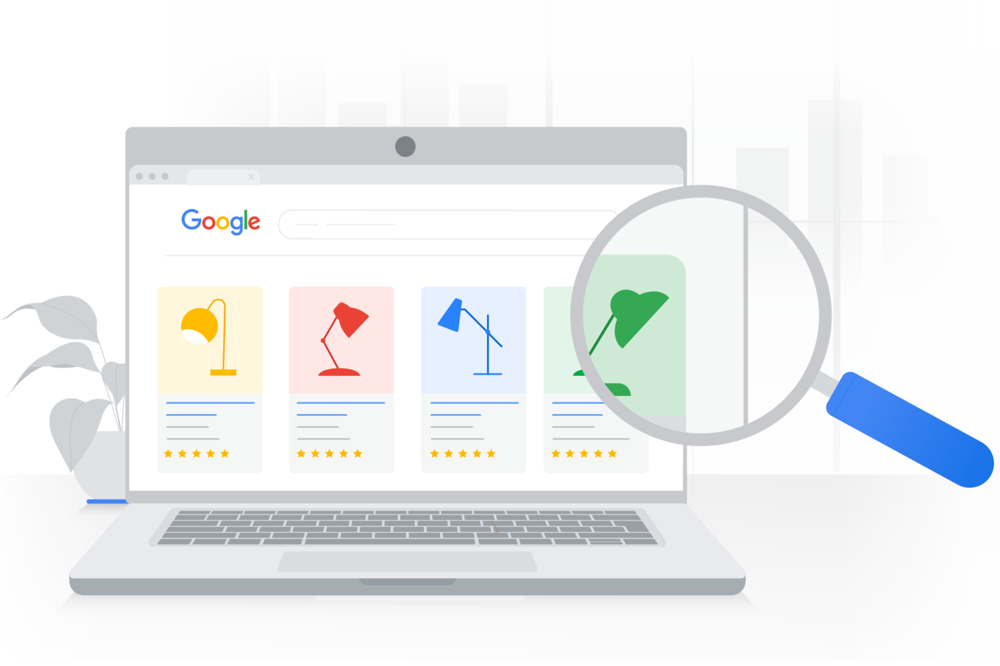

# Reconoce el valor de los anuncios de búsqueda potenciados por IA

En este momento, hay consumidores buscando los productos o servicios que ofreces. Cuando creas campañas de Búsqueda de Google puedes llegar al público que está buscando tus productos cuando más los necesita.

En este módulo, aprenderás qué son las campañas de Búsqueda y la importancia de que el público vea tus anuncios en el momento preciso.

## La importancia de la Búsqueda
Todos los días se realizan alrededor de 3,500 millones de búsquedas con la Búsqueda de Google. En todas partes, los usuarios buscan información, compran en línea, comparan precios de productos, buscan instrucciones sobre cómo llegar a un sitio o simplemente aprenden algo nuevo.

La misión de Google es organizar toda esta información disponible y hacerla accesible y útil.

Cuando las personas quieren obtener información, realizar una compra, ir a algún lugar o realizar una acción, la Búsqueda de Google es su primer recurso de consulta.

## Transforma la intención del usuario en resultados comerciales
Con las campañas de Búsqueda de Google, tus anuncios pueden aparecer junto a los resultados de la búsqueda cuando alguien busque los productos o servicios que ofreces.

## ¿De qué manera te conectan los anuncios de la Red de Búsqueda de Google con tu público?
Sigamos a Lucas, un comprador potencial, para aprender cómo funcionan los anuncios de la Red de Búsqueda de Google. Después de haber vivido en la ciudad durante un tiempo, Lucas decidió que prefiere trasladarse en bicicleta a su trabajo. Pero ¿qué bicicleta debería comprar?

### Lucas comienza su búsqueda.
Enciende su computadora y escribe “mejor bicicleta urbana” en Google.com.

### Analiza los resultados.
Ve lo siguiente:
- Anuncios de Shopping, etiquetados como Patrocinado*
- Anuncios de texto, etiquetados como Anuncio*
- Resultados orgánicos

Lucas mira rápidamente los resultados orgánicos y no ve nada relevante. Aparecen algunos anuncios de texto en la parte superior y uno capta su atención.

El título parece ser relevante para lo que busca: `¿Quieres viajar al trabajo? | 30% de descuento en bicis urbanas | Envío gratis`

La descripción del anuncio le proporciona información adicional sobre la oferta, la ubicación de la tienda y otros detalles útiles.
* Los anuncios de Shopping y de texto no siempre aparecen.

### Hace clic en un anuncio. 
De inmediato, llega a una página de bicicletas urbanas. Le gusta lo que ve, pero necesita tiempo para pensar sobre hacer una compra como esa.

### Explora las opciones.
Lucas visita la tienda local de bicicletas para probar el modelo urbano Ultraveloz. Quiere comprarla, pero el precio en línea es distinto.

### Vuelve a visitar el sitio web que ya revisó.
Lucas usa su teléfono celular y vuelve a navegar en el sitio web que visitó antes. Es momento de hacer esa compra al precio adecuado.

## ¿Las campañas de Búsqueda de Google son la solución adecuada para ti?
Marca todos los elementos que correspondan a tu caso.
- ¿Quieres que tu empresa aparezca cuando los usuarios busquen y comparen distintas opciones?
- ¿Quieres que tu empresa aparezca en el momento exacto en que alguien busca el tipo de productos o servicios que ofreces? 
- ¿Quieres que tu empresa aparezca en los resultados de la búsqueda cuando aparezcan otras empresas similares a la tuya?
- ¿Quieres saber lo que buscan los usuarios y el tipo de anuncios con los que interactúan para poder tomar decisiones fundamentadas sobre cómo aportar más valor a sus vidas?

## Conclusiones clave

- Todos los días se realizan alrededor de 3,500 millones de búsquedas con la Búsqueda de Google.
- Con las campañas de Búsqueda de Google, tus anuncios pueden aparecer junto a los resultados de la búsqueda cuando alguien busque los productos o servicios que ofreces.