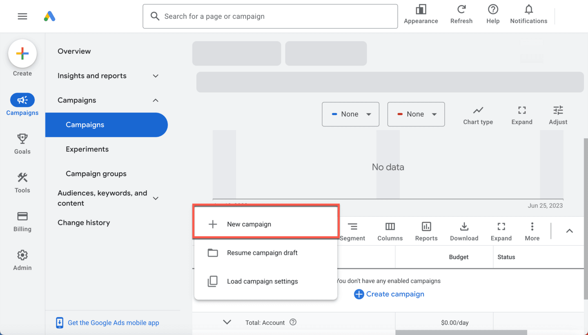
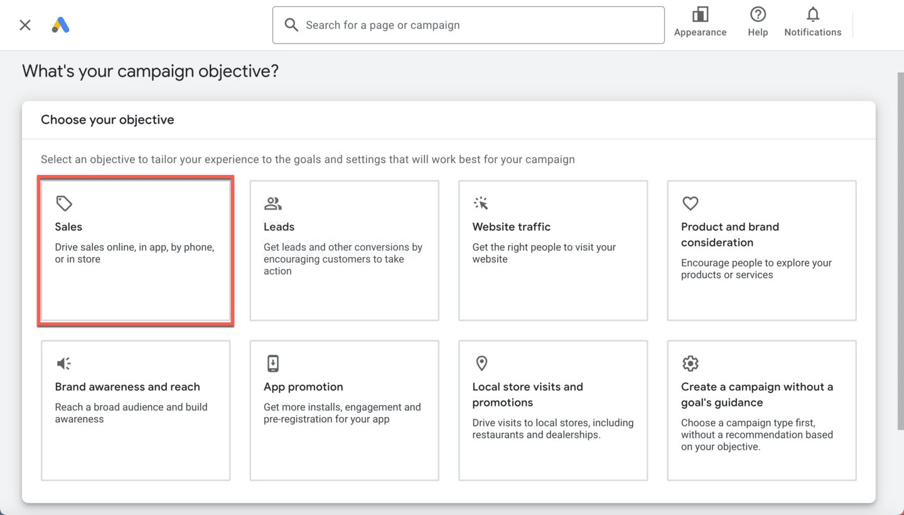
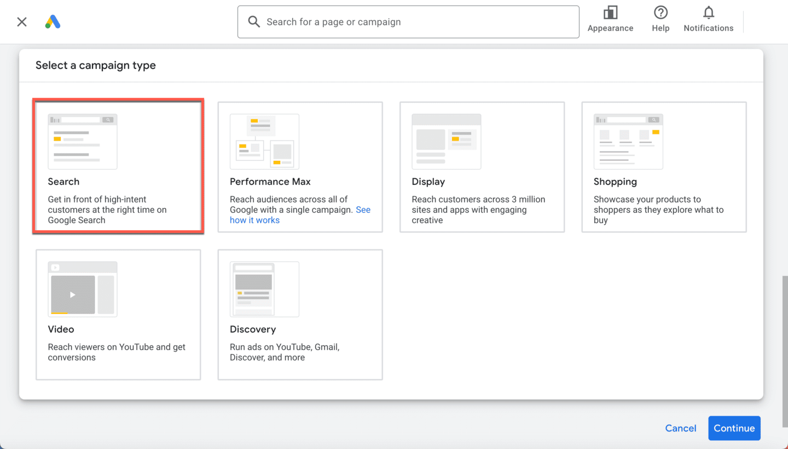
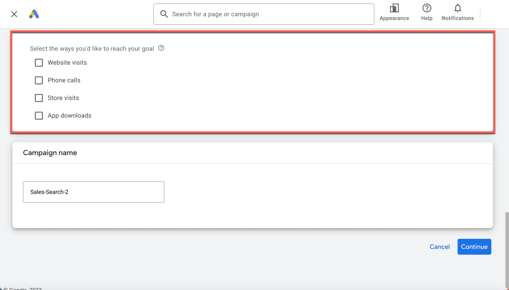
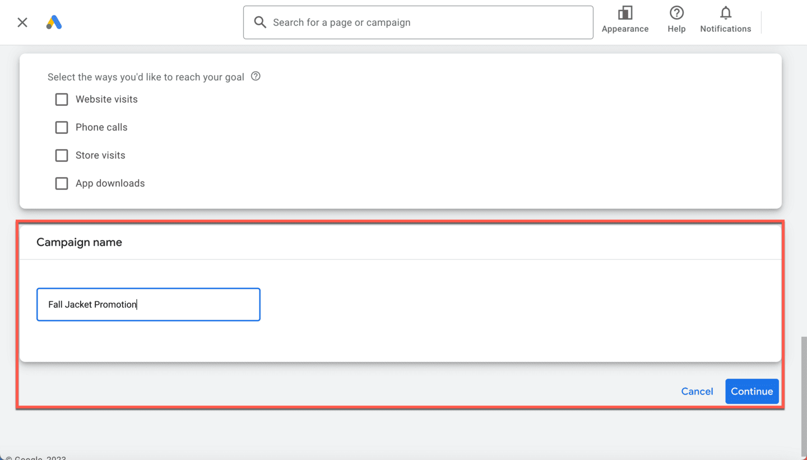
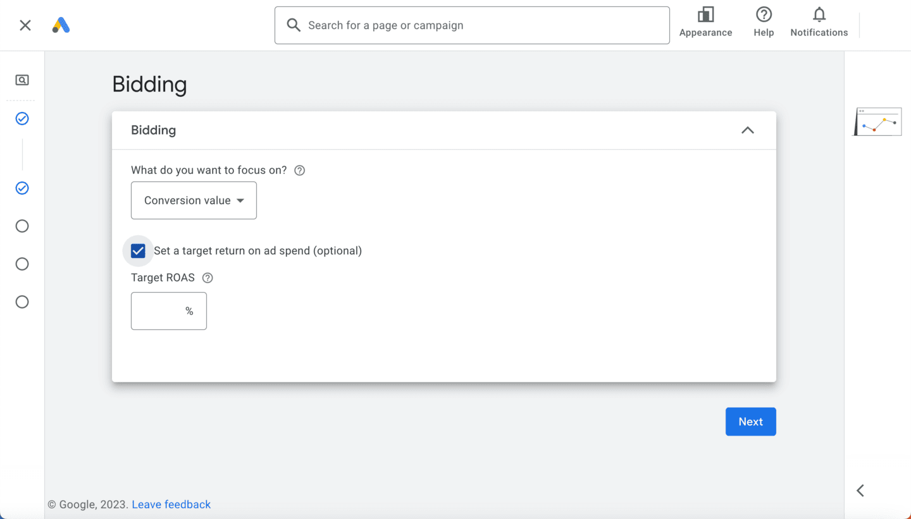
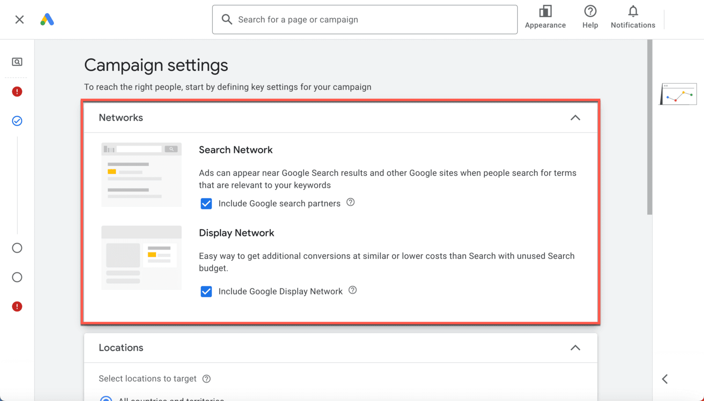
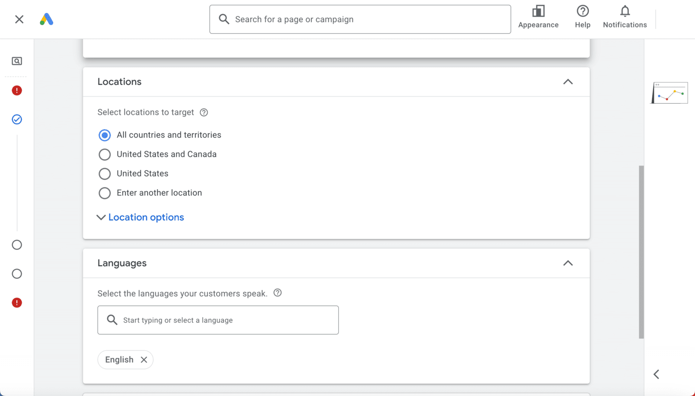
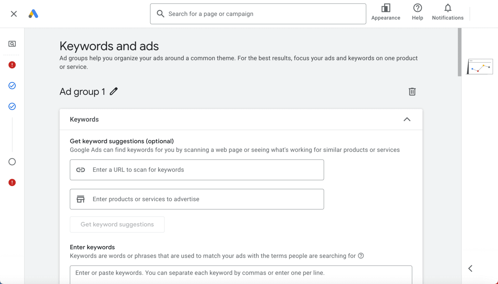
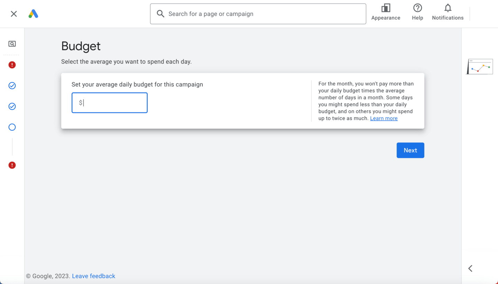

# Crea una campaña de Búsqueda potenciada por IA

¿Cómo puedes crear tu primera campaña de Búsqueda potenciada por IA? Primero, debes aprender cómo funcionan las Cuentas de Google. Después, para comenzar, identifica objetivos de marketing claros. Con estos en mente, podrás determinar cuál es la mejor manera de alcanzarlos con Google Ads y estructurar tu campaña según corresponda.

Al final de este módulo, tendrás las herramientas para crear una campaña de Búsqueda potenciada por IA y optimizada para reflejar tus objetivos de marketing.

## Cómo se organizan las Cuentas de Google
Antes de comenzar, es importante que entiendas cómo funcionan en conjunto los elementos de tu cuenta. Familiarizarte con esta organización puede ayudarte a configurar campañas y encontrar los datos de rendimiento con mayor facilidad. Google Ads dispone de cuatro capas de organización: cuenta de administrador, cuenta, campaña y grupo de anuncios.
- **Cuenta de administrador**
    - Algunos anunciantes administran varias cuentas de Google Ads. Para consultar y gestionar fácilmente estas cuentas en un solo lugar, los anunciantes pueden crear una cuenta de administrador, lo que les permitirá ahorrar tiempo cuando generen informes, en el control de acceso y la facturación consolidada.
- **Cuenta**
    - Una cuenta es una colección de campañas. Se asocia a una dirección de correo electrónico, una contraseña y datos de facturación únicos.
- **Campaña**
    - Una campaña es una colección de grupos de anuncios. Tiene su propio presupuesto y configuración, que determinan dónde aparecerán los anuncios.
- **Grupo de anuncios**
    - Un grupo de anuncios incluye un conjunto de anuncios y palabras clave (las palabras y frases que hacen que los anuncios se muestren a los usuarios) similares.

## Las campañas tienen tres componentes clave
Los tres componentes de las campañas son la segmentación, los formatos de anuncios y las estrategias de ofertas. Familiarízate con cada uno para que puedas aplicarlos a tu campaña.
- **Segmentación**
    - Usa soluciones de público y palabras clave para llegar a tu público. Las primeras son herramientas que te permiten conectarte mejor con los consumidores, y las segundas son palabras o frases que Google usa para establecer concordancia entre los anuncios y los términos que buscan los consumidores.
    - También hay dos campañas con la búsqueda habilitada que no tienen palabras clave y que te permiten aumentar el alcance: anuncios dinámicos de búsqueda (DSA) y campañas de máximo rendimiento. Ambas campañas usan la IA de Google para impulsar el alcance incremental y ayudar a tu empresa a expandirse rápidamente.
- **Formatos de anuncios**
    - Usa los anuncios de búsqueda responsivos para que se muestre tu empresa a los consumidores que buscan productos o servicios como los que ofreces. Con los anuncios de búsqueda responsivos, la IA de Google utiliza los títulos, las descripciones y las imágenes que proporcionas (tus recursos) para crear anuncios relevantes para tu público consumidor.
- **Estrategias de ofertas**
    - Aplica la estrategia de ofertas que mejor se ajuste a tu objetivo de marketing. La IA de Google habilita un conjunto de estrategias de ofertas llamado Ofertas inteligentes, que ayuda a generar un mayor volumen de conversiones o valor de conversión.

## Creemos una campaña de Búsqueda potenciada por IA con Alicia.

Alicia trabaja en una pequeña tienda de indumentaria. Ella y su equipo realizarán un gran evento promocional y quieren usar los anuncios de búsqueda potenciados por la IA de Google para generar ventas.

Tienen varias líneas de productos, pero Alicia usará el evento promocional para aumentar las ventas de las chaquetas, los zapatos y los bolsos de la tienda.

### Primero, considera los objetivos de marketing de Alicia
Hay muchas formas en que los anuncios de búsqueda potenciados por IA pueden ayudarte a alcanzar tus objetivos de marketing. Sin embargo, es importante que primero identifiques lo que significa el éxito para tu empresa. Así, podrás optimizar y medir el éxito de la campaña con respecto a tus objetivos.

Veamos algunos objetivos de marketing. Determina cuál se ajusta más a los objetivos comerciales de Alicia.
- **Clientes potenciales**
    - Motiva a las personas a realizar una acción para aumentar las conversiones.
    - Por ejemplo, una agencia de seguros que se enfoca en aumentar las solicitudes de cotizaciones en su sitio web.
- **Ventas**
    - Haz crecer las ventas en línea, en la app, presenciales o por teléfono.
    - Por ejemplo, una cadena de tiendas de bicicletas que quiere aumentar las ventas de bicicletas y accesorios en sus puntos de venta minorista.
- **Tráfico del sitio web**
    - Haz que las personas indicadas visiten tu sitio web.
    - Por ejemplo, un nuevo hotel que espera generar reconocimiento de la marca aumentando la cantidad de visitantes a su sitio web.
Según lo que sabemos sobre el gran evento promocional en la tienda de Alicia, su objetivo es aumentar las ventas.

## Ahora crea una campaña de Búsqueda y elige tu objetivo
Después de definir el objetivo de la campaña de Alicia, es hora de crear una campaña de Búsqueda potenciada por IA en Google Ads. Aplica lo que sabes sobre los objetivos de Alicia para determinar el enfoque y la configuración de su campaña.

### Paso 1: Campaña nueva
En el menú, selecciona Campañas (Campaigns). Selecciona el ícono de signo más y, luego, Campaña nueva (New campaign) en el menú desplegable.

### Paso 2: Objetivo de la campaña
Elige el objetivo de la campaña que más se alinee con tu objetivo de marketing. Así podrás ajustar la configuración y la experiencia a tus objetivos. El objetivo de Alicia es aumentar las ventas, así que seleccionará Ventas (Sales).

### Paso 3: Tipo de campaña
Selecciona un tipo de campaña. Para crear una campaña de Búsqueda, elige Búsqueda (Search).

### Paso 4: Selecciona las formas en que lograrás tu objetivo
Selecciona cómo te gustaría lograr tus objetivos y, si aún no lo has hecho, configura el seguimiento de conversiones.

### Paso 5: Nombre de la campaña
Elige un nombre que represente el propósito de la campaña. En este ejemplo, el objetivo de Alicia es aumentar las ventas de chaquetas durante la promoción de la tienda, así que nombra la campaña “Promoción de chaquetas de otoño” (“Fall Jacket Promotion”).

> **Realiza un desglose**: Quizás recuerdes que la tienda de Alicia también incluirá zapatos y bolsos en la promoción. Debido a que Alicia quiere crear mensajes específicos para los productos y realizar optimizaciones en función de los objetivos de retorno de la inversión de cada producto, debería crear una campaña independiente para cada línea de producto. Comenzará con las chaquetas.

## Selecciona la configuración de la campaña y configura los anuncios
Ahora seleccionaremos la mejor configuración para la campaña de Alicia. Durante el proceso, puedes avanzar y retroceder en la configuración con el menú que está en el lado izquierdo de la pantalla.

### Paso 6: Ofertas
La estrategia de ofertas que selecciones determina cómo priorizarás la publicación de anuncios y la participación del usuario en tus anuncios. Si te enfocas en el volumen de conversiones, tendrás la opción de establecer un costo por acción objetivo (CPA objetivo). Si prefieres priorizar el valor de conversión, podrás establecer un retorno de la inversión publicitaria objetivo (ROAS objetivo).

### Paso 7: Redes
La red indica el lugar en el que aparecerá tu anuncio, según el tipo de campaña que elegiste. Por ejemplo, si eliges la Red de Búsqueda, el anuncio podrá aparecer en los sitios de la Búsqueda de Google y en los de otras empresas. Estos últimos, como CNN, se llaman socios de búsqueda de Google.

### Paso 8: Idiomas y ubicaciones
Elige el idioma en el que publicas los anuncios para tu público. Los anuncios de tu campaña serán aptos para mostrarse en las ubicaciones geográficas para las que se segmenten o a los consumidores que seleccionen uno de los idiomas de segmentación en la configuración de idiomas de su navegador.

### Paso 9: Grupos de anuncios
Tu campaña contendrá uno o más grupos de anuncios, que te ayudarán a organizar los anuncios con un tema común y objetivos similares. Deberás ingresar las palabras clave, una por línea. Para usar la concordancia amplia, ingresa una palabra clave sin formato. Por ejemplo, Alicia eligió chaquetas de lluvia para mujer. Después, usó las palabras clave sugeridas para agregar más palabras. En los grupos de anuncios, deberás agregar los títulos y los recursos, entre los que se incluyen imágenes, logotipos, vínculos a sitios y mucho más.

### Paso 10: Presupuesto
Por último, selecciona el importe promedio que quieres invertir cada día en la campaña. Después de que se publique tu campaña, es posible que los costos publicitarios sean un poco más altos o más bajos de lo que ingresaste. No te preocupes. En el curso de un ciclo de facturación de un mes, no se te cobrará más que lo que tu presupuesto diario promedio hubiera permitido en un mes promedio.

## ¿Sabías que…?
Cuando seleccionas Búsqueda como el tipo de campaña, quizás veas que aparece una campaña de máximo rendimiento. Las campañas de Búsqueda y de máximo rendimiento potenciadas por IA son la combinación más potente de Google Ads, ya que funcionan en conjunto para ayudarte a maximizar las conversiones en las distintas plataformas de Google. Primero, enfócate en optimizar tus anuncios de búsqueda potenciados por IA con la concordancia amplia y las ofertas basadas en el valor. Luego, explora cómo aumentar tu impacto con la IA de Google.

## Conclusiones clave

- Google Ads dispone de cuatro capas de organización: cuenta de administrador, cuenta, campaña y grupo de anuncios.  
- El primer paso para crear una campaña es alinear tus objetivos de marketing con Google Ads. Las campañas de Búsqueda permiten respaldar diversos objetivos de marketing, como aumentar las ventas, generar clientes potenciales y aumentar el tráfico web.
- Las campañas de Búsqueda tienen tres componentes clave: la segmentación, los formatos de los anuncios y las estrategias de ofertas. También puedes configurar las ubicaciones y los idiomas para ajustar el alcance de tu campaña.
- Tú controlas el presupuesto diario de la campaña. Ajusta el importe que quieres invertir y ten en cuenta el total que usarás cada mes.
- Cuando organices tus campañas, aplica las prácticas recomendadas para la estructuración, como simplificar la generación de informes y segmentar los grupos de anuncios.