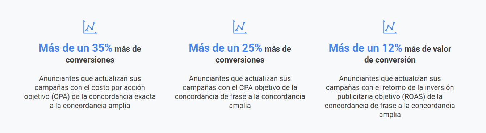

# Accede a nuevas oportunidades con la concordancia amplia

La concordancia amplia tiene una larga trayectoria. Con una mejor comprensión de la intención de búsqueda, los indicadores adicionales y la relevancia de las variaciones de palabras clave, este tipo de concordancia evoluciona continuamente.

Actualmente, la concordancia amplia encuentra búsquedas nuevas de alto rendimiento y tendencias emergentes para ayudar a los especialistas en marketing a llegar a más clientes y obtener un mejor rendimiento.

Al final de este módulo, tendrás las herramientas para seguir las prácticas recomendadas para implementar la concordancia amplia en tus campañas de anuncios de búsqueda potenciadas por IA.

## Descubre cómo ha evolucionado la concordancia amplia
La concordancia amplia ayuda a los anunciantes a llegar a su público objetivo y, al mismo tiempo, les ahorra tiempo, ya que no es necesario gestionar numerosas variaciones de la misma palabra clave. 

> **¿Sabías que…?** La concordancia amplia funciona bien cuando se combina con las Ofertas inteligentes basadas en el valor. De hecho, el 75% de los anunciantes que utilizan las Ofertas inteligentes también usan la concordancia amplia para los anuncios de texto.

- **En combinación con las Ofertas inteligentes, la concordancia amplia ayuda a los especialistas en marketing a maximizar el rendimiento**
    - Juntas, pueden ayudar a conseguir tráfico valioso y simplificar la administración de la cuenta. Considera cómo se compara la concordancia amplia con Ofertas inteligentes con otros tipos de concordancia.
    - Utilicemos como ejemplo el calzado deportivo.
        - **Concordancia exacta**
            - **Definición**: Los anuncios pueden aparecer en búsquedas con el mismo significado o la misma intención que la palabra clave. Solo proporciona concordancias estrictas.
            - **Ejemplo**: `[Calzado deportivo]` está entre corchetes, como se escribe aquí. Con la concordancia exacta, solo las búsquedas de las palabras clave “Calzado deportivo” mostrarán el anuncio.
            - **Implicaciones en la subasta**: La subasta de Google Ads tiene en cuenta ciertos indicadores, de acuerdo con las definiciones semánticas de los productos.
        - **Concordancia de frase**
            - **Definición**: Los anuncios pueden aparecer en búsquedas que incluyan el mismo significado, que puede ser implícito. Proporciona concordancias moderadas.
            - **Ejemplo**: Utilicemos las palabras clave “calzado deportivo para niños”. Las búsquedas de “calzado deportivo para niñas”, “calzado deportivo infantil” o “comprar calzado para niños” pueden mostrar el anuncio.
            - **Implicaciones en la subasta**: Como con la concordancia exacta, la subasta de Google Ads solo considera ciertos indicadores.
        - **Concordancia amplia**
            - **Definición**: Los anuncios pueden aparecer en todas las búsquedas relevantes relacionadas con las palabras clave, aunque no estén presentes en las búsquedas. Proporciona una concordancia integral, ya que las palabras clave de concordancia amplia cubren todas las mismas búsquedas de los tipos de concordancia más específicas y más.
            - **Ejemplo**: Las palabras clave “calzado deportivo” aparecen sin la notación. Las búsquedas de “calzado deportivo”, “conjunto deportivo”, “calzado deportivo usado” o “equipo deportivo mejor calificado” mostrarán este anuncio.
            - **Implicaciones en la subasta**: La concordancia amplia utiliza todos los indicadores disponibles para la concordancia durante la subasta y a nivel de la búsqueda. Con las Ofertas inteligentes, esta combinación de indicadores establece las mejores ofertas para conseguir la relevancia de las palabras clave.

> **La concordancia amplia funciona mejor con las Ofertas inteligentes, mientras que las Ofertas inteligentes lo hacen mejor con los datos de conversiones**

Para las campañas de Búsqueda potenciadas por IA, hay que empezar por establecer los objetivos comerciales adecuados. Los especialistas en marketing deben asegurarse de que los datos de conversiones enviados a Google reflejen con exactitud sus datos de la empresa.

## Implementación a través de la página Recomendaciones
Esta opción puede ser la mejor para los anunciantes que desean aumentar el rendimiento, pero necesitan priorizar la facilidad en las implementaciones sin pruebas.
- **Implementación**
    - **¿Cómo funciona esta opción?**
        - Con esta opción, los especialistas en marketing pueden agregar palabras clave de concordancia amplia al mismo grupo de anuncios que las palabras clave de concordancia exacta y de frase de sus campañas.
    - **¿Qué pasos se deben completar?**
        - Navega a la página Recomendaciones y selecciona Aplicar todas.
- **Evaluación de resultados**
    - ¿Cómo evalúo los resultados?
        - Google Ads conserva los informes, el rendimiento y el historial cuando se agregan nuevos tipos de concordancia. Una vez transcurrido el tiempo necesario para obtener las conversiones, consulta el informe de términos de búsqueda para evaluar el éxito.

## Aplicación del experimento con un solo clic

Este enfoque puede ser el mejor para los anunciantes que deseen probar la concordancia amplia con experimentos en una campaña siguiendo las prácticas recomendadas.

- **Implementación**
    - **¿Cómo funciona esta opción?**
        - La aplicación de un experimento con un solo clic crea un experimento automáticamente. Utiliza un grupo de control (la campaña actual) y un grupo experimental (concordancia amplia). Agrega palabras clave de concordancia amplia además de las ya existentes de concordancia exacta o de frase.
    - **¿Qué pasos se deben completar?**
        - En la página Recomendaciones, busca la recomendación para Agrega palabras clave de concordancia amplia.
        - Busca la campaña con la que quieres experimentar y selecciona el menú de tres puntos en el lado derecho.
        - Selecciona Aplicar experimento.
        - En el cuadro de diálogo, selecciona Guardar.
- **Evaluación de resultados**
    - **¿Cómo evalúo los resultados?**
        - Asegúrate de seguir las prácticas recomendadas para los experimentos luego de la implementación. Cuando el experimento finalice, navega a la página Experimentos para evaluar los resultados y escalar la adopción.

## Sigue estos pasos para ejecutar buenos experimentos
Cuando se realizan pruebas, los especialistas en marketing deben ejecutar experimentos hasta alcanzar la importancia estadística, lo que suele tardar al menos cuatro semanas. Evita hacer cambios en tus campañas de base o de prueba durante ese tiempo. Luego, evalúa los resultados del experimento excluyendo el período de adaptación (que suele ser de aproximadamente una semana).

- **Configurar**
    - Consulta la página Recomendaciones para las campañas con recomendaciones de tipo de concordancia.
    - Las campañas deben publicarse con Ofertas inteligentes basadas en conversiones y la concordancia exacta o de frase activada.
    - Aplica el experimento para agregar palabras clave de concordancia amplia a las palabras clave existentes.
- **Observar**
    - Deja que el experimento se ejecute durante al menos cuatro semanas o hasta que alcance la importancia estadística.
    - El experimento debe tener presupuestos abiertos y no modificarse durante este período para obtener resultados claros.
- **Analizar los resultados**
    - Observa cuántas conversiones adicionales se consiguen con la concordancia amplia.
    - Para obtener resultados claros, excluye del análisis el período de adaptación al principio del experimento y ten en cuenta cualquier demora en las conversiones en la evaluación de los resultados.

## Amplía tu alcance con la concordancia amplia siguiendo estas prácticas recomendadas
Con el uso de las Ofertas inteligentes y la configuración de los valores de conversión correctos, además de la concordancia amplia, los especialistas en marketing pueden seguir estas prácticas recomendadas para aprovechar todo el potencial de la IA de Google y alcanzar sus objetivos.

- **Organizar tus grupos de anuncios por un tema en común**
    - Por ejemplo, organiza grupos de anuncios de productos y servicios similares. Recuerda que la prueba y la implementación de palabras clave de concordancia amplia con las Ofertas inteligentes no requiere la reestructuración de la cuenta.
- **Sigue las prácticas recomendadas para creatividades**
    - Usa los anuncios de búsqueda responsivos, incluidos todos los recursos relevantes. Asegúrate de que los títulos y las páginas de destino en el sitio web reflejen las búsquedas segmentadas en tus campañas.
- **Sé consciente de la segmentación negativa**
    - Sé consciente de las palabras clave negativas que puedes venir acumulando a lo largo de los años. Trabaja con la segmentación por palabras clave negativas con regularidad y elige con cuidado para asegurarte de que solo se utilicen para las búsquedas con las que no quieres que coincidan los anuncios.
- **Considera las restricciones de marcas en la concordancia amplia**
    - Algunos especialistas en marketing necesitan que su campaña coincida únicamente con el tráfico de marcas específicas. Con las restricciones de marcas en la concordancia amplia (ahora en versión beta abierta), la IA de Google puede restringir el tráfico a determinadas marcas, así como a productos y servicios relacionados. 

## Conclusiones clave

- Las palabras clave de concordancia amplia consiguen el mismo tráfico y más que las de concordancia exacta y de frase.
- La concordancia amplia y las Ofertas inteligentes se complementan para publicar anuncios para las búsquedas más relevantes para precio adecuado.
- El uso de la página Recomendaciones y los experimentos de un solo clic son las mejores formas de probar la concordancia amplia con las campañas.