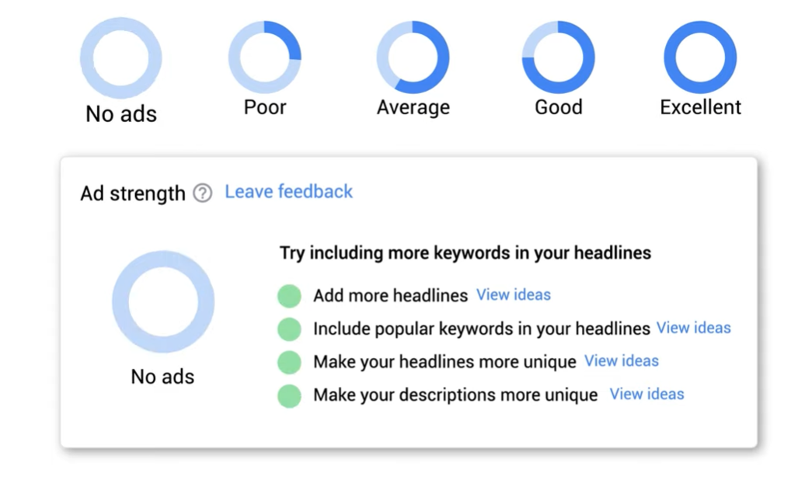
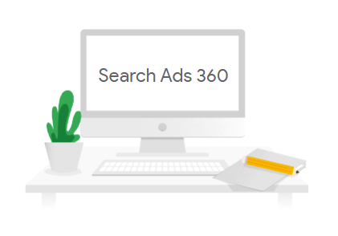

# Atrae a los usuarios con creatividades potenciadas por IA

Los anuncios de búsqueda responsivos te permiten crear anuncios que se adaptan para mostrar mensajes más relevantes para los consumidores.

Al final de este módulo, tendrás las herramientas para adaptar el contenido de tus anuncios de modo que coincidan mejor con los términos de búsqueda de los consumidores potenciales y mejorar el rendimiento de tus campañas.

## Muéstrale el mensaje correcto a la persona adecuada
- Las formas en que las personas buscan lo que les interesa cambian constantemente. De hecho, según datos internos de Google del 2022, el 15% de las búsquedas diarias son búsquedas nuevas que nunca se habían registrado. Para aprovechar este crecimiento, las empresas deben invertir en los datos adecuados y en soluciones potenciadas por IA.
- Los anuncios de búsqueda responsivos ofrecen una verdadera optimización del tiempo de búsqueda, ya que organizan los recursos para crear anuncios que se prevé que tendrán un mejor rendimiento para la búsqueda de cada usuario. Esto significa evaluar decenas de miles de anuncios potenciales en una fracción de segundo para mostrar mensajes más relevantes para cada persona a partir de indicadores contextuales y de intención.
- Según datos internos de Google del 2022, los anunciantes que cambian de los anuncios de texto expandidos a los anuncios de búsqueda responsivos, con los mismos recursos, obtienen un aumento, en promedio, del 7% en las conversiones a un costo por conversión similar.

## Ayuda a los consumidores a ver anuncios customizados con los anuncios de búsqueda responsivos
Los anuncios de búsqueda responsivos te permiten crear anuncios que se adaptan para mostrar mensajes más relevantes para los consumidores. Prueban automáticamente varias combinaciones de títulos y descripciones y aprenden cuál tiene el mejor rendimiento.

## Cómo funcionan
- Mientras más títulos y descripciones ingreses, más oportunidades tendrá Google Ads de publicar anuncios que coincidan mejor con las búsquedas de los clientes potenciales, lo que mejorará el rendimiento de tus anuncios.
- Una vez que ingresas los títulos y las descripciones, Google Ads crea varias combinaciones de anuncios con este texto para evitar redundancias. A diferencia de los anuncios de texto expandidos, puedes ingresar hasta 15 títulos y cuatro descripciones para un mismo anuncio de búsqueda responsivo.
- Luego, en cualquier anuncio, se seleccionarán un máximo de tres títulos y dos descripciones para mostrarlos con diferentes combinaciones y en distintos órdenes. Es posible que parte del texto del anuncio aparezca automáticamente en negrita si coincide por completo o en parte con la búsqueda de un usuario. Con el transcurso del tiempo, Google Ads probará las combinaciones más prometedoras del anuncio y aprenderá cuáles son las más relevantes para las distintas búsquedas.

## Por qué funcionan
Vincular palabras clave de concordancia amplia y Ofertas inteligentes con los anuncios de búsqueda responsivos puede ayudarte a llegar a nuevas búsquedas de alto rendimiento y a optimizar tus ofertas en tiempo real. Según datos internos de Google del 2021, los anunciantes que adoptan los anuncios de búsqueda responsivos en las campañas que también utilizan la concordancia amplia y las Ofertas inteligentes obtienen, en promedio, un 20% más de conversiones a un costo por acción similar.

- **Ofertas inteligentes** 
    - Evalúan miles de millones de combinaciones de indicadores para establecer la oferta adecuada para cada búsqueda y subasta según tus objetivos de retorno de la inversión (ROI).
    - Las Ofertas inteligentes optimizan tus ofertas en tiempo real para ayudarte a permanecer actualizado en cuanto a las tendencias de mercado y los rápidos cambios en la demanda.
- **Concordancia amplia**
    - Permite búsquedas nuevas de alto rendimiento y tendencias emergentes para llegar a más consumidores y obtener un mejor rendimiento.
    - Google mejora continuamente la concordancia amplia considerando nuevos indicadores, como la ubicación del usuario o la actividad de búsqueda reciente, lo que mejora la relevancia de las variaciones de palabras clave y la concordancia holística con todas las palabras clave de tu grupo de anuncios.
- **Anuncios de búsqueda responsivos**
    - Los anuncios de búsqueda responsivos pueden organizar automáticamente las creatividades más relevantes para cada subasta y hasta ayudarte a que aparezcas en nuevas búsquedas.
    - Proporciona hasta 15 títulos y cuatro descripciones como recursos de creatividad. El sistema utiliza esos recursos para crear automáticamente anuncios nuevos que se adaptan a cada búsqueda en función de los indicadores durante la subasta.

## Crea y optimiza anuncios de búsqueda responsivos a gran escala
### Recomendaciones para el nivel de optimización
- El nivel de optimización calcula la eficacia de la configuración de tu cuenta de Google Ads para lograr el rendimiento esperado. Los niveles van del 0 al 100% (el 100% significa que tu cuenta puede funcionar a su máximo potencial). Estas son tres formas de optimizar tus anuncios de búsqueda responsivos con el nivel de optimización.

> **Nota**: Las funciones de Google Ads evolucionan con rapidez y algunos aspectos de la interfaz de usuario pueden ser distintos de lo que se muestra. Las capturas de pantalla contienen datos de muestra con fines ilustrativos.

- **Agrega anuncios de búsqueda responsivos**
    - La recomendación muestra una sugerencia para un anuncio de búsqueda responsivo utilizando recursos de anuncios de texto expandidos (ETA). Revisa los anuncios sugeridos y haz cambios si es necesario (como mejorar la calidad del anuncio).
- **Agregue elementos a los anuncios de búsqueda responsivos**
    - La recomendación muestra una sugerencia para mejorar los recursos de anuncios de búsqueda responsivos agregando recursos de imagen.
- **Mejore los anuncios de búsqueda responsivos**
    - La recomendación muestra una sugerencia para mejorar la calidad de los anuncios de búsqueda responsivos, ya que algunos tienen una calidad inferior a “Buena”.

### Recomendaciones para el creador de anuncios (Search Ads 360)

Con el creador de anuncios, puedes agregar nuevos recursos a miles de grupos de anuncios en solo unos clics. Actualiza fácilmente los anuncios desde una sola pantalla y personaliza los anuncios de cada grupo de anuncios con la automatización inteligente.

### Recomendaciones para Google Ads Editor
Los anuncios de búsqueda responsivos pueden crearse y optimizarse con Google Ads Editor. Puedes fijar un título, comprobar la calidad de los anuncios y recibir recomendaciones sobre cómo mejorarlos. Asegúrate de tener la versión más reciente para que aparezca la opción de crear anuncios de búsqueda responsivos.

### Recursos creados automáticamente
Los recursos creados automáticamente son un parámetro de configuración opcional a nivel de la campaña que se encuentra en fase beta. Habilitar esta opción te permitirá generar recursos adicionales (títulos y descripciones) para usar en combinación con los recursos que incluyas en tus anuncios de búsqueda responsivos. Estos recursos nuevos se generan en función del contexto único de tus anuncios, que incluye la página de destino, los anuncios existentes y las palabras clave de tu grupo de anuncios.

## Calidad del anuncio
La calidad del anuncio mide la relevancia, la cantidad y la diversidad del contenido de los anuncios de búsqueda responsivos. En combinación con comentarios prácticos, la calidad del anuncio facilita mejorar la eficacia de los anuncios incluso antes de que se publiquen.

Cuando trabajes con anuncios de búsqueda responsivos, verás una de las cinco clasificaciones de calidad del anuncio: incompleto, deficiente, promedio, buena y excelente. Además de estas calificaciones, verás elementos de acción para mejorar la eficacia de los anuncios. Según datos internos de Google, los anunciantes que mejoran la calidad de sus anuncios de búsqueda responsivos de deficientes a excelentes observan un 9% más de clics y conversiones en promedio.

Examinemos la diferencia entre la calidad de los anuncios y el rendimiento de los recursos.
- **Calidad del anuncio**
    - **En qué consiste**: Se trata de una herramienta que analiza la relevancia, la cantidad y la diversidad del contenido de los anuncios de búsqueda responsivos según las prácticas recomendadas.
    - **Cuándo se usa**: Durante la creación de los anuncios de búsqueda responsivos
    - **Impacto**: No influye en la entrega ni en el rendimiento de los anuncios
    - **Componentes**:
        - Cantidad de títulos
        - Relevancia de los títulos (palabras clave)
        - Títulos únicos
        - Descripciones únicas
- **Rendimiento de los recursos**
    - **En qué consisten**: Las etiquetas de rendimiento de los recursos miden el rendimiento de tu recurso en relación con otros recursos del anuncio. Se actualizan a medida que cambian los comportamientos de búsqueda de los usuarios, lo que repercute en la combinación de búsquedas, la posición de los anuncios, etcétera.
    - **Cuándo se usan**: Después de que se publican los anuncios de búsqueda responsivos.
    - **Impacto**: Reflejan el rendimiento después de que se publican los anuncios.
    - **Componentes**: Incluyen una mezcla ponderada de métricas de rendimiento con una confianza estadísticamente significativa.
- **Uso conjunto**
    - La calidad del anuncio refleja la calidad general prevista de todo el anuncio de búsqueda responsivo durante su creación. Después de que el anuncio se publique, verifica las etiquetas de rendimiento de los recursos para modificar los recursos individuales y mejorar aún más la calidad del anuncio.

## Prácticas recomendadas relacionadas con los anuncios de búsqueda responsivos
- Proporciona 10 o más títulos.
- Proporciona tres o más descripciones.
- Incluye al menos tres palabras clave populares en los títulos.
- Asegúrate de que los títulos sean únicos y no repitas frases iguales o parecidas.
- Utiliza palabras de llamado a la acción.
- Intenta usar descripciones para destacar información adicional sobre tu producto o servicio.
- Destaca los argumentos de venta únicos.
- Deja de fijar títulos, si es posible.
- Los recursos pueden mostrarse en cualquier orden, así que asegúrate de que tengan sentido de forma individual o combinados, y de que no infrinjan las políticas o leyes locales.
- Se recomienda tener un anuncio de búsqueda responsivo por grupo de anuncios con una calidad del anuncio “Buena” o “Excelente” como mínimo. Hay un límite de tres anuncios de búsqueda responsivos habilitados por grupo de anuncios.
- Si quieres mostrar un texto determinado en todos los anuncios, debes agregarlo en la posición 1 o 2 del título, o bien en la posición 1 de la descripción.

> **Sugerencia: Para actualizar de forma dinámica el texto del anuncio con las palabras clave que se usaron para segmentar el anuncio, usa la Inserción de palabras clave.**

## Conclusiones clave

- Los anuncios de búsqueda responsivos ofrecen una verdadera optimización del tiempo de búsqueda, ya que organizan los recursos para crear anuncios que se prevé que tendrán un mejor rendimiento para la búsqueda de cada usuario.
- Los anuncios de búsqueda responsivos prueban automáticamente varias combinaciones de títulos y descripciones, y aprenden cuál tiene el mejor rendimiento.
- Vincular palabras clave de concordancia amplia y Ofertas inteligentes con los anuncios de búsqueda responsivos puede ayudarte a llegar a nuevas búsquedas de alto rendimiento y a optimizar tus ofertas en tiempo real.  
- Para crear y optimizar anuncios de búsqueda responsivos a gran escala, usa las recomendaciones relacionadas con el nivel de optimización, el creador de anuncios (Search Ads 360) y Google Ads Editor.