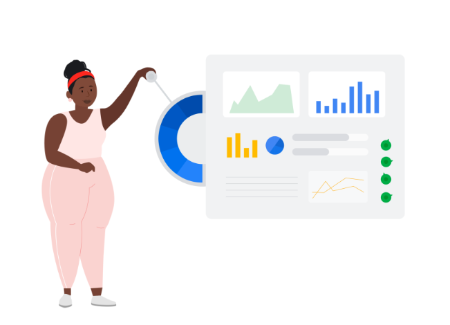
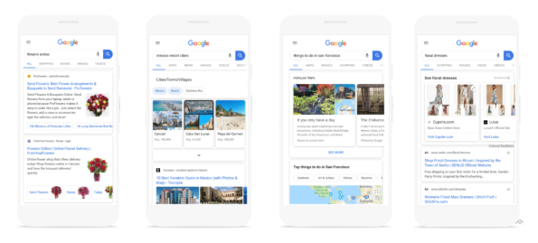
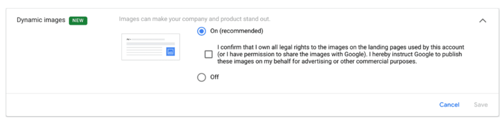
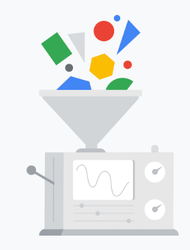
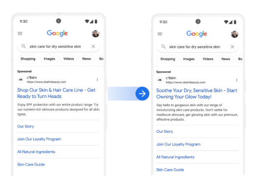
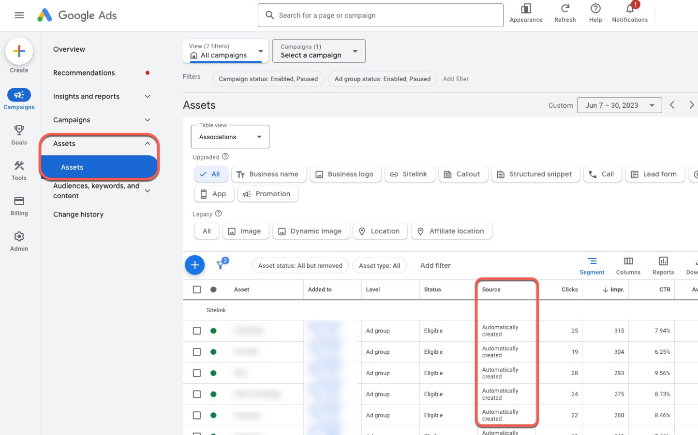

# Mejora los anuncios con recursos

Cada consulta que realizan los consumidores en Google refleja una necesidad específica. Ya sea que los usuarios busquen información general, un producto, una ubicación o algo distinto, quieren resultados que sean relevantes para ellos. Los recursos de anuncios proporcionan información adicional para destacar datos relevantes sobre tu empresa y lo que ofreces.

Al final de este módulo, contarás con el conocimiento necesario para usar recursos de anuncios y así mejorar la conexión con tu público y cumplir tus objetivos de marketing.

## ¿Por qué son importantes los recursos de anuncios?
Los recursos de anuncios son un complemento de producto que se publican en tus anuncios de texto existentes. Destacan información relevante sobre tu negocio y lo que ofreces. También mejoran la participación de los usuarios y la relevancia, lo que puede aumentar el rendimiento de los anuncios. Estos son algunos de sus otros beneficios:
- **Permiten destacar los anuncios**: Los recursos de anuncios hacen que tu anuncio de texto se destaque, lo que genera más participación del usuario y una mayor tasa de clics (CTR).
- **Aumentan la eficiencia**: Estos clics adicionales suelen tener un costo por clic (CPC) menor que el costo de subir una posición.
- **Generan más conversiones**: Si les brindas a los usuarios información relevante por adelantado, podrás obtener más clientes potenciales calificados.

Cuando determines qué recursos de anuncios usarás, piensa en tus consumidores y su recorrido. ¿Cómo suelen buscar tu empresa? ¿Qué información buscan? ¿Cuál es la mejor manera de guiarlos para que realicen la acción que quieres?

> **Nota sobre los recursos de anuncios**: Los recursos de anuncios no se publican en todas las subastas. El sistema elige publicar un recurso del anuncio o un grupo de recursos del anuncio cuando es más probable que genere el rendimiento del anuncio deseado.

## La experiencia de búsqueda orgánica se está volviendo más visual

Los resultados orgánicos de la mayoría de las búsquedas en dispositivos móviles ahora activan la publicación de una experiencia visual. Los usuarios son más propensos a interactuar con formatos visuales, y las imágenes ayudan a los usuarios a hacer lo siguiente:
- Comprender el mensaje con mayor facilidad.
- Realizar acciones de manera más rápida.

## Información de la empresa
Con la función Información de la empresa, los anuncios de búsqueda ahora se presentan con el nombre de la empresa y un logotipo para ayudar a los usuarios a comprender mejor la fuente de los anuncios que ven; además, esto hace que los anuncios sean más atractivos en la página de Búsqueda.

Cuando corresponde, Google rastrea automáticamente los dominios y presenta el nombre de la empresa y el logotipo junto a un anuncio.

Los anunciantes que muestran el logotipo y el nombre de su empresa en sus anuncios de búsqueda obtienen, en promedio, un 8% más de conversiones con un costo por conversión similar.

## Recursos de imagen y recursos de imagen dinámica
Los recursos de imagen y los recursos de imagen dinámica son recursos de anuncios que te permiten subir imágenes enriquecidas y relevantes para complementar tus anuncios de texto existentes.

Los recursos de imagen pueden ayudar a impulsar el rendimiento de tus anuncios con imágenes atractivas de los productos o servicios, lo cual mejora el mensaje de tu anuncio de texto.

Los recursos de imagen dinámica son recursos automatizados de la cuenta que le permiten a Google seleccionar imágenes relevantes de la página de destino de tu anuncio para complementar tus anuncios de búsqueda existentes. Pueden ayudarte a cumplir tus objetivos de rendimiento con imágenes atractivas de tus productos o servicios que mejoran el mensaje de tus anuncios de texto. Puedes habilitar los recursos de imagen dinámica a nivel de la cuenta.

Los primeros resultados muestran que los anunciantes obtienen aumentos de hasta un 10% en la CTR cuando se publican recursos de imagen o de imagen dinámica junto con sus anuncios de búsqueda para dispositivos móviles en la primera posición absoluta.

Los principales componentes del anuncio de texto siguen siendo los mismos:
- Títulos
- Descripciones
- URL visible y URL final

Un componente de imagen en el que se puede hacer clic es una imagen de 1 x 1 o una imagen horizontal de 1.91 x 1 que subes y se publica junto con el anuncio, y que conduce a la misma URL final que el título.

> **Sugerencia**: Debes usar recursos de imagen y recursos de imagen dinámica en conjunto. La publicación de los recursos de imagen siempre toma precedencia sobre la publicación de los de imagen dinámica. Asegúrate de haber configurado tus recursos de imagen al nivel que te resulte más conveniente.

Revisa las siguientes prácticas recomendadas para los recursos de imagen dinámica.
- **Da prioridad a los grupos con un alto volumen de impresiones**
    - Los recursos de imagen tienen un rendimiento óptimo cuando se relacionan estrechamente con las búsquedas dentro del grupo de anuncios.
    - Las imágenes deben brindar información útil al usuario que realiza la búsqueda y concordar con la experiencia que este encontrará en la página de destino.
- **Ten, por lo menos, cuatro imágenes únicas por cada grupo de anuncios**
    - Coloca el contenido importante en el 80% central de la imagen.
    - Proporciona relaciones de aspecto de 1 x 1 y de 1.91 x 1 para maximizar la publicación de anuncios en el experimento de la búsqueda con imágenes.
- **Habilita los recursos de una imagen dinámica**
    - Proporciona recursos de imagen a nivel del grupo de anuncios o de la campaña para complementar la cobertura y permitirte un mayor control sobre la relevancia de las imágenes y los lineamientos de desarrollo de la marca de los clientes.

> **Sugerencia sobre el nivel de optimización**: Usa la herramienta Nivel de optimización de la pestaña Recomendaciones para ver qué campañas no tienen recursos universales. Revisa los recursos recomendados o crea nuevos para aumentar la relevancia y el rendimiento de tus anuncios.

## Recursos automáticos a nivel de la cuenta

Los recursos automáticos a nivel de la cuenta suelen aumentar el rendimiento de los anuncios y las probabilidades de que los usuarios hagan clic en ellos. Cuando se predice que un recurso puede mejorar el rendimiento de tu anuncio, Google Ads automáticamente crea el recurso y lo muestra debajo de tu anuncio. Estos recursos pueden crearse a nivel de la cuenta y compartirse entre varias campañas. La mayoría de los recursos automáticos a nivel de la cuenta son aptos para mostrarse con todos los tipos de anuncios, pero algunos solo se muestran en computadoras de escritorio y laptops. Los recursos automáticos a nivel de la cuenta son compatibles con las campañas y los grupos de anuncios que también utilizan recursos manuales. Es recomendable que uses todos los recursos manuales que resulten adecuados para tu negocio.

Los siguientes recursos se consideran recursos universales, ya que resultan muy adecuados para la mayoría de los objetivos de marketing, como la consideración, las ventas (en línea), la generación de clientes potenciales, la instalación de aplicaciones y las ventas (sin conexión).

### Vínculos a sitio y vínculos a sitio dinámicos

Los vínculos a sitio permiten que los anunciantes les muestren a los usuarios vínculos directos a páginas específicas dentro de sus sitios web.

Los vínculos a sitio dinámicos permiten que Google seleccione vínculos a sitio de alta calidad por ti según el contenido de tu sitio web.

- **Beneficios**
    - Agregar vínculos a sitio puede incrementar la tasa de clics promedio de un anuncio. 
    - También reducen la cantidad de pasos necesarios para generar una conversión, ya que llevan a los usuarios directamente a la página correcta.
- **Prácticas recomendadas**
    - Agrega tantos vínculos a sitio relevantes y útiles como puedas, aunque la cantidad ideal oscila entre los 8 y 10. 
    - Usa vínculos que dirijan a las secciones populares o de alta conversión del sitio para que los consumidores puedan navegar hacia ellas con más facilidad. 
    - Asegúrate de que haya suficiente contenido en el sitio web para tener al menos dos vínculos al sitio; de lo contrario, estos no se mostrarán. 
    - Los vínculos a sitio están disponibles a nivel de la cuenta, de la campaña y del grupo de anuncios. 
    - Puedes habilitar los vínculos a sitio dinámicos a nivel de la cuenta.

### Fragmentos estructurados y fragmentos estructurados dinámicos
Con los fragmentos estructurados, los anunciantes pueden destacar aspectos específicos de sus productos o servicios en un formato estructurado que se basa en un conjunto de encabezados disponibles. Los fragmentos estructurados se muestran en respuesta a búsquedas relevantes como una línea adicional de texto en el que no se puede hacer clic, con el formato Encabezado: Valor 1, Valor 2, Valor 3, etcétera.

Los fragmentos estructurados dinámicos permiten que Google presente información estructurada útil automáticamente.

- **Beneficios**
    - Usa fragmentos estructurados para obtener más clientes potenciales calificados. Cuando los usuarios obtienen información más específica sobre lo que se ofrece antes de visitar un sitio web, son más propensos a realizar una conversión después de hacer clic.
- **Prácticas recomendadas**
    - Asegúrate de que los encabezados seleccionados proporcionen información útil y atractiva para los usuarios. 
    - La publicación de los fragmentos estructurados aptos a nivel del grupo de anuncios toma precedencia sobre la publicación de los de nivel de campaña o cuenta. 
    - La publicación de los fragmentos estructurados aptos a nivel de la campaña toma precedencia sobre la publicación de los de nivel de cuenta. 
    - Los fragmentos estructurados dinámicos se habilitan a nivel de la cuenta.

## Textos destacados y textos destacados dinámicos
Con los textos destacados, los anunciantes pueden destacar argumentos de venta relevantes y de alto impacto sobre sus productos o servicios que pueden mostrarse junto con los anuncios de texto de la Búsqueda.

Los textos destacados dinámicos permiten que Google presente automáticamente argumentos de venta relevantes que complementen tus anuncios de texto de la Búsqueda.

- **Beneficios**
    - Los recursos de texto destacado se usan para destacar información sobre atributos que agregan valor al negocio, a los productos o a los servicios. También pueden aumentar la participación de los usuarios y las tasas de clics.
- **Prácticas recomendadas**
    - Asegúrate de que los textos destacados sean tan breves y específicos como sea posible para destacar lo que hace que tu empresa sea única. 
    - Incluye al menos seis textos destacados en tus campañas. 
    - Los textos destacados están disponibles a nivel de la cuenta, de la campaña y del grupo de anuncios. 
    - Puedes habilitar los textos destacados dinámicos a nivel de la cuenta.

## Elige recursos adicionales según tu objetivo de marketing
Además de los tres recursos universales, hay recursos de anuncios designados que pueden usarse para objetivos de marketing específicos. Si alineas los recursos del anuncio con los objetivos que deseas lograr, puedes atraer más a los consumidores y motivarlos a realizar acciones.
- **Recursos de llamada**
    - Incentiva a los usuarios a llamar directamente a tu empresa desde tus anuncios de búsqueda con los recursos de llamadas.  
    - Cómo funcionan
        - Cuando se muestran recursos de llamada, los usuarios pueden hacer clic en ellos para llamar directamente a tu empresa, o bien hacer clic en el anuncio y así ir a tu sitio web. 
        - Puedes obtener informes detallados sobre las llamadas que recibes con estos anuncios.
    - Prácticas recomendadas
        - Habilita los informes de conversiones de llamadas telefónicas en la configuración de la cuenta si deseas evaluar qué campañas, grupos de anuncios y palabras clave son más eficaces para generar conversiones de llamadas.
- **Recursos de ubicación**
    - Los recursos de ubicación les dan a los consumidores instrucciones sobre cómo llegar a tu negocio, lo cual ayuda a generar tráfico en la tienda.
    - Cómo funcionan
        - Los recursos de ubicación te permiten mostrar la dirección de tu empresa, el número de teléfono y un marcador de mapa junto al texto del anuncio. 
        - En los dispositivos móviles, un vínculo proporciona instrucciones sobre cómo llegar a tu negocio.
    - Prácticas recomendadas 
        - Los recursos de ubicación se publican con una cuenta de Google Mi Negocio. 
        - Asegúrate de que estén actualizados todos los datos, como la dirección y el número de teléfono. 
        - Realiza ofertas más agresivas destinadas a los usuarios que están cerca de tus tiendas para guiarlos hacia ellas. Puedes hacerlo con los ajustes de la oferta en la Configuración avanzada de ubicación de Google Ads.
- **Recursos de aplicación**
    - Los recursos de aplicación promocionan las descargas de tu app para dispositivos móviles y dan a los usuarios la opción de visitar tu sitio.
    - Cómo funcionan 
        - Si un consumidor hace clic en este recurso, llegará a la página de descarga de la app en su tienda de aplicaciones para dispositivos móviles. 
        - Si el usuario hace clic en el título del anuncio de búsqueda, llegará a la página de destino que especificaste de tu sitio web.
    - Prácticas recomendadas
        - Implementa los recursos de aplicación para publicar en búsquedas que contengan palabras clave genéricas y de la marca. 
        - No limites el recurso a las palabras clave destinadas a generar descargas de apps para dispositivos móviles, ya que los usuarios también tienen la opción de hacer clic y así visitar el sitio web.

## Recurso de calificación del vendedor (estrellas)
Las calificaciones de vendedores son recursos automáticos a nivel de la cuenta que permiten a los usuarios saber si tu negocio tiene calificaciones altas en relación con la calidad del servicio. Google recibe información de las siguientes fuentes de datos, que puede utilizarse para generar una puntuación de calificaciones del vendedor.

- **Reseñas de usuarios de Google**
    - Las Reseñas de usuarios en Google (GCR) son un servicio gratuito que ayuda a las empresas a recopilar comentarios de usuarios que realizaron una compra en su sitio web. Con tan solo un clic en la página de confirmación de compras, los usuarios pueden optar por recibir una encuesta para calificar su experiencia. Las calificaciones resultantes de estas encuestas a los usuarios se aplican a la elegibilidad de los anunciantes para la calificación del vendedor.
- **StellaService**
    - StellaService es una empresa independiente que evalúa el rendimiento de la atención al cliente de ciertos negocios en línea.
- **Investigación sobre compras realizadas por Google**
    - La investigación sobre compras que realiza Google evalúa el rendimiento del servicio de atención al cliente de ciertas empresas en línea. Utiliza una metodología y procesos propios, que pueden ser similares a los de StellaService.
- **Encuestas para consumidores de Google**
    - Las Encuestas para consumidores de Google son una plataforma que recopila calificaciones de ciertos dominios y empresas. Google ejecuta y administra las encuestas.
- **Sitios de opioniones de terceros**
    - Los sitios de terceros agregan reseñas de usuarios.

## Recursos creados automáticamente

Los recursos creados automáticamente muestran anuncios más relevantes con texto de alta calidad adaptado con la IA de Google según las búsquedas.

Esta función de nivel de campaña para la Búsqueda puede ayudarte a mejorar la relevancia y el rendimiento de tus anuncios de búsqueda responsivos. Además de utilizar el texto de la página de destino de un anunciante y de otros anuncios de la cuenta, la IA generativa hará que estos recursos sean aún más relevantes según las búsquedas de los clientes, siendo fieles a las ofertas del anunciante. Esta función también reduce el trabajo manual que se necesita si deseas mantener tus creatividades actualizadas y relevantes para la búsqueda y el contexto del usuario en la Búsqueda.

Por ejemplo, si un consumidor realiza una búsqueda relacionada con piel seca y sensible, el anuncio puede mostrar títulos generados por IA que correspondan a la búsqueda del cliente. Verás que los títulos nuevos están más estrechamente vinculados con la búsqueda.

## Cómo comprobar el rendimiento de los recursos automáticos
Para comprobar el rendimiento de un recurso de anuncio automático en la interfaz de Google Ads, haz lo siguiente:
- En el menú de navegación de la izquierda, selecciona Recursos (Assets).
- Selecciona la pestaña Recursos (Assets).
Todas las cuentas que reciban tráfico por estos recursos recibirán informes automáticamente.

Nota: Las capturas de pantalla tienen datos de muestra con fines ilustrativos.

## Conclusiones clave

- Los recursos de anuncios son complementos para tus anuncios de texto existentes que destacan información relevante sobre un negocio y lo que ofrece.
- Usa fragmentos estructurados, textos destacados y vínculos a sitio si deseas mejorar la relevancia de los anuncios y hacerlos más atractivos para los consumidores. Además de los recursos universales, selecciona otros recursos de anuncio que se alineen con tus objetivos de marketing.
- Los recursos de anuncios automáticos les dan a los consumidores más información relevante dentro de un anuncio, lo cual ayuda a incrementar las ventas y los clientes potenciales calificados.