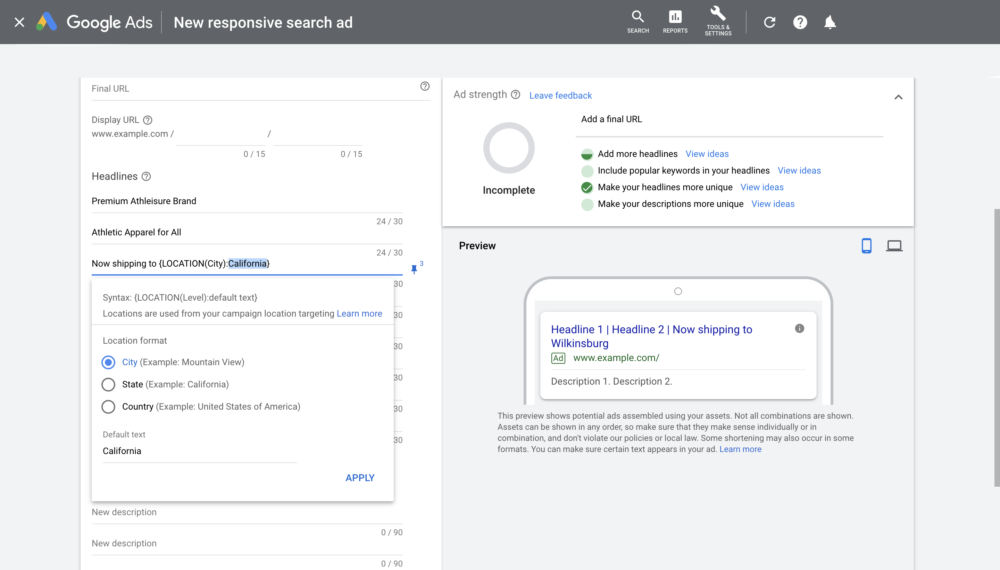
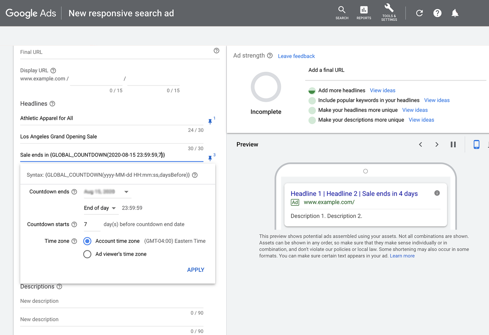
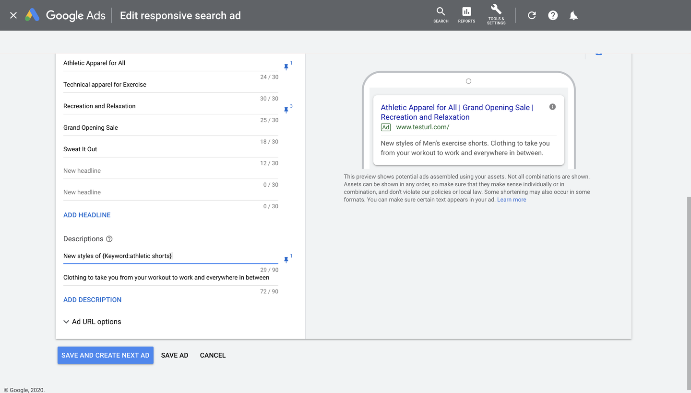

# Aumenta la relevancia usando creatividades personalizadas

Es posible que llegues al público apropiado, pero, si tu mensaje no genera un impacto en él, las personas podrían no realizar la acción deseada. Crear tus anuncios de búsqueda es el primer paso para conectarte con tu público. El siguiente es mejorar aún más la relevancia y el impacto de tus anuncios usando las herramientas de personalización de creatividades y las funciones de aprendizaje automático.

En este módulo, aprenderás a aplicar la personalización de creatividades a tu campaña de Búsqueda.

## ¿Por qué es importante la optimización de creatividades?
Crear textos personalizados y relevantes para tus anuncios de búsqueda es fundamental si quieres conectarte con tu público y motivarlo a realizar acciones que conduzcan al logro de tus objetivos. Los expertos en marketing saben que la personalización puede contribuir de manera significativa a la rentabilidad comercial. Con esto en mente, ¿cómo puedes personalizar aún más tus anuncios de búsqueda para impulsar el crecimiento de tu empresa?

Además de implementar extensiones relevantes de anuncios de búsqueda y optimizar la calidad de tus anuncios de búsqueda responsivos (RSA) para publicar creatividades atractivas, hay algunas funciones avanzadas de personalización disponibles en Google Ads que exploraremos en este curso.

### Personalizadores de anuncios de búsqueda responsivos
Los personalizadores de anuncios te permiten agregar información en tiempo real a tu anuncio para adaptar tu mensaje a gran escala. Personaliza tu anuncio con un título o descripción personalizados para mostrarle una versión relevante a cada cliente potencial.

Actualmente, hay dos personalizadores de anuncios de búsqueda responsivos disponibles: la inserción de ubicación y los personalizadores de cuenta regresiva.

### Inserción de ubicación
Con la inserción de ubicación, puedes adaptar el texto de tus anuncios de búsqueda responsivos a la ubicación del usuario o a una en la que este demuestre interés. Esta función permite destacar la ubicación en el título o la descripción del anuncio mencionando la ciudad, el estado o el país. Las ubicaciones disponibles se seleccionan según la configuración de segmentación geográfica de la campaña.

### Configura la inserción de ubicación
Bárbara es la directora de marketing de rendimiento de una marca de indumentaria para deportes y tiempo libre que vende productos a través de tiendas minoristas y un sitio web lanzado recientemente. Bárbara y su equipo están enfocados en aumentar los ingresos por ventas en su tienda en línea tanto como sea posible, mientras garantizan un retorno proveniente de su inversión publicitaria.

La marca ha tenido mucho éxito en la generación de ventas valiosas en la Búsqueda de Google, y el equipo de liderazgo quiere continuar la expansión. Hace poco, lanzó una campaña con el propósito de destacar su expansión en California y su nueva capacidad para enviar productos a esa región. 

La campaña se enfoca en todo el estado de California, pero Bárbara y su equipo quieren personalizar el texto de su anuncio para adaptarlo a la ubicación específica de cada usuario. Con la inserción de ubicación, pueden personalizar el título según la ubicación de su público para mejorar la relevancia, la participación y la acción.

Para comenzar, te recomendamos configurar un anuncio de búsqueda responsivo. Puedes adaptar tus títulos y descripciones con la inserción de ubicación cuando crees el anuncio nuevo o agregar el personalizador cuando edites un anuncio existente. Necesitarás al menos tres títulos sin inserción de ubicación o puedes usar texto predeterminado.

> **Sugerencia**: Asegúrate de que la segmentación geográfica de tu campaña esté configurada en el alcance correcto para tu empresa y que el nivel establecido en la inserción de ubicación sea adecuado según la segmentación geográfica de la campaña.

### Personalizadores de cuenta regresiva
Agrega una cuenta regresiva al texto de tu anuncio para informarles a los clientes potenciales sobre ofertas o eventos especiales. Los personalizadores de cuenta regresiva muestran la cuenta por día, después por hora y, finalmente, por minuto.

### Configura el personalizador de cuenta regresiva
Con su expansión a la costa oeste, Bárbara quiere destacar la gran apertura de una tienda nueva en Los Ángeles. Con el objetivo de generar expectativa y motivación entre los consumidores, quiere configurar un personalizador de cuenta regresiva para destacar cuánto tiempo falta para la rebaja de la gran inauguración. Veamos cómo lo hacen Bárbara y su equipo.

- Paso 1: **Configura un anuncio de búsqueda responsivo**
    - Comienza por configurar un anuncio de búsqueda responsivo (también puedes editar un anuncio existente).
- Paso 2: **Agrega el personalizador de cuenta regresiva**
    - Coloca la hora de finalización de la rebaja entre llaves y selecciona Cuenta regresiva (Countdown) en el menú desplegable.
    - En la sección La cuenta regresiva finaliza (Countdown ends), ingresa la fecha y hora en la que quieres que finalice la cuenta regresiva.
    - En la sección La cuenta regresiva comienza (Countdown starts), ingresa cuantos días antes de la fecha de finalización quieres que comience la cuenta regresiva. Si esta sección se deja en blanco, la cuenta regresiva comenzará cinco días antes de la fecha de finalización.
- Paso 3: **Establece la zona horaria**
    - Selecciona una zona horaria. La Zona horaria de la cuenta (Account time zone) realiza una cuenta regresiva hasta la hora de finalización en la zona horaria de tu cuenta. 
    - Esta es una buena opción para un evento que se realiza en una ubicación específica. La Zona horaria del usuario que ve el anuncio (Ad viewer's time zone) realiza una cuenta regresiva hasta la hora de finalización en la zona horaria del usuario. 
    - Esta es una buena opción para un evento que no se realizará en un lugar geográfico específico, como una venta en línea.
- Paso 4: **Agrega texto y guárdalo** 
    - Agrega cualquier texto relevante antes o después de tu personalizador de cuenta regresiva y selecciona `GUARDAR ANUNCIO`. Podrás ver una vista previa del personalizador de cuenta regresiva en la sección de vista previa del anuncio.

> **Recordatorio**: Puedes agregar un personalizador de cuenta regresiva por anuncio en los campos de título o descripción. También necesitarás al menos tres títulos sin personalizadores de anuncios para que se cree el anuncio.

## Inserción de palabras clave
Con la inserción de palabras clave, puedes actualizar de forma dinámica el texto del anuncio con la palabra clave que activó su aparición. Solo necesitas agregar un fragmento de código al texto de tu anuncio. Así, cada vez que se muestre un anuncio, reemplazaremos automáticamente el código por la palabra clave que lo activó, lo que mejorará la relevancia y utilidad del texto para generar acciones.

A Bárbara le interesa hacer que el texto de su anuncio sea tan relevante como sea posible para cada usuario, por lo que ahora experimenta con la inserción de palabras clave. Ella y su equipo publicarán una campaña con inserción de palabras clave con el fin de promocionar su nueva línea de pantalones cortos deportivos para hombres. Esta línea incluye pantalones cortos para correr, entrenar y practicar yoga y senderismo, y las palabras clave en los grupos de anuncios respectivos se alinean con estos productos.

Por ejemplo, supongamos que la búsqueda de un cliente potencial es “pantalones cortos azules para correr”. Con la inserción de palabras clave, el anuncio de Bárbara puede adaptarse para publicar un título o una descripción que incluya esos términos. Sin embargo, si otro usuario busca “pantalones cortos azules para yoga”, el anuncio de búsqueda de Bárbara podría publicarse con un texto que incluya “pantalones cortos azules para yoga”. En caso de que la palabra clave no se pueda reemplazar, Bárbara podrá usar texto predeterminado y configurar el anuncio para que se publique con el texto más general “pantalones cortos deportivos”.

### Configura la inserción de palabras clave

- Paso 1: **Configura un anuncio de búsqueda responsivo**
    - Comienza por configurar un anuncio de búsqueda responsivo (también puedes editar un anuncio existente).
- Paso 2: **Agrega la inserción de palabras clave**
    - Coloca el texto del anuncio entre llaves y selecciona Inserción de palabras clave en el menú desplegable.
- Paso 3: **Ingresa tus palabras clave**
    - En la sección Texto predeterminado, ingresa las palabras que quieres que aparezcan cuando el texto no se puede reemplazar por una palabra clave (p. ej., pantalones cortos deportivos).
- Paso 4: **Elige el formato que deseas para tus palabras clave**
    - Elige entre mayúsculas de título, mayúsculas de oración o minúsculas. 
        - Con las mayúsculas de título, la primera letra de todas las palabras clave se colocará en mayúscula (p. ej., Pantalones Cortos para Correr). 
        - Con las mayúsculas de oración, solo la primera letra de la primera palabra clave se colocará en mayúscula (Pantalones cortos para correr). 
        - Con las minúsculas, no se colocará ninguna letra en mayúscula (pantalones cortos para correr).
- Paso 5: **Agrega texto y guárdalo**
    - Agrega cualquier texto relevante antes o después de la sección Inserción de palabras clave. Selecciona `GUARDAR`.

## Conclusiones clave

- Los personalizadores de anuncios como la inserción de ubicación y los personalizadores de cuenta regresiva permiten que agregues información en tiempo real a los anuncios de búsqueda responsivos y que personalices tu mensaje a gran escala.
- La inserción de palabras clave te permite actualizar de forma dinámica tu anuncio de texto con la palabra clave que activó su aparición, lo que mejora aún más la relevancia del anuncio.
- Con la personalización de anuncios, puedes mostrarles a los usuarios que tienes lo que buscan, lo cual incrementa las probabilidades de generar conversiones.