# Explora las estrategias de oferta en las campañas de Búsqueda

Millones de personas recurren a la Búsqueda de Google todos los días. ¿Cómo puedes saber cuáles de esas búsquedas generarán los clientes de mayor valor para tu empresa? Optimizar tus estrategias de Ofertas inteligentes puede ser útil, ya que estas soluciones combinan indicadores con el fin de establecer ofertas precisas para cada subasta.

En este módulo, aprenderás a aplicar las prácticas recomendadas de la optimización de ofertas para cumplir tus objetivos de marketing con Google Ads.

## ¿Por qué es importante la optimización de ofertas?
Las soluciones de Ofertas inteligentes de Google usan tecnología avanzada de aprendizaje automático a fin de establecer ofertas precisas para cada subasta y propiciar el crecimiento. Aplicar prácticas recomendadas a la estrategia de Ofertas inteligentes de tu campaña puede ayudarte a alcanzar tus objetivos comerciales y de marketing.

A medida que creas y administras tus campañas, es importante que revises continuamente los objetivos y presupuestos para asegurarte de que coinciden con tus objetivos de marketing. Hay muchas herramientas, como el informe de estrategia de oferta y los simuladores, que brindan orientación sobre cómo optimizar tu estrategia en función de tus objetivos.

### La tarea de Gonzalo
Gonzalo es un estratega de agencias que se enfoca en aumentar los clientes potenciales para su cliente, una startup de software que ayuda a emprendedores a administrar su base de clientes. La startup obtiene negocios nuevos de clientes que refieren clientes potenciales en su sitio web.

Él ha estado trabajando con Lucas, el director de Marketing de la empresa. Hace poco, Lucas decidió adaptar un poco su estrategia de marketing. Aunque el objetivo de la empresa sigue siendo el mismo, es decir, aumentar los clientes potenciales a través del sitio web, ahora quiere obtener más resultados con sus campañas de Búsqueda. Lucas quiere supervisar su costo por cliente potencial y optimizar sus campañas para aumentar las conversiones con un CPA similar.

Gonzalo debe identificar el CPA actual de su cliente para mantener el rendimiento de sus campañas enfocado en ese objetivo y deberá conservar ese CPA, a la vez que aumenta el volumen con el paso del tiempo.

### Identifica las métricas de rendimiento de la campaña
Según tus objetivos, cada campaña que creaste puede tener métricas de rendimiento diferentes que se pueden revisar en la interfaz de Google Ads. Aquí te mostramos cómo encontrar esas métricas.

- Paso 1
    - En el menú de la izquierda, selecciona Campañas (Campaigns).
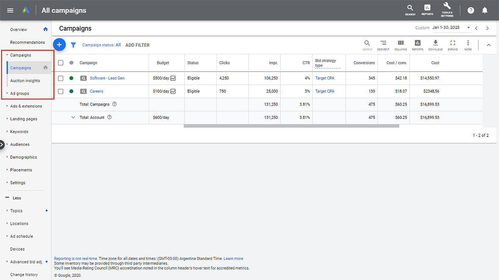

- Paso 2
    - En el menú que está arriba de la tabla, selecciona el ícono COLUMNAS (COLUMNS) y, luego, elige Modificar columnas (Modify columns).
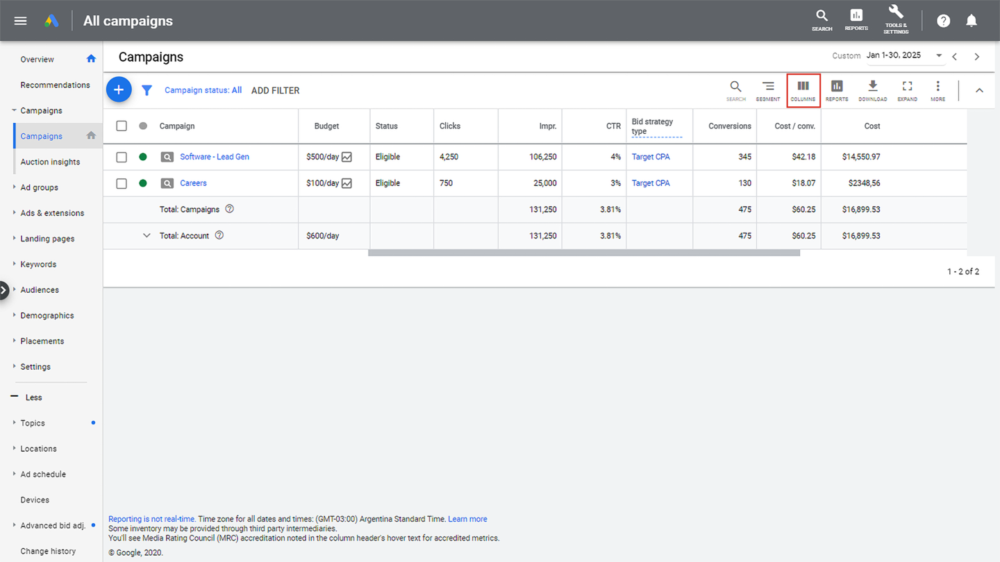

- Paso 3
    - Selecciona el menú desplegable Conversiones (Conversions) y elige las opciones de columna que reflejen tus objetivos.

- Paso 4
    - Selecciona `APLICAR` (APPLY).
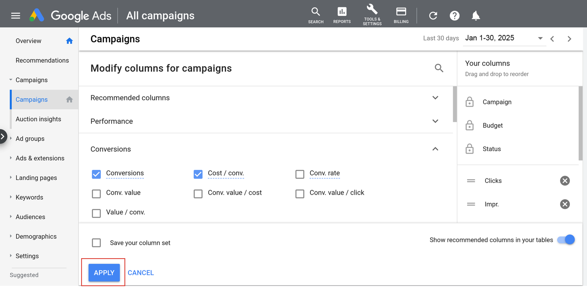

### Nota
> Consulta la página Recomendaciones a fin de identificar campañas adicionales que serían opciones ideales para las Ofertas inteligentes y para configurar objetivos y presupuestos óptimos. En el caso de las campañas que no usan Ofertas inteligentes, revisa las recomendaciones en cuanto a cuál estrategia de Ofertas inteligentes usar y qué objetivo configurar en función de tu historial de rendimiento. 

> En algunos casos, es posible que en las recomendaciones también se muestre el impacto o la mejora de la aplicación de una estrategia de Ofertas inteligentes. Para las campañas que ya usan Ofertas inteligentes, también puedes ver las recomendaciones de qué cambios deben hacerse en los objetivos o presupuestos, además de los efectos previstos.

## Configura el informe de estrategia de oferta
El informe de estrategia de oferta es una herramienta importante para entender el rendimiento de tus estrategias de Ofertas inteligentes. Este incluye métricas adaptadas para mostrar lo que resulta más relevante para cada tipo de estrategia de oferta, al igual que otros datos importantes, como el estado de tu estrategia de oferta, los simuladores de objetivos y presupuestos, el CPA objetivo promedio, el ROAS objetivo promedio, la demora en las conversiones y los indicadores principales.

- Paso 1
    - En el menú de la izquierda, selecciona Campañas (Campaigns).

- Paso 2
    - En la columna Tipo de estrategia de oferta (Bid strategy type), selecciona una estrategia para abrir el informe de estrategia de oferta.
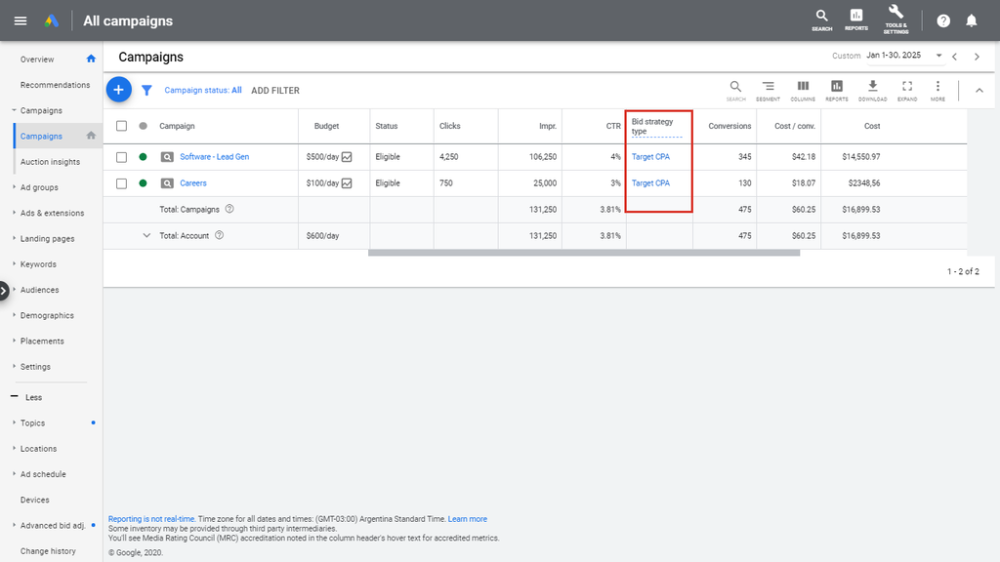

- Paso 3
    - Revisa las métricas de rendimiento en la tarjeta Historial de rendimiento (Performance history). 
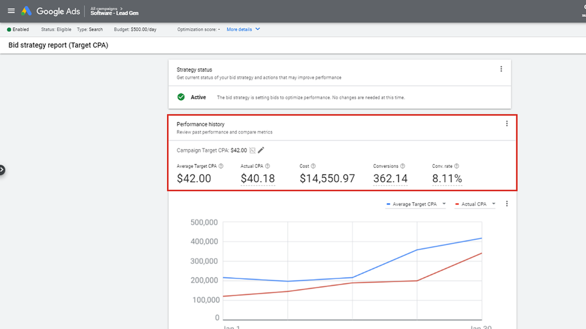

- Paso 4
    - Coloca el cursor sobre Conversiones (Conversions) en la tarjeta Historial de rendimiento (Performance history) a fin de ver las estadísticas relacionadas con las estimaciones de conversiones para un período específico.
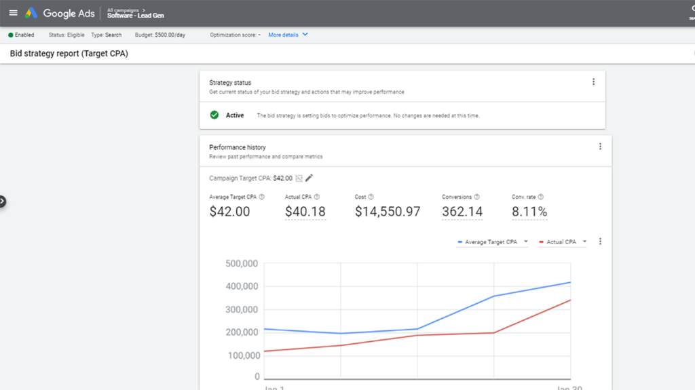

## Tarjeta de indicadores principales

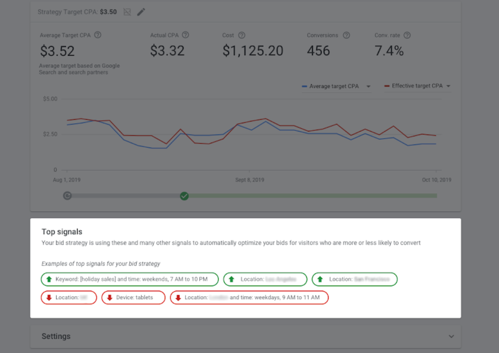

Es posible que veas una tarjeta de indicadores principales en tu informe de estrategia de oferta. En ella, se destacan algunas de las dimensiones en las que la estrategia de oferta optimiza automáticamente las ofertas para los visitantes que tienen más o menos probabilidades de generar conversiones. Los indicadores principales pueden incluir (pero sin limitarse a ello) tipo de dispositivo, ubicación, día de la semana, hora del día, palabras clave y públicos.

## Configura el simulador de objetivos de las Ofertas inteligentes
Los simuladores de objetivos y presupuestos de las Ofertas inteligentes te muestran de qué manera diferentes configuraciones pueden cambiar el rendimiento de tus anuncios. Estas herramientas te ayudan a entender lo que ocurrirá si cambias tus objetivos o presupuestos.

- Paso 1
    - En el menú de la izquierda, selecciona Campañas (Campaigns).

- Paso 2
    - Identifica la campaña que te gustaría simular y ubica la columna Presupuesto (Budget). Elige el ícono del simulador. También se puede acceder a los simuladores en el informe de estrategia de oferta.
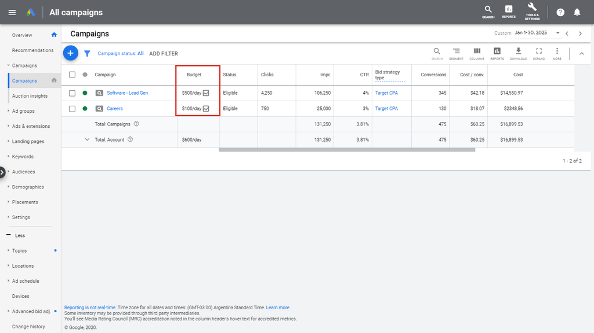

- Paso 3
    - Revisa la tabla y el gráfico de la sección Simulador de CPA objetivo de la campaña (Campaign Target CPA simulator) para ver cómo configurar diferentes objetivos o presupuestos puede influir en los KPI clave, así como en los clics y el costo. En la tabla, también se modelan diferentes situaciones de presupuesto que pueden ayudar a descubrir más oportunidades para una campaña.
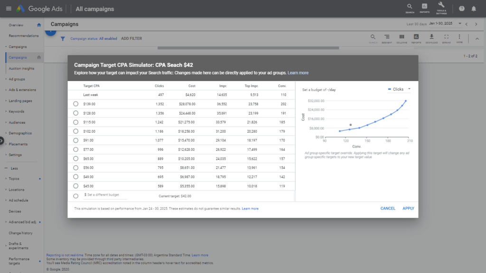

- Paso 4
    - Elige un objetivo nuevo en la tabla. Selecciona `APLICAR` (APPLY).
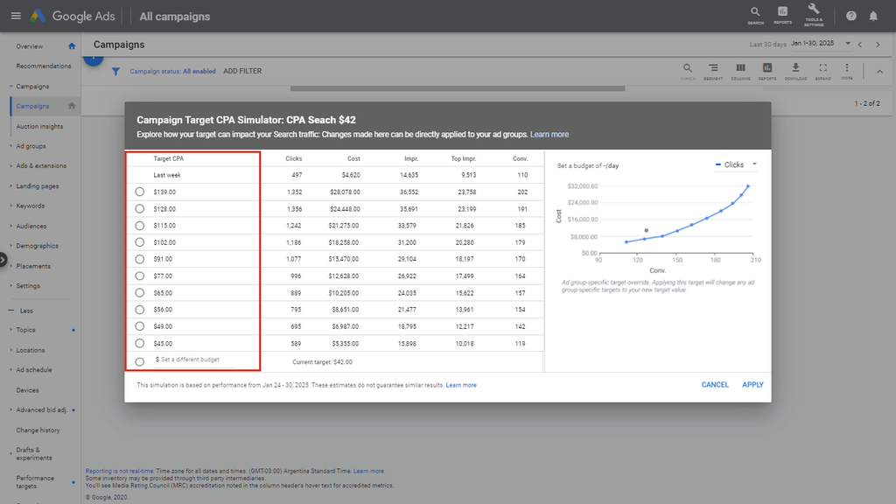

## Desarrolla campañas con las Ofertas inteligentes
Después de implementar una estrategia de Ofertas inteligentes y darles tiempo a las campañas para estabilizarse y generar conversiones y valor de conversión, te recomendamos que expandas tus campañas para que capten más clientes. Aquí te presentamos dos formas de hacerlo.

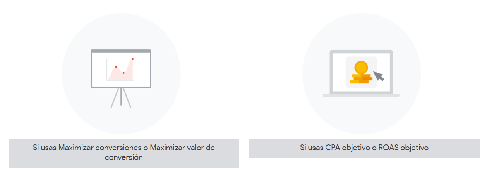

- Si usas **Maximizar conversiones** o **Maximizar valor de conversión**
    - Si usas Maximizar conversiones, enfócate en el volumen de conversiones.
    - Si usas Maximizar valor de conversión, enfócate en el valor de conversión.
    - Si usas Maximizar conversiones o Maximizar valor de conversión, asegúrate de contar con inventario disponible adicional en tu campaña. Esto le da espacio al algoritmo para incrementar el volumen o el valor. Agrega nuevas palabras clave, usa los tipos de concordancia amplia, crea anuncios dinámicos de búsqueda y agrega listas de públicos propios con el fin de ampliar tu segmentación.
    - Una vez que ajustes tu estrategia de oferta, accede a la página Recomendaciones para ver cómo las inversiones adicionales podrían incrementar el valor o volumen de tus conversiones con una tarifa más eficiente.
- Si usas **CPA objetivo** o **ROAS objetivo**
    - Si usas el CPA objetivo, enfócate en el costo por acción.
    - Si usas el ROAS objetivo, enfócate en el retorno de la inversión publicitaria.
    - Si la campaña tiene un presupuesto limitado, revisa la página Recomendaciones para ver oportunidades que te permitirán obtener conversiones o valor de conversión adicionales con un CPA o ROAS similares.
    - Si la campaña no tiene un presupuesto limitado, aumenta tu CPA objetivo o reduce tu ROAS objetivo para captar más conversiones o valores de conversión. También puedes agregar nuevas palabras clave, usar tipos de concordancia amplia, crear anuncios dinámicos de búsqueda y agregar listas de públicos propios con el fin de ampliar tu cobertura y segmentación.

## Prácticas recomendadas
Recuerda tener en mente las siguientes prácticas recomendadas cuando supervises y optimices el rendimiento de tu estrategia de Ofertas inteligentes.
- **Alinea tu estrategia de ofertas inteligentes con tus objetivos de marketing**
    - Usa la estrategia de ofertas automáticas que se alinee mejor con el objetivo de tu campaña.
- **Ajusta tu objetivo para captar más volumen**
    - Si una campaña no tiene presupuesto limitado, flexibiliza el objetivo de tu estrategia de ofertas automáticas para obtener más conversiones o mayor valor de conversión. Esto significa que debes aumentar el CPA objetivo o reducir el ROAS objetivo.
- **Evita presupuestos limitados**
    - Si una campaña tiene un presupuesto limitado mientras se usa el CPA objetivo o el ROAS objetivo, la estrategia de oferta no puede alcanzar la meta de maximizar el volumen con el objetivo establecido. Puedes aumentar tu presupuesto para obtener conversiones o valor de conversión adicionales con mismo CPA o ROAS. Si estableciste objetivos de presupuesto, usa Maximizar conversiones o Maximizar valor de conversión para realizar optimizaciones sin exceder el presupuesto establecido.
    - Revisa la página Recomendaciones y tu nivel de optimización para obtener sugerencias de presupuesto.
- **Considera la demora de las conversiones:**
    - La mayoría de los clics no genera conversiones inmediatas. 
    - Asegúrate de conocer tu lapso de tiempo estándar para generar conversiones (el tiempo promedio que tarda un clic en producir una conversión) y tenlo en cuenta en el período de espera a fin de garantizar que mides el rendimiento de las conversiones con precisión. 
    - En el caso de las campañas de Búsqueda, puedes usar el informe de demora en las conversiones incluido en el informe de estrategia de oferta. Esto también toma en cuenta las demoras en los informes si registras conversiones sin conexión.

## Conclusiones clave

- El informe de estrategia de oferta permite identificar tendencias de rendimiento en tu estrategia de Ofertas inteligentes, así como descubrir oportunidades para mejorar el rendimiento en función de tus objetivos de marketing.
- Los simuladores de las Ofertas inteligentes proporcionan estadísticas respecto de cómo ajustar el objetivo de tu estrategia de Ofertas inteligentes o tu nivel de presupuesto puede generar nuevas conversiones o valor en tu campaña.
- Sigue las prácticas recomendadas para las Ofertas inteligentes a fin de obtener resultados óptimos con tu campaña.