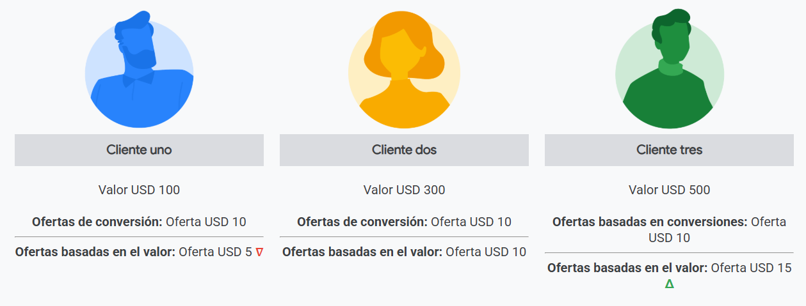
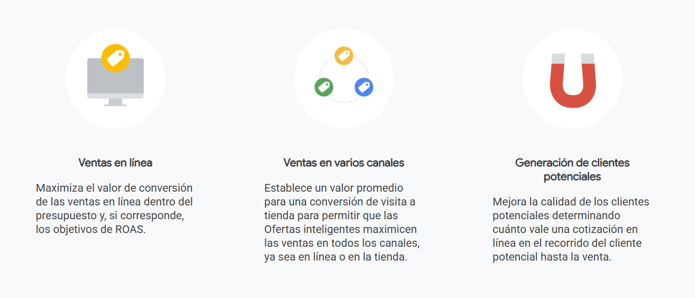
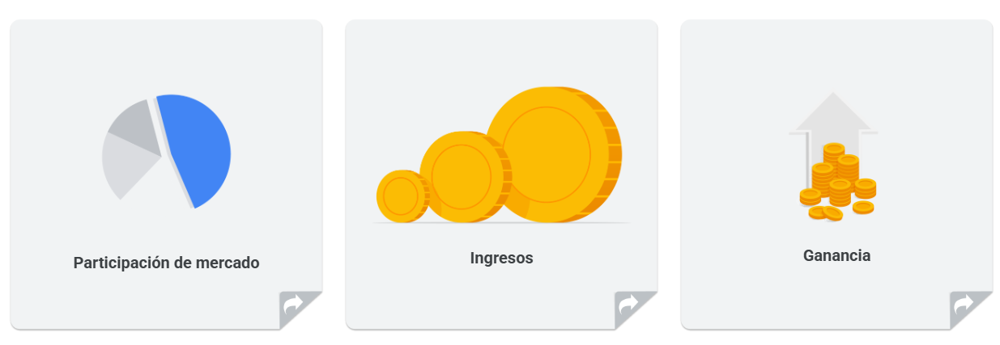
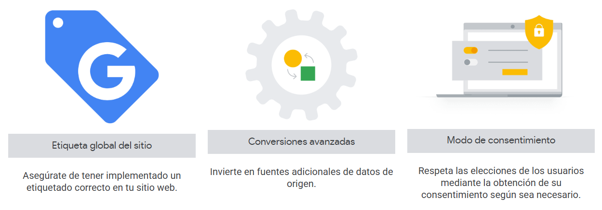

# Comprende cómo funcionan las ofertas basadas en el valor

Un objetivo comercial basado en el valor o en el retorno de la inversión puede ayudar a impulsar el crecimiento de tu empresa, aunque también es posible que necesites mucho tiempo para administrarlo. Con las soluciones de Ofertas inteligentes de Google, puedes invertir de forma más eficiente el tiempo que dedicas a la administración de las campañas.

Al final de este módulo, podrás usar una estrategia de ofertas enfocada en el valor para conseguir más de tus campañas de Búsqueda.

## Ofertas basadas en el valor en Búsqueda
La IA aprende de tu trabajo y tú aprendes de ella. Cuanto mejores sean los datos que le proporciones a la IA de Google para que trabaje, mejores resultados podrá obtener. Esto puede representar una ventaja competitiva para tu estrategia de anuncios en línea.

## Usa el aprendizaje automático para obtener un mayor valor de conversión
Las ofertas basadas en el valor son una estrategia de Ofertas inteligentes que usan aprendizaje automático para Maximizar valor de conversión, con ofertas para conversiones que logren los objetivos comerciales. Usa miles de millones de combinaciones de indicadores para predecir el valor de conversión, lo que te permite calificar mejor las conversiones que genera el presupuesto de tu campaña.

Las ofertas basadas en el valor te permiten ofertar por valores estáticos o dinámicos que son importantes para tu negocio. Los ejemplos de valores dinámicos incluyen datos de nivel de conversión propios, como ganancias, puntuaciones de probabilidad y valor previsto del ciclo de vida del cliente.

## ¿Por qué deberías ofertar en función del valor?
No todos los clientes aportan el mismo valor a tu empresa. Algunas conversiones no son tan importantes para tus objetivos comerciales, pero otras tienen un valor mayor, por lo que es necesario generar los informes y realizar las optimizaciones que correspondan. Las ofertas basadas en el valor pueden ayudar a maximizar el valor de conversión general.

## La importancia de las ofertas basadas en el valor
Las ofertas basadas en el valor aportan valores a las Ofertas inteligentes, lo que maximiza el valor de conversión y el retorno de la inversión (ROI). Ayuda a aumentar el valor del consumidor y el retorno de la inversión de forma significativa. En promedio, los anunciantes que cambian su estrategia de ofertas de un costo por adquisición (CPA) objetivo a un retorno de la inversión publicitaria (ROAS) objetivo obtienen un 14% más de valor de conversión con un retorno de la inversión publicitaria similar.

- **Diferencia a tus consumidores...**
    - Los anunciantes diferencian el valor de sus consumidores, pero no suelen compartir esta información con la optimización de Google.
- **... aumentará el rendimiento**
    - Compartir datos sobre el valor de los consumidores permite realizar ofertas basadas en el valor, y las ofertas dirigidas a los consumidores más valiosos ayudan a aumentar los ingresos y la rentabilidad de los anunciantes.

## ¿Cómo funcionan las ofertas basadas en el valor?
Las ofertas basadas en el valor funcionan en todos los modelos de negocio y también te permiten conocer mejor a los consumidores. Habilitar valores para las conversiones también te proporciona mejores estadísticas en relación con las actividades de marketing que llevas a cabo en Google.

- **Las ofertas basadas en el valor te permiten captar a los consumidores más importantes**
    - Algunas conversiones no son tan importantes para tus objetivos comerciales, pero otras tienen un valor mayor, por lo que es necesario generar los informes y realizar las optimizaciones que correspondan. 
    - Cuando agregas valor a una estrategia de publicidad, no te centras solo en los costos de adquisición de los clientes (o clientes potenciales), sino que te enfocas en aumentar el retorno monetario (valor) de tu cuenta. 
    - Las ofertas basadas en el valor te permiten captar a los consumidores más importantes y generar el mayor valor monetario para tu empresa.
- **Las ofertas basadas en el valor son adecuadas para un futuro centrado en la privacidad**
    - Las ofertas basadas en el valor se han vuelto cada vez más importantes y relevantes a medida que la industria continúa evolucionando a la luz de las reglamentaciones, las actualizaciones de los navegadores y las inquietudes sobre la privacidad del usuario. Este tipo de solución se adapta bien a un futuro centrado en la privacidad porque aprovecha los datos de origen y la automatización.
- **Las ofertas basadas en el valor permiten una optimización precisa y efectiva**
    - Las funciones de ofertas de valor te permiten importar datos de origen que puedes usar para una optimización más precisa y significativa hacia los objetivos de marketing de tus clientes.

## Las ofertas de valor ayudan a cumplir los objetivos comerciales más comunes con ofertas eficaces
A medida que la publicidad en línea se vuelve más automatizada, los KPIs que quieres que los algoritmos de aprendizaje automático optimicen y los datos que compartes con estos algoritmos se convertirán en una de las ventajas competitivas más importantes en tu estrategia de anuncios en línea.

- **Participación de mercado**
    - Aumenta el porcentaje de participación de mercado en una industria o producto y servicio determinados.
- **Ingresos**
    - Aumenta la cantidad de dinero que la empresa aporta.
- **Ganancia**
    - Consiste en aumentar la cantidad de dinero que retiene la empresa luego de restar los costos.

## Prácticas recomendadas para implementar ofertas basadas en el valor en la Búsqueda
Según tu modelo de negocio, elige distintas opciones para implementar de mejor manera las ofertas basadas en el valor.

 Para obtener las mejores sugerencias para implementar y optimizar estrategias de Ofertas inteligentes basadas en el valor en la Búsqueda para que puedas alcanzar con éxito tus objetivos comerciales.
- Oferta por lo que realmente importa
- Alinea la configuración de la estrategia de ofertas con tus objetivos
- Optiscore y recomendaciones
- Analiza la performance
- Optimiza

## La medición de conversiones impulsa el rendimiento digital
En este ecosistema digital en evolución, es importante contar con una medición de conversiones óptima para promover el rendimiento digital. Puedes empezar a realizar el seguimiento de las acciones de conversión, pasar a soluciones de medición más avanzadas, como la atribución, y, luego, optar por la automatización y optimización con Ofertas inteligentes.

## Empieza a ofertar como un profesional: framework de ofertas basadas en el valor
La medición centrada en el valor (VCM) es un marco de trabajo que se usa para ayudar a los especialistas en marketing a definir valores de conversión y, luego, importarlos a Google. La VCM es el primer paso para habilitar las ofertas basadas en el valor y representa un cambio en la madurez, pasando del seguimiento básico a la calidad y el valor de las conversiones.

## ¿Qué es la medición centrada en el valor (VCM)?
Las ofertas basadas en el valor dependen de la VCM, que representa los pasos previos que permiten expresar el valor a Google.

La VCM se divide en dos áreas:
- **Definición de valor**: ¿Cuál es el valor de la conversión? (probabilidad, LTV, puntuación de clientes potenciales, etcétera)
    - La definición de valor depende de la habilidad para captar o calcular el valor al momento de la conversión. Eso depende en gran medida del modelo de negocio y del momento o de cuándo se obtiene el valor. La definición se puede dividir en tres categorías:
        - **Real**: El valor se identifica al momento de la conversión (ingresos, valor sin conexión/en varios canales, ganancias).
        - **Proxy**: Se entiende un valor general en el momento de la conversión (puntuación de clientes potenciales).
        - **Predictivo**: Se calcula un valor previsto al momento de la conversión según los indicadores captados (probabilidad, subsistencia/deserción, valor del ciclo de vida del cliente).
    - Es posible que muchas marcas usen elementos de creatividades de anuncios que no consideren publicar en YouTube, ya que no se ajustan a una fórmula específica o a los estándares de lo que debería funcionar.
- **Transferencia de valores**: ¿Cómo se pueden integrar esos valores en los sistemas de Google? (OCI, interfaz de programación de aplicaciones de administración de contenido, etcétera)
    - Existen tres formas principales de transferir o integrar valor en los sistemas de Google.
        - **Etiqueta global del sitio**: Seguimiento de conversiones y activación de valor a través de la etiqueta del sitio web después de la actividad en línea (One Google Tag, Google Tag Manager, Google Analytics 4, conversiones avanzadas de clientes potenciales [ECL]).
        - **Importación**: las conversiones se pasan directamente a la plataforma mediante la importación (OCI, API de conversiones, ajuste de conversiones sin conexión, mejoras en las ventas en la tienda).
        - **Seguimiento de Google**: el seguimiento de los eventos de conversión se realiza en los sistemas de Google (visitas a tienda, EVC, medición de llamadas y acciones locales).

## Productos que habilitan el framework de ofertas basadas en el valor
Existen varios productos clave que se pueden habilitar en el recorrido del framework de las ofertas basadas en el valor.
- **Comparte mejores datos**
    - Adopta las soluciones de medición y privacidad correctas para hacer seguimientos de conversiones.
    - Opción de producto de Google
        - Etiqueta global del sitio
        - Importación de conversiones sin conexión
        - Conversiones avanzadas
        - Atribución basada en datos
        - Ajustes de conversión
- **Asignación de datos de valor**
    - Asigna valores de conversión a tu conversión para habilitar las ofertas basadas en el valor.
    - Opción de producto de Google
        - Valores de conversión dinámicos o estáticos.
- **Optimiza las ofertas**
    - Usa las ofertas a nivel de la subasta y Maximizar valor de conversión.
    - Opción de producto de Google
        - Maximizar valor de conversión
        - ROAS objetivo opcional
        - Regla de valor de conversión, etcétera

## Conclusiones clave

- Las ofertas basadas en el valor son una estrategia de Ofertas inteligentes que usan aprendizaje automático para Maximizar valor de conversión, con ofertas para conversiones que logren los objetivos comerciales.
- Las ofertas basadas en el valor te permiten ofertar por valores estáticos o dinámicos que son importantes para tu negocio.
- Las ofertas basadas en el valor dependen del marco de trabajo de medición centrada en el valor (VCM), que representa los pasos previos que permiten expresar el valor a Google.
- La VCM se divide en dos áreas: definición de valor y transferencia de valor.