# Crea estrategias de ofertas para anuncios de búsqueda

Si quieres generar ventas o clientes potenciales para tu empresa, puedes usar las Ofertas inteligentes y sus ofertas basadas en conversiones y así olvidarte de las conjeturas.

¿Buscas formas de aumentar el reconocimiento de la marca o la visibilidad de tus mensajes en la Búsqueda de Google? En vez de supervisar las métricas de impresiones de tu campaña y así optimizarlas manualmente, usa las Ofertas inteligentes y el Porcentaje de impresiones objetivo para realizar ofertas de forma sencilla y eficiente.

Al final de este módulo, tendrás las herramientas para usar las estrategias de ofertas mejor alineadas con tus objetivos de marketing.

## Identifica tu objetivo de marketing
Crear una estrategia de ofertas que se alinee con tus objetivos de marketing es un aspecto importante de la configuración de una campaña de Búsqueda de Google exitosa. A continuación, te presentamos distintas estrategias de ofertas que puedes usar según tus objetivos comerciales.
- Las **Ofertas inteligentes** proporcionan estrategias de ofertas basadas en las conversiones y en el valor
    - Objetivo comercial: **Aumentar las transacciones** o los clientes potenciales
        - Estrategia de ofertas: Maximizar conversiones
        - Cuándo se debe utilizar: Para obtener la mayor cantidad de conversiones posible sin exceder un presupuesto fijo.
    - Objetivo comercial: **Aumentar las ventas**, las ganancias o los clientes potenciales calificados
        - Estrategia de ofertas: Costo por acción (CPA) objetivo
        - Cuándo se debe utilizar: Para obtener la mayor cantidad de conversiones posible en el marco de un objetivo de costo por acción.
    - Objetivo comercial: **Aumentar la cantidad de visitantes del sitio web**
        - Estrategia de ofertas: Maximizar valor de conversión
        - Cuándo se debe utilizar: Para obtener la mayor cantidad de valor de conversión posible sin exceder un presupuesto fijo.
    - Objetivo comercial: **Aumentar o estabilizar el reconocimiento**
        - Estrategia de ofertas: Retorno de la inversión publicitaria (ROAS) objetivo
        - Cuándo se debe utilizar: Para obtener la mayor cantidad de valor de conversión posible en el marco de un objetivo de retorno de la inversión publicitaria objetivo.
- **Estrategias de ofertas basadas en el reconocimiento**
    - Objetivo comercial: **Clics o tráfico**
        - Estrategia de ofertas: Maximizar clics
        - Cuándo se debe utilizar: Para obtener la mayor cantidad de clics con tu presupuesto.
    - Objetivo comercial: **Reconocimiento o visibilidad**
        - Estrategia de ofertas: Porcentaje de impresiones objetivo.
        - Cuándo se debe utilizar: Para mostrar tu anuncio en la parte superior absoluta de la página, en la parte superior de la página o en cualquier parte de la página de resultados de la Búsqueda de Google.

## Configuración: Crea estrategias de ofertas de Ofertas inteligentes
Las ofertas Maximizar conversiones y ofertas Maximizar valor de conversión son estrategias de Ofertas inteligentes que utilizan la IA de Google para optimizar con el propósito de obtener más conversiones o un mayor valor de conversión en cada subasta. Una función denominada “ofertas durante la subasta” ajusta las ofertas automáticamente para ayudarte a establecer una conexión con el cliente correcto en el momento adecuado por medio de una optimización que busca obtener los mejores resultados posibles dentro de tu presupuesto.
- **ofertas Maximizar conversiones**
    - Las ofertas Maximizar conversiones (acciones de los clientes que generan conversiones de ventas o servicios) te ayudarán a optimizar para obtener más conversiones.
        - Tienes la opción de establecer un CPA objetivo en tu estrategia de ofertas Maximizar conversiones, lo que significa que las Ofertas inteligentes intentarán obtener la mayor cantidad posible de conversiones según el CPA objetivo que hayas establecido. Si no se establece la opción de CPA objetivo, Maximizar conversiones intenta invertir tu presupuesto para obtener la mayor cantidad de conversiones posible.
- **ofertas Maximizar valor de conversión**
    - Las ofertas Maximizar valor de conversión aún se aplicarán a cada conversión, pero el valor variará según el tipo de conversión (bajo impacto en comparación con alto impacto), y el costo no excederá el presupuesto que hayas especificado. Cuando crees una estrategia de ofertas Maximizar valor de conversión, establecerás un ROAS objetivo.
        - Cuando usas Maximizar valor de conversión sin establecer un ROAS objetivo, el presupuesto se invierte de manera tal que se maximice el valor de conversión para tus campañas.
        - Cuando utilizas Maximizar valor de conversión con un ROAS objetivo establecido, el objetivo es lograr el mayor valor de conversión posible con el ROAS objetivo. Deberás proporcionar valores de conversión específicos de la transacción.

## Crea una estrategia de Ofertas inteligentes de tipo Maximizar conversiones o Maximizar valor de conversión
Puedes crear estas estrategias de ofertas de las siguientes maneras:
- Crearlas con una campaña nueva.
- Crearlas en la página Estrategias de ofertas de la Biblioteca compartida.
- Crearlas o modificarlas desde la configuración de la campaña.

### Crea una campaña nueva
Para crear una campaña nueva, debes navegar a Campañas y seleccionar Campaña nueva. Selecciona el objetivo comercial, los objetivos de conversión y el tipo de campaña. Luego, selecciona las maneras en las que te gustaría alcanzar tu objetivo y ponle un nombre a la campaña nueva.

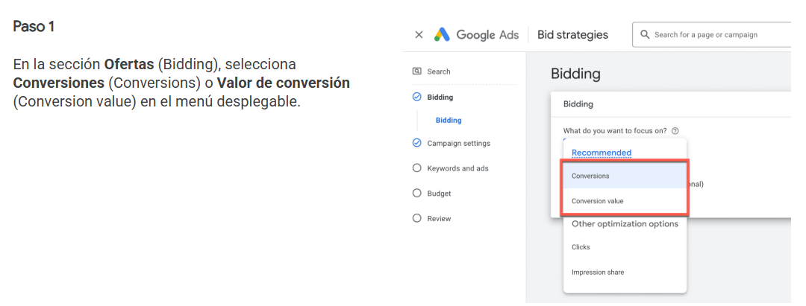

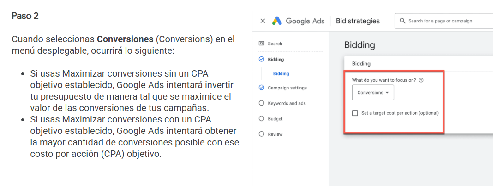

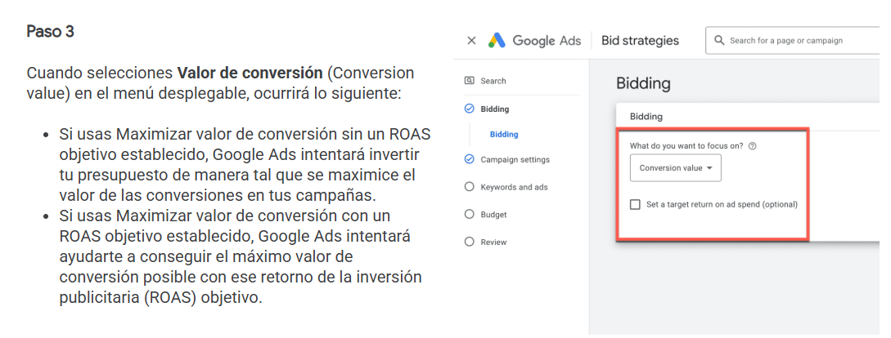

### Crea una estrategia de ofertas de cartera en la página Estrategias de ofertas de la Biblioteca compartida

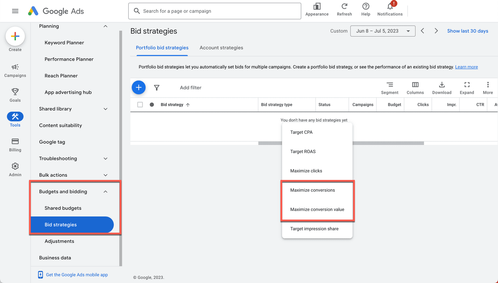

En tu cuenta de Google Ads, selecciona el ícono Herramientas (Tools). A continuación, haz clic en el menú desplegable Presupuestos y ofertas (Budgets and bidding) y selecciona Estrategias de ofertas (Bid strategies).

Selecciona el botón de signo MÁS y elige el tipo de estrategia de ofertas que quieres crear.
- Ingresa el nombre de tu nueva estrategia de ofertas de cartera.
- Selecciona las campañas que deseas incluir. También puedes agregar más campañas después de crear tu estrategia de ofertas de cartera.
- Ingresa la configuración de la estrategia de ofertas: Selecciona Guardar (Save).

### Crea o modifica una estrategia de ofertas o una estrategia de ofertas de cartera con campañas existentes
También puedes editar las estrategias de ofertas en campañas existentes.

- **Paso 1**: Para modificar la estrategia de ofertas de una campaña, selecciónala. En la sección Ofertas (Bidding), selecciona Cambiar la estrategia de ofertas (Change bid strategy).
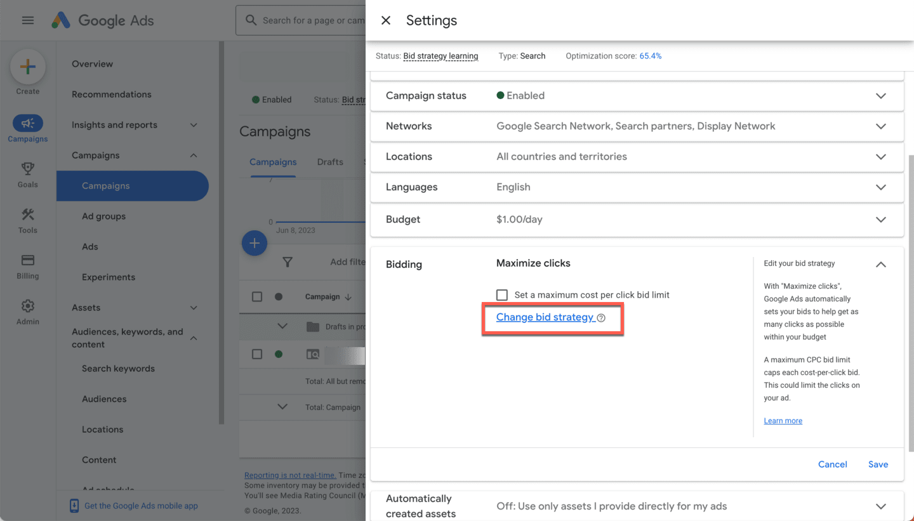

- **Paso 2**: Puedes modificar tu estrategia y seleccionar Guardar (Save).
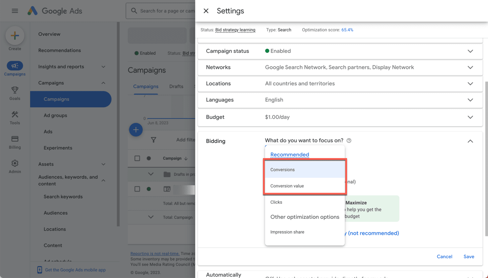

- **Paso 3**: Para cambiar tu estrategia de ofertas por una estrategia de cartera, selecciona la casilla de verificación junto a las campañas que desees incluir.
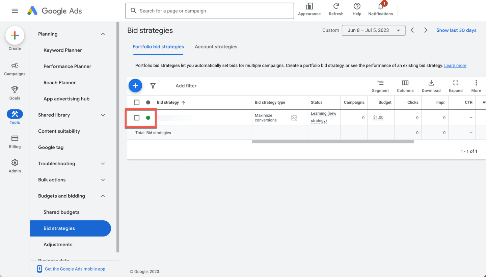

- **Paso 4**: En la pestaña Estrategias de ofertas (Bid Strategies), selecciona Editar (Edit) en la parte superior de la lista de estrategias.
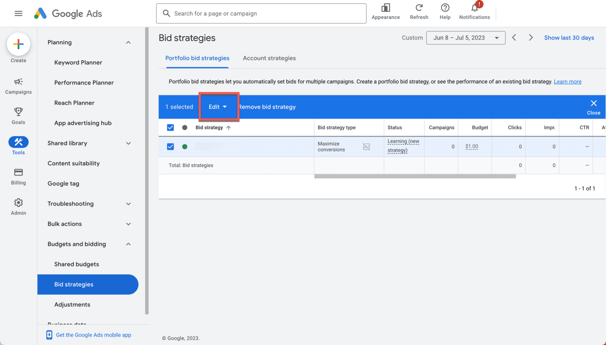

- **Paso 5**: Selecciona Cambiar el objetivo de la estrategia de ofertas (Change bid strategy target) en el menú desplegable.
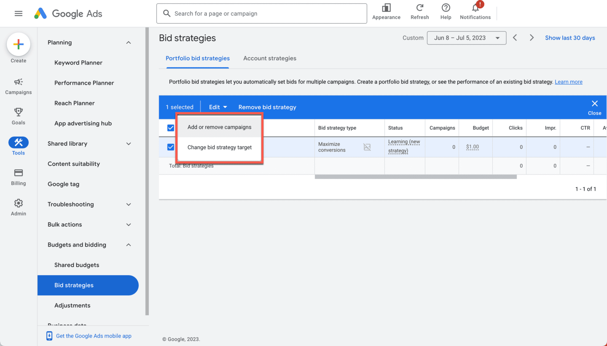

- **Paso 6**: Puedes optar por editar la estrategia de ofertas de la campaña. Selecciona Aplicar (Apply) cuando hayas terminado.
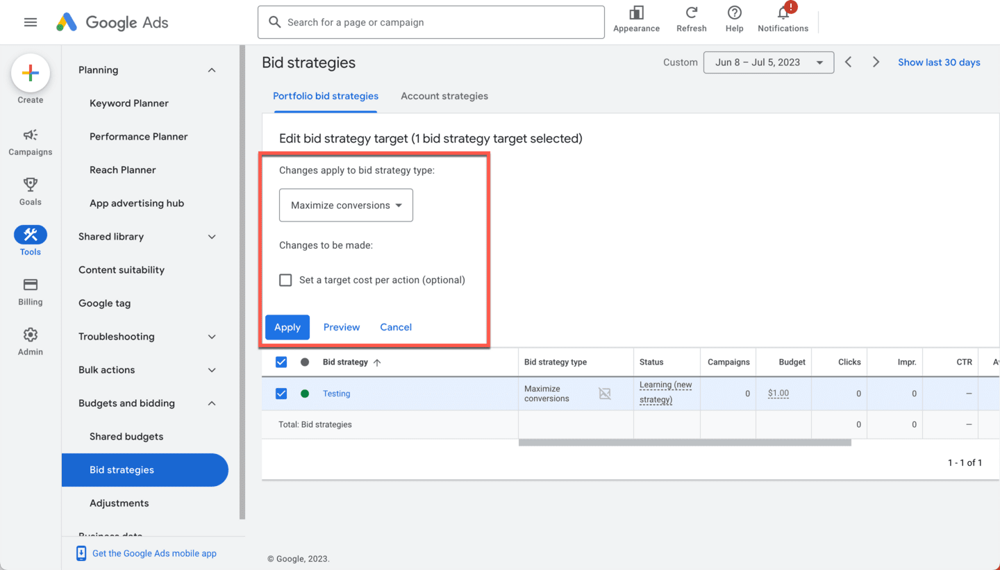

## Prácticas recomendadas
- Sugerencias para publicar una estrategia de ofertas enfocada en el valor.
    - **Obten más datos de conversiones**
        - Las campañas de Búsqueda deben acumular un mínimo de 15 conversiones durante los últimos 30 días antes de que actives una estrategia de ofertas ROAS objetivo, de manera que los algoritmos de aprendizaje automático tengan más datos para tomar decisiones fundamentadas sobre las ofertas.
    - **Ten una idea de cuánto estás inviertiendo con maximizar valor de conversión**
        - Maximizar valor de conversión tratará de invertir en su totalidad tu presupuesto diario para obtener la mayor cantidad de conversiones posible, por lo que, si actualmente inviertes mucho menos que tu presupuesto, es posible que observes un incremento significativo en la inversión. Además, deberías evaluar tus objetivos de retorno de la inversión (ROI) con el tiempo. Si tienes un objetivo de ROI para tu empresa, te recomendamos que consideres cambiarlo por un CPA objetivo.
    - **Espera un tiempo para que se realizen las optimizaciones**
        - Con las Ofertas inteligentes, es importante darles tiempo a las campañas para que se optimicen antes de que evalúes su rendimiento. También ten en cuenta la demora en las conversiones cuando evalúes el rendimiento reciente.
    - **Usa el informe de estrategia de ofertas**
        - Este informe te permite analizar el rendimiento de tu estrategia de ofertas respecto a métricas clave.
- Sugerencias para ejecutar una estrategia de ofertas basada en las conversiones de manera eficaz.
    - **No establezcas la estrategia de maximizar conversiones (con un objetivo de CPA) con un valor muy bajo**
        - La estrategia Maximizar conversiones (con un objetivo de CPA) que establezcas puede influir en el volumen de conversiones que obtengas. Por ejemplo, si tu objetivo es muy bajo, podrían generarse menos conversiones totales. Si tienes datos de conversiones históricos, Google Ads puede recomendar una estrategia Maximizar conversiones (con un objetivo de CPA) según el rendimiento reciente.
    - **Descubre cuánto estás inviertiendo con maximizar conversiones (sin un objetivo de CPA)**
        - Maximizar conversiones (sin un objetivo de CPA) tiene como propósito invertir todo tu presupuesto diario para obtener la mayor cantidad de conversiones posible. Si actualmente inviertes menos de lo que tienes presupuestado, podrías ver un aumento significativo en la inversión. Evalúa tus objetivos de retorno de la inversión (ROI) a lo largo del tiempo. Si tienes un objetivo de ROI para tu empresa, considera cambiar la estrategia por Maximizar conversiones (con un objetivo de CPA).
    - **Espera un tiempo para que se realizen las optimizaciones**
        - Cuando utilices las Ofertas inteligentes, dale tiempo a la campaña para que se optimice antes de evaluar su rendimiento. También ten en cuenta la demora en las conversiones cuando evalúes el rendimiento reciente.
    - **Usa el informe de estrategia de ofertas**
        - Este informe te permite analizar el rendimiento de tu estrategia de ofertas según métricas clave. 

> **Sugerencia sobre el nivel de optimización**: ¿Te gustaría saber cuáles de tus campañas serían adecuadas para estas estrategias? Consulta tu nivel de optimización en la página Recomendaciones para ver qué campañas podrían mejorar si adoptaras una estrategia de ofertas nueva.

## Aumenta el reconocimiento con el Porcentaje de impresiones objetivo
### ¿Por qué es importante la estrategia de ofertas Porcentaje de impresiones objetivo?
El Porcentaje de impresiones objetivo es una estrategia de ofertas automáticas que establece ofertas automáticamente para mostrar tu anuncio en una ubicación específica de la página de resultados de la Búsqueda de Google. Utiliza esta estrategia de ofertas para aumentar el reconocimiento de la marca y mostrar tus anuncios en la página de resultados por un período específico.

Hay tres opciones para la ubicación de los anuncios: en la parte superior absoluta de la página de los resultados de la Búsqueda de Google, en la parte superior de esta o en cualquier lugar de la página. Google Ads configura automáticamente tus ofertas según la posición que elijas.

Por ejemplo, si eliges un objetivo de porcentaje de impresiones del 70% en la parte superior absoluta de la página, Google Ads configura automáticamente tus ofertas de CPC para mostrar los anuncios en esa posición de la página el 70% del tiempo total.

### Configuración: Crea una estrategia de ofertas Porcentaje de impresiones objetivo
Sigue los pasos que aparecen a continuación para crear una estrategia de ofertas Porcentaje de impresiones objetivo en tus campañas de Búsqueda.

- **Paso 1**: Selecciona Campañas (Campaigns) y el ícono de signo MÁS para crear una Campaña nueva (New campaign). Cuando llegues a la sección Ofertas (Bidding) del proceso de creación de la campaña, selecciona Porcentaje de impresiones (Impression share) en el menú desplegable.
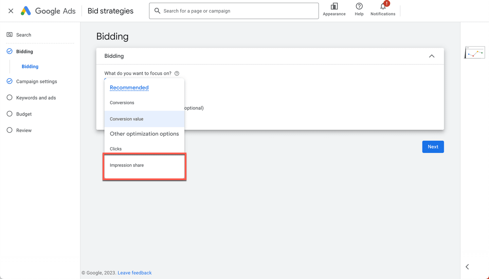

- **Paso 2**: Selecciona una de las tres opciones de segmentación disponibles en la página de resultados de búsqueda: En cualquier lugar (Anywhere), Parte superior de la página de resultados (Top of the results page) o Parte superior absoluta de la página (Absolute top of page). Asigna un objetivo de porcentaje de impresiones y un límite de oferta de CPC máximo; luego, selecciona Siguiente.

Sugerencia: Asegúrate de tener margen en tu presupuesto y establece un CPC máximo razonable para permitir que la estrategia tenga un rendimiento adecuado.
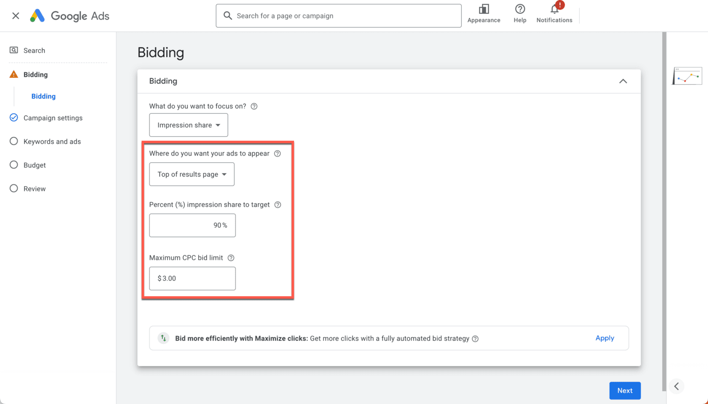

- **Paso 3**: Si deseas implementar una estrategia de ofertas Porcentaje de impresiones objetivo para la cartera de ofertas, navega a Herramientas (Tools) y selecciona Estrategias de ofertas (Bid Strategies).

Selecciona el ícono de signo MÁS para crear una nueva estrategia de ofertas de cartera y selecciona Porcentaje de impresiones objetivo (Target impression share).
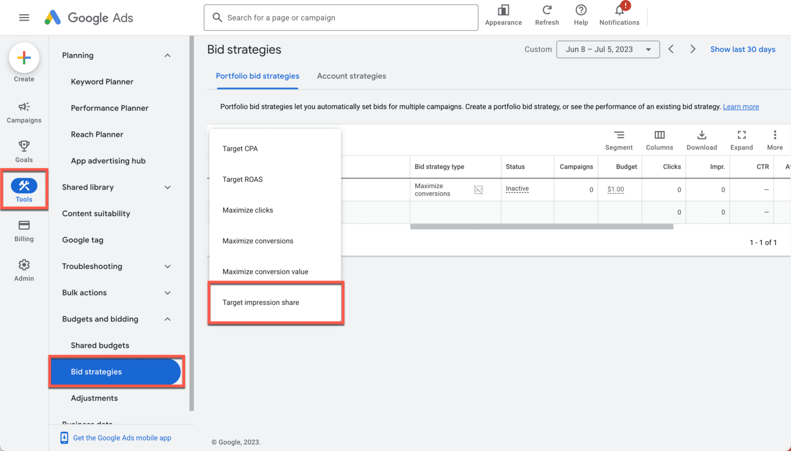

## Prácticas recomendadas
Aquí encontrarás algunas sugerencias para publicar tu estrategia de ofertas Porcentaje de impresiones objetivo.
- **Evita los límites de oferta restringidos**: Cuando configures tu estrategia de ofertas Porcentaje de impresiones objetivo, podrás establecer un límite máximo de costo por clic (CPC). Esta es la cantidad máxima que permites que Google Ads pague por cada clic. No establezcas un límite muy bajo para evitar que se restrinjan las ofertas que configura Google Ads, ya que podría impedir que logres tu objetivo de porcentaje de impresiones.
- **Comienza con el objetivo apropiado**: Cuando configures tu objetivo inicial de porcentaje de impresiones, asegúrate de que se alinee con el porcentaje de impresiones promedio de 30 días de tu campaña. Además, comprueba que tu campaña tenga suficiente presupuesto, ya que Google Ads no aumentará las ofertas de palabras clave en campañas con presupuestos limitados.
- **Espera un tiempo para que se realicen las optimizaciones**: Cuando utilices las ofertas automáticas, dale tiempo a la campaña para que se optimice antes de evaluar su rendimiento. También ten en cuenta la demora en las conversiones cuando evalúes el rendimiento reciente.
- **Usa el informe de estrategia de ofertas**: Este informe te permite analizar el rendimiento de tu estrategia de ofertas según métricas clave. En el caso de las campañas que usan el Porcentaje de impresiones objetivo, puedes ver si tu límite de CPC máximo es demasiado bajo, lo que impide que las campañas alcancen los objetivos de porcentaje de impresiones.

> **Sugerencia sobre el nivel de optimización**: Usa el nivel de optimización de tu cuenta para comprender qué campañas podrían beneficiarse de una estrategia de Ofertas inteligentes, como el Porcentaje de impresiones objetivo.

## ¿Por qué es importante Maximizar clics?
Maximizar clics es una estrategia de ofertas automáticas para quienes desean incrementar el tráfico al sitio web, pero que no realizan un seguimiento de las conversiones. Si no haces un seguimiento de las conversiones en tu cuenta de Google Ads, esta estrategia de ofertas se establece de forma predeterminada cuando creas una nueva campaña de Búsqueda.

Además, te ayuda a obtener la mayor cantidad posible de clics cada día sin exceder tu presupuesto y minimiza el esfuerzo manual que se necesita para mantener las ofertas. Se ajusta automáticamente a la oferta de costo por clic (CPC) máximo de una campaña específica para maximizar la cantidad de clics sin exceder un presupuesto determinado.

**Recuerda**: Maximizar clics no optimiza según los datos de conversiones. Si haces un seguimiento de las conversiones en tu cuenta, considera usar una estrategia de ofertas basada en conversiones, como CPA objetivo, Maximizar conversiones, ROAS objetivo o Maximizar valor de conversión.

### Configuración: Crea una estrategia de ofertas Maximizar clics
Si quieres cambiar a una estrategia de ofertas automáticas Maximizar clics en tu campaña de Búsqueda, sigue estos pasos.

- **Paso 1**
    - Selecciona Campañas (Campaigns) y el ícono de signo MÁS para crear una campaña nueva.
    - En la sección Ofertas (Bidding) del proceso de creación de campaña, selecciona Clics (Clicks) en el menú desplegable.
    - Selecciona el recuadro Límite de oferta de CPC máximo (Maximum CPC bid limit) si quieres establecer un máximo para las ofertas. Esto te permite controlar el importe máximo que quieres pagar por cada clic.

Si no ingresas un límite de oferta de CPC máximo, Google Ads ajustará tus ofertas para permitirte obtener la mayor cantidad posible de clics sin exceder tu presupuesto.
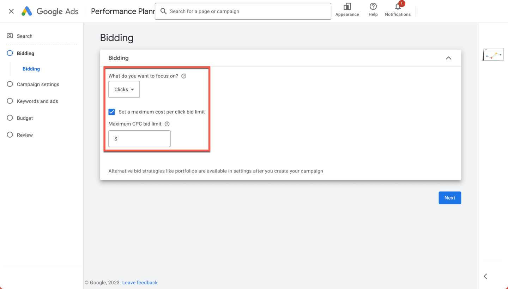

- **Paso 2**
    - También puedes implementar una estrategia de ofertas Maximizar clics para una cartera de ofertas con Herramientas (Tools), Presupuestos y ofertas (Budgets and bidding) o Estrategias de ofertas (Bid strategies). Aquí, selecciona el ícono de signo MÁS para crear una estrategia de ofertas de cartera nueva. Luego, selecciona Maximizar clics (Maximize clicks).
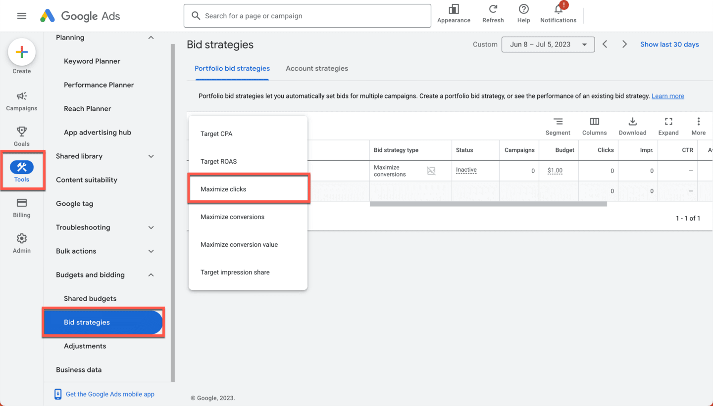

## Conclusiones clave

- Maximizar clics es una estrategia de ofertas automáticas para quienes desean incrementar el tráfico al sitio web, pero no realizan un seguimiento de las conversiones.
- Google Ads cuenta con dos estrategias de ofertas basadas en conversiones (Maximizar conversiones y Maximizar valor de conversión) para ayudarte a generar acciones en tu negocio.
- Para aumentar el reconocimiento de la marca, Porcentaje de impresiones objetivo es una estrategia de ofertas automáticas que establece ofertas automáticamente con el objetivo de mostrar tus anuncios en determinada ubicación de la página de resultados de la Búsqueda de Google.