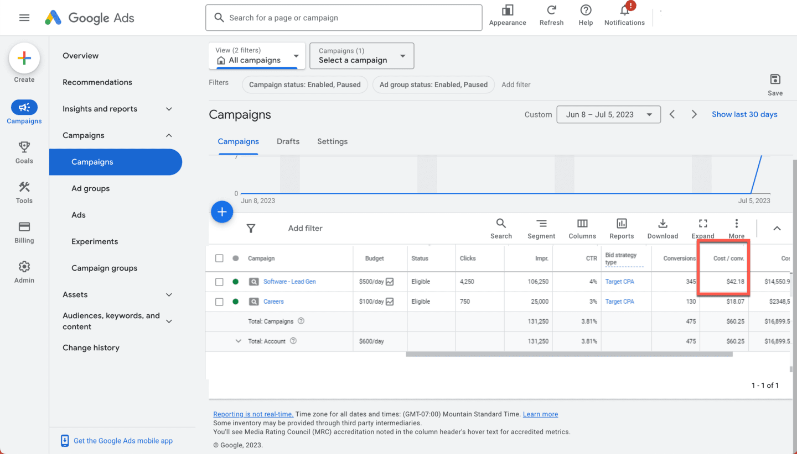
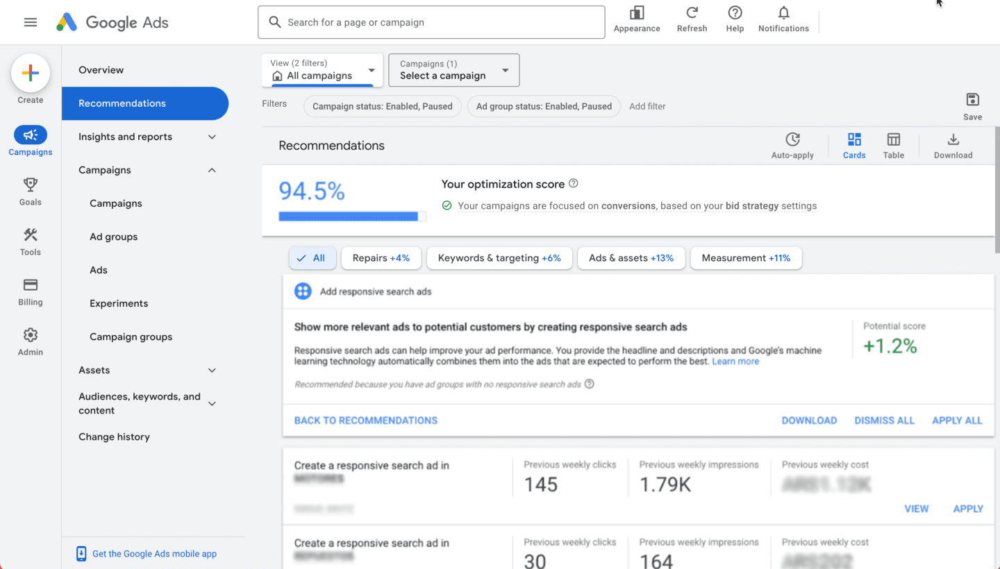

# Incentiva el uso de estrategias basadas en conversiones en la Búsqueda

Asegúrate de cumplir los objetivos de marketing que intentas lograr en tu campaña de Google Ads. Muchos anunciantes de la Búsqueda se enfocan en el crecimiento de conversiones, ya sea generando clientes potenciales o aumentando las ventas.

Al final del módulo, podrás identificar las estrategias de optimización para ayudar a mejorar el rendimiento de tu campaña de Búsqueda.

## Aprovecha al máximo tu campaña de Búsqueda
Después de crear una campaña de Búsqueda, espera a que comiencen a acumularse las conversiones antes de evaluar el rendimiento o realizar cambios.

Luego de eso, la mejor manera de optimizar la campaña dependerá de tu objetivo de marketing. Veamos un ejemplo.

### Conoce a Gonzalo
Gonzalo es un estratega de agencias que se enfoca en aumentar los clientes potenciales para su cliente, una startup que vende software. La empresa obtiene negocios nuevos de usuarios que refieren clientes potenciales en su sitio web.

Dado que la empresa sigue creciendo, el cliente de Gonzalo está enfocado en aumentar el volumen de clientes potenciales que llegan a través del sitio web. Se estableció el objetivo de aumentar los clientes potenciales provenientes del marketing digital en un 15% este trimestre. Google Ads es el canal de marketing digital principal que usan Gonzalo y su equipo para alcanzar el objetivo de marketing de su cliente.

La campaña de generación de clientes potenciales de Gonzalo actualmente está configurada con una estrategia de ofertas Maximizar conversiones. Él y su equipo asignaron un presupuesto de USD 500 por día.

Las dos razones por las que la estrategia de ofertas Maximizar conversiones es una buena opción para el objetivo de Gonzalo son:
- Las ofertas Maximizar conversiones son buenas para los anunciantes que buscan maximizar la cantidad de conversiones de una campaña con un presupuesto determinado.
- Las ofertas Maximizar conversiones son buenas para los anunciantes que aún no quieren realizar optimizaciones en función de una meta de CPA objetivo. 

Gonzalo y su equipo han usado las ofertas Maximizar conversiones durante algunas semanas y los entusiasma ver cuál es el rendimiento de sus campañas. La métrica de mayor importancia para ellos es el volumen de conversiones que genera la campaña.

## Cambio de objetivos
Unos meses después de que Gonzalo lanza la campaña inicial, recibe un correo electrónico de Lucas, el director de Marketing de la empresa de software, quien le pide coordinar una llamada. Veamos cómo se desarrolla esta conversación.

Después de hablar con el cliente, Gonzalo tiene una nueva perspectiva de su estrategia de marketing. Si bien su objetivo sigue siendo el mismo, necesitará ver un mayor crecimiento de sus campañas de Búsqueda. El cliente quiere generar un mayor volumen de conversión y está dispuesto a aumentar el presupuesto, siempre y cuando se logre un costo por acción (CPA) razonable.

Gonzalo debe identificar el CPA actual de su cliente para mantener el rendimiento de su campaña orientado hacia ese objetivo y conservar ese CPA, a la vez que logra un volumen constante con el paso del tiempo.

## Establece tu CPA objetivo
Puedes optimizar campañas para alcanzar tu objetivo de costo por conversión a través de una estrategia de ofertas Maximizar conversiones (con un objetivo de CPA).

Ahora que Gonzalo debe cambiar su estrategia para enfocarse en un objetivo de CPA, puede consultar el rendimiento histórico de su campaña como punto de partida. Gonzalo consulta la columna Costo/conversión de su campaña para identificar el CPA de esta, que fue de USD 42.18 durante los últimos 30 días, luego de excluir su ventana reciente de demora en las conversiones.

## Llega al público más importante
La forma en que los usuarios buscan productos y servicios evoluciona constantemente. Aprovecha varias soluciones de Google Ads para llegar a muchas más personas.

## Enfócate en la cobertura
Los especialistas en marketing deben priorizar la cobertura de todas las búsquedas con mensajes relevantes. Revisa estas acciones para optimizar las campañas.
- Agrega **palabras clave nuevas**
    - Puedes supervisar continuamente la lista de palabras clave de tu campaña y agregar nuevas palabras clave.
        - La página Recomendaciones te puede ayudar a identificar nuevas palabras clave con un alto potencial.
        - La herramienta Planificador de palabras clave puede inspirar ideas de nuevas palabras clave y estimar el impacto de las palabras adicionales.
        - Puedes usar el Informe de términos de búsqueda para obtener nuevas palabras clave que tengan una oportunidad alta y ayudar a identificar el tráfico que se recomienda excluir.
- Agrega tipos de **concordancia amplia**
    - Si ya usas una estrategia de ofertas automáticas en tu campaña, como CPA objetivo, una práctica recomendada es combinar palabras clave de concordancia amplia con una estrategia de Ofertas inteligentes para captar todo el tráfico relevante que se espera que tenga un buen rendimiento.
    - Los términos de concordancia amplia pueden aumentar el rendimiento con las ofertas automáticas, ya que pueden incrementar el tráfico y ofrecer más datos a una estrategia de ofertas para aprender a establecer ofertas adecuadas. Para comenzar, revisa la página Recomendaciones para agregar versiones de concordancia amplia de tus palabras clave.

## Optimización de creatividades
Los anuncios de búsqueda responsivos (RSA) permiten que Google pruebe diferentes combinaciones de descripciones y títulos, y usen el aprendizaje automático para agrupar recursos relevantes.

Cuando optimizas los mensajes de los anuncios de búsqueda, incluye información útil para los clientes potenciales con cada anuncio. Estas son algunas opciones para personalizar tus mensajes de anuncios.

- **Recursos del anuncio**
    - Los recursos del anuncio se diseñaron para impulsar el rendimiento. Agregarlos puede ayudar a aumentar la cantidad de clientes potenciales o dirigir a los visitantes a alguna ubicación o página de tu sitio
- **Personalizadores de anuncios**
    - Los personalizadores de anuncios te permiten incorporar información en tiempo real, como información sobre la ubicación o una cuenta regresiva. Usa personalizadores de anuncios para generar anuncios dinámicos a gran escala y publicar creatividades sumamente relevantes.
- **Inserción de palabras clave**
    - Usa la inserción de palabras clave para actualizar tus anuncios de modo que incluyan las palabras clave que activaron la aparición del anuncio. Por ejemplo, cuando alguien busca “software de CRM”, el título del anuncio puede incluir el término “software de CRM”.

## Realiza optimizaciones en función de lo más importante
Supervisa y ajusta tus estrategias de ofertas automáticas para cumplir con los objetivos de marketing. Estos son algunos lineamientos para optimizar anuncios.
- **Usa el informe de estrategias de ofertas**
    - Consulta este informe para analizar el rendimiento de las métricas clave, como el volumen de conversiones o el CPA real, en un período específico o úsalo para revisar los principales indicadores en función de los cuales se optimiza tu estrategia de ofertas, así como los datos sobre simulación de objetivos o presupuestos.
- **Considera la demora en conversiones**
    - Comprende el lapso de tiempo estándar de tu campaña para generar conversiones, que es el tiempo promedio que tarda un clic en dar como resultado una conversión. Usa estos datos para medir el rendimiento de las conversiones correctamente. Los datos de demora en las conversiones se pueden encontrar en el informe de estrategia de ofertas y se pueden registrar como conversiones sin conexión.
- **Simula el rendimiento de las campañas**
    - Un simulador de Ofertas inteligentes puede ayudarte a entender cómo un objetivo o presupuesto diferentes influirán en el rendimiento de un anuncio. Esta herramienta analiza datos de tus subastas para estimar cuál podría ser el rendimiento de tus anuncios si tuvieran un objetivo o presupuesto diferentes.
- **Evita presupuestos limitados**
    - Es posible que las campañas que funcionan con presupuestos limitados no puedan lograr los objetivos de maximizar las conversiones o el valor con un objetivo específico. Define un presupuesto diario de campañas de CPA objetivo que sea un 20% o un 30% más alto que la inversión de un día normal para obtener un mayor volumen con una eficiencia y un margen de crecimiento similares. Si tienes objetivos de presupuesto, usa ofertas Maximizar conversiones o Maximizar valor de conversión para realizar optimizaciones dentro del presupuesto diario establecido. Usa el Planificador de rendimiento para identificar el presupuesto correcto en función de los objetivos de tu campaña, o un presupuesto compartido y estrategias de ofertas de cartera para administrar campañas con objetivos similares automáticamente.

## Usa el nivel de optimización para fijar tu estrategia

En la página de Recomendaciones, encuentra tu nivel de optimización y obtén recomendaciones específicas de la cuenta según tus objetivos de marketing. Tu nivel de optimización es una estimación de qué tan bien está configurada tu cuenta para lograr el rendimiento esperado y cuál es tu margen de mejora. Incluye recomendaciones en las que se sugieren las soluciones de productos adecuadas para tu empresa y se enfoca en la medición, los presupuestos, las Ofertas inteligentes, las creatividades y los métodos de alcance, como las palabras clave, los DSA y los públicos.

## ¿Qué sucede con Gonzalo?
Gonzalo sabe que, para mantener el CPA que busca su cliente, debe considerar la optimización de campaña. Las recomendaciones destacadas en el nivel de optimización de su cuenta lo ayudarán a mantenerse enfocado en alcanzar sus objetivos y encontrar oportunidades nuevas para generar clientes potenciales.

## Demuestra lo que sabes
La empresa de tu cliente está enfocada en aumentar las ventas en línea, pero tu cliente quiere hacerlo a un costo por acción eficiente. Elige las tres estrategias de optimización que pueden ayudar a alcanzar este objetivo de marketing.

| ❌ | ✅ |
|----|-----|
| | Usar los simuladores de Ofertas inteligentes para identificar cómo un presupuesto y un costo por acción mejorarán el rendimiento|
| | Aplicar una estrategia de ofertas de CPA objetivo a las campañas | 
| Aplicar una estrategia de ofertas Maximizar clics a las campañas | | 
| | Llegar a un público de visitantes anteriores que no generaron conversiones |

## Conclusiones clave

- Para mantener el enfoque en conservar el rendimiento de tu campaña de Búsqueda, alinea tu estrategia de optimización con tus objetivos, usa la automatización para maximizar el rendimiento y vuelve a aplicar estrategias creativas.
- Usa el informe de estrategia de oferta y el nivel de optimización para identificar oportunidades que permitan ajustar el rendimiento de la campaña. 