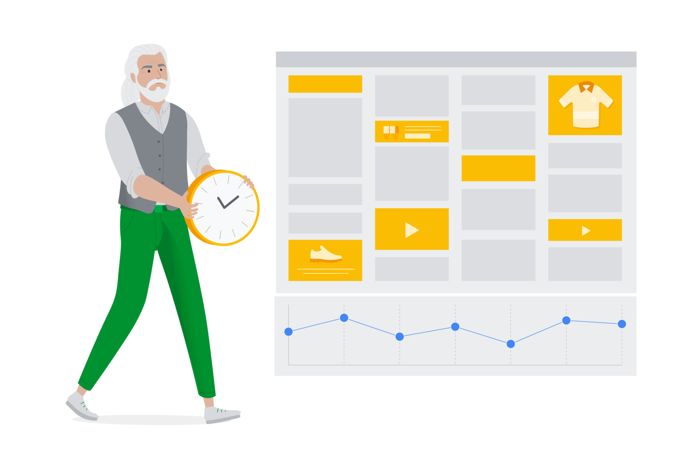

# Aplica recomendaciones automáticamente

Es esencial aprovechar todo el potencial de tu cuenta de Google Ads para lograr tus objetivos. Cuando aplicas recomendaciones automáticamente, puedes impulsar el rendimiento y la eficiencia de tu cuenta, a la vez que ahorras tiempo valioso.

En este módulo, aprenderás a hacer lo siguiente:
- Explicar cómo la aplicación automática de recomendaciones puede mejorar el rendimiento de tu cuenta
- Identificar los tipos de recomendaciones disponibles para aplicar automáticamente
- Implementar una estrategia para aplicar recomendaciones automáticamente

## Aplica recomendaciones automáticamente
El nivel de optimización es una estimación de qué tan bien están configuradas tus cuentas de Google Ads para lograr el rendimiento deseado en las campañas discovery, de Búsqueda, de Display, de Shopping y de acción de video. Las recomendaciones se basan en el historial de rendimiento de tu cuenta, la configuración de la campaña y las tendencias en Google. En conjunto, con estos factores se determinan las actualizaciones que debes aplicar para mejorar el rendimiento y la eficiencia de tu cuenta.

### ¿Cómo funciona?
Si aceptas aplicar las recomendaciones automáticamente, configurarás tus cuentas de Google Ads para que se apliquen las prácticas recomendadas, lo que te permite enfocar la atención en las iniciativas estratégicas. Así, tendrás la posibilidad de aplicar ciertas recomendaciones automáticamente sin aumentar tu presupuesto.

## Beneficios clave
La aplicación de recomendaciones automáticamente tiene cinco beneficios principales que veremos con mayor detalle a continuación.
- **Escala las prácticas recomendadas**
    - Con esta función, se aplican recomendaciones personalizadas en función de tu configuración y objetivos, lo que significa que tendrás más oportunidades de conectarte con clientes potenciales. Para aprovechar al máximo tus campañas, asegúrate de que tu cuenta esté siempre activa con las funciones adecuadas según esta configuración y estos objetivos.
- **Mejora el rendimiento**
    - El nivel de optimización tiene en cuenta el historial de rendimiento, la configuración de la campaña y las tendencias en Google para garantizar la aplicación de las recomendaciones más relevantes para mejorar los resultados.
- **Aumenta la eficiencia**
    - Reduce el tiempo dedicado a las tareas manuales y úsalo para definir la estrategia de tu negocio. Las recomendaciones personalizadas se basan en el historial de rendimiento de tu cuenta, la configuración de tu campaña y las tendencias en Google.
- **Visibilidad y control**
    - Puedes no aplicar las recomendaciones seleccionadas automáticamente. Esto incluye la capacidad de inhabilitar la aplicación automática de recomendaciones individuales o masivas. Puedes hacer un seguimiento del progreso y consultar las recomendaciones aplicadas más recientes en el informe de rendimiento semanal, la página Historial de cambios de tu cuenta y la pestaña Historial de la página Recomendaciones.
- **No aumenta el presupuesto**
    - La aplicación automática de recomendaciones no aumentará el presupuesto de la cuenta ni reasignará el presupuesto entre tus campañas actuales. Para revisar las recomendaciones relacionadas con el presupuesto o el crecimiento, visita la página Recomendaciones.

## ¿Para quién resulta indicado aplicar recomendaciones automáticamente?
Las agencias, los especialistas en marketing y los anunciantes acuden a Google para comprender las tendencias clave de la industria, incluidas las relacionadas con la privacidad, a fin de aumentar su clientes y brindarles un servicio de forma eficaz. A medida que implementas tácticas más avanzadas, es posible que tengas menos tiempo para estar pendiente de las optimizaciones en curso. Con la opción para habilitar la aplicación de ciertas recomendaciones automáticamente, puedes dedicar tu tiempo a otras iniciativas estratégicas clave.

## Consulta los resultados
El departamento de una agencia con sede en los Países Bajos aplicó recomendaciones automáticamente en la cartera de su cliente, y su estrategia funcionó. La agencia ahorró el 20% del tiempo que invertía anteriormente en tareas repetitivas, a la vez que aumentó los niveles de optimización de Google Ads 18 puntos en promedio. Además, el departamento notó un efecto positivo en el rendimiento de su cliente, una empresa de construcción, con un aumento del 10% en su volumen de conversiones y del 20% en su porcentaje de conversiones.

## Tipos de recomendaciones
Según tu historial de rendimiento, la configuración de la campaña y las tendencias en las distintas plataformas de Google, existen tres tipos de recomendaciones que puedes aplicar automáticamente.
- **Anuncios y extensiones**
    - Mejora los anuncios y grupos de anuncios existentes, y muestra tus mejores anuncios con más frecuencia.
    - Ejemplos:
        - Usa la rotación de anuncios optimizada.
        - Mejora tus anuncios de búsqueda responsivos.
- **Palabras clave y segmentación**
    - Conéctate con más personas interesadas en lo que ofreces.
    - Ejemplos:
        - Agrega palabras clave nuevas.
        - Quita elementos negativos en conflicto.
- **Ofertas y presupuestos**
    - Encuentra la estrategia de ofertas adecuada para cumplir tus objetivos comerciales.
    - Ejemplos:
        - Establece ofertas más eficientes mediante la estrategia Maximizar conversiones con un CPA objetivo.
        - Ajusta tus objetivos de ROAS.

## Administra y revisa las recomendaciones aplicadas automáticamente
Una vez que habilites las recomendaciones aplicadas automáticamente, podrás hacer un seguimiento de las que se implementaron en la pestaña Historial de la página Recomendaciones, así como inhabilitarlas en cualquier momento. Puedes revisar las recomendaciones aplicadas automáticamente para saber con qué frecuencia se aplicó una recomendación en la última semana, cuándo se aplicó por última vez y cuándo habilitaste su implementación.

Recuerda que la aplicación de recomendaciones de forma automática no aumentará tu presupuesto; por lo tanto, continúa revisando la página Recomendaciones para asegurarte de que el presupuesto no limite tu rendimiento.

- **Administra las recomendaciones**
    - En esta página, los usuarios pueden seleccionar opciones de las categorías disponibles para administrar las recomendaciones que se deben aplicar automáticamente.
- **Haz un seguimiento de las recomendaciones**
    - Una vez que aceptes aplicar una recomendación automáticamente, podrás realizar un seguimiento de ella en la pestaña Historial de la página Recomendaciones. También podrás ver cuántas veces se aplicó una recomendación en la última semana, cuándo se aplicó por última vez y cuándo habilitaste su implementación.
- **Inhabilita recomendaciones**
    - Tú tienes el control.
    - Inhabilita una recomendación aplicada automáticamente de forma individual en la tabla “Historial”, o bien de forma masiva en la configuración “Administrar”.

## Preguntas frecuentes
Cuando quieras explorar los beneficios de aplicar recomendaciones automáticamente, es importante que conozcas los datos clave. Revisemos algunas preguntas comunes.
- **¿Las recomendaciones aplicadas automáticamente aumentarán la inversión en mi cuenta?**
    **No**. Si bien cualquier cambio en la cuenta, incluidos los que se realizan mediante la aplicación de recomendaciones de forma automática, podrían ocasionar un aumento o una disminución de la inversión publicitaria, estos ajustes nunca superarán el presupuesto elegido. El propósito de esta función es permitirte conseguir la mayor cantidad de clics, llamadas y ventas en tu cuenta, a la vez que controlas tu presupuesto general.
- **¿Todas las recomendaciones que aparezcan en mi cuenta se aplicarán automáticamente?**
    **No**. Cuando habilitas esta función, elegirás las recomendaciones que quieras usar de un menú de opciones. Solo las que selecciones serán aptas para aplicarse automáticamente.
- **¿Puedo activar las recomendaciones aplicadas automáticamente a nivel de la campaña?**
    - **No**. Las recomendaciones aplicadas automáticamente se activan a nivel de la cuenta y del administrador. Esta función se habilita para todas las campañas dentro de una cuenta activada.
- **¿Puedo revertir los cambios luego de aplicar las recomendaciones automáticamente en mi cuenta?**
    - **Sí**. De la misma forma en que harías cambios o actualizaciones en tu cuenta de Google Ads, accede y modifica tu configuración, de modo que quede como estaba antes de que se implementaran las recomendaciones aplicadas automáticamente. Si no puedes revertir los cambios en la página de historial de cambios, deberás ir a la campaña específica para hacerlo (p. ej., quitar palabras clave de forma individual).

## Demuestra lo que sabes
Alicia es propietaria de una boutique de ropa y usa Google Ads para aumentar el reconocimiento y generar ingresos. Ella quiere aprovechar mejor sus campañas y asegurarse de que utiliza las funciones adecuadas según su configuración y objetivos, pero no tiene tiempo para realizar tareas manuales. Además, le gustaría que aumentara su nivel de optimización, pero le preocupa el presupuesto. ¿Cómo pueden las recomendaciones aplicadas automáticamente ayudarla a mejorar el rendimiento de su cuenta?

| ❎ | ✅ |
|----|-----|
| | Con esta función, se implementan de forma habitual prácticas recomendadas en la cuenta sin aumentar automáticamente el presupuesto. |
| Con esta función, se aplican todas las recomendaciones automáticamente en la cuenta sin necesidad de implementar aprobaciones manuales. | | 
| Esta función se puede aplicar a nivel de la campaña para garantizar que sus elementos se apliquen únicamente a un presupuesto específico. | | 
| Con esta función, se evita la administración manual de recomendaciones de un proceso de optimización de la cuenta.  | | 

## Conclusiones clave

- Cuando habilitas las recomendaciones aplicadas automáticamente, implementas prácticas recomendadas de forma frecuente en tus cuentas de Google Ads.
- Existen tres categorías de recomendaciones: `anuncios y extensiones`, `palabras clave y segmentación`, y `ofertas y presupuestos`.
- Puedes administrar y revisar las recomendaciones habilitadas en la pestaña Historial de la página Recomendaciones.