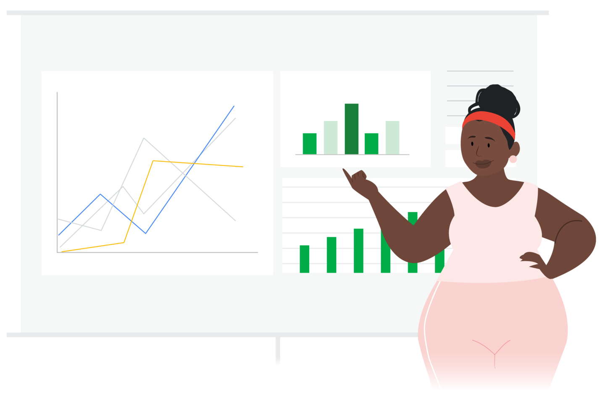
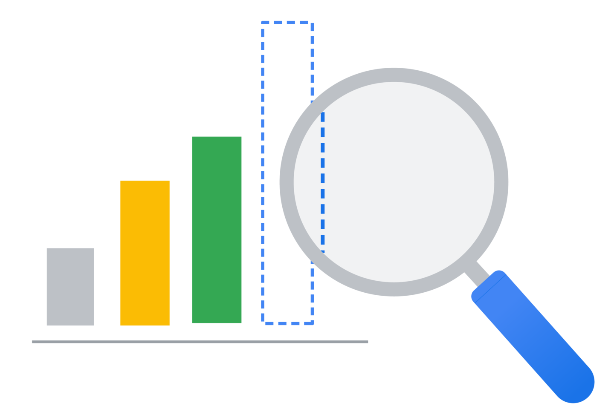
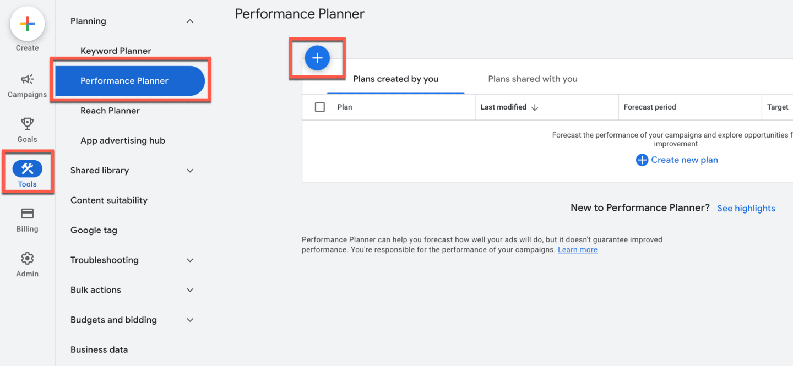
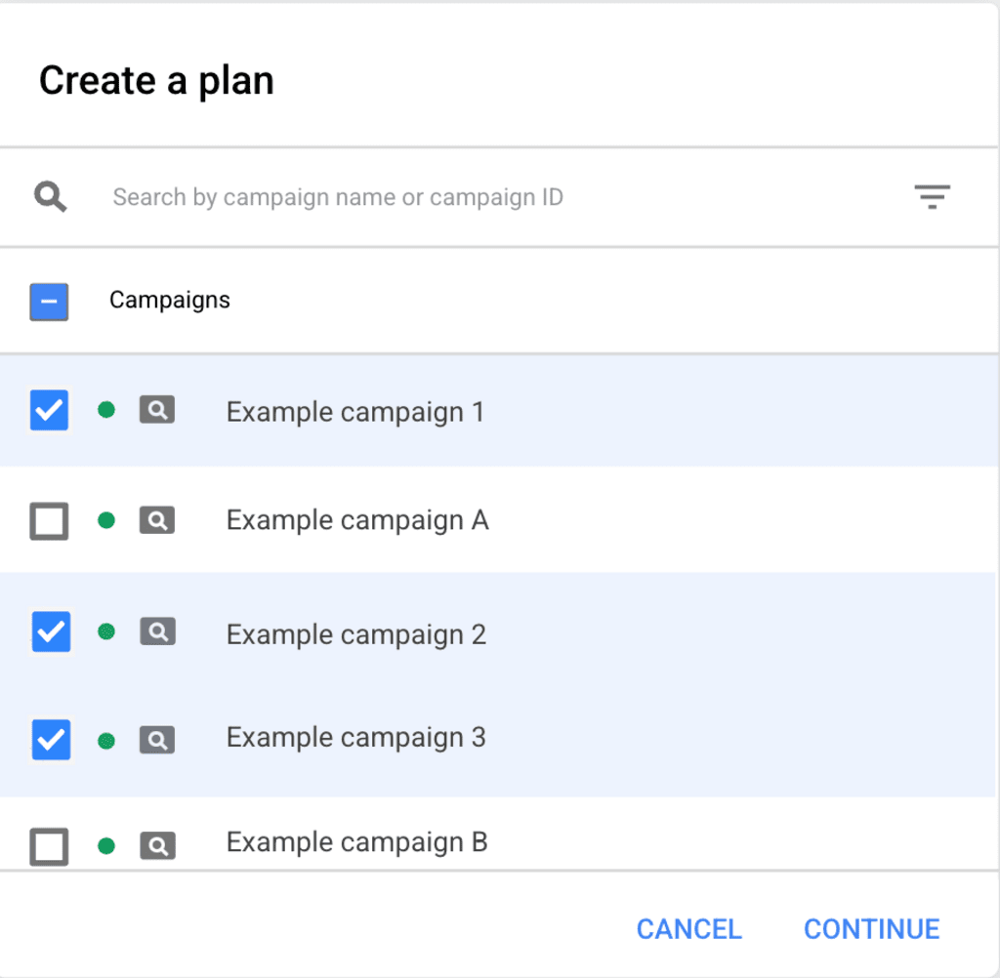
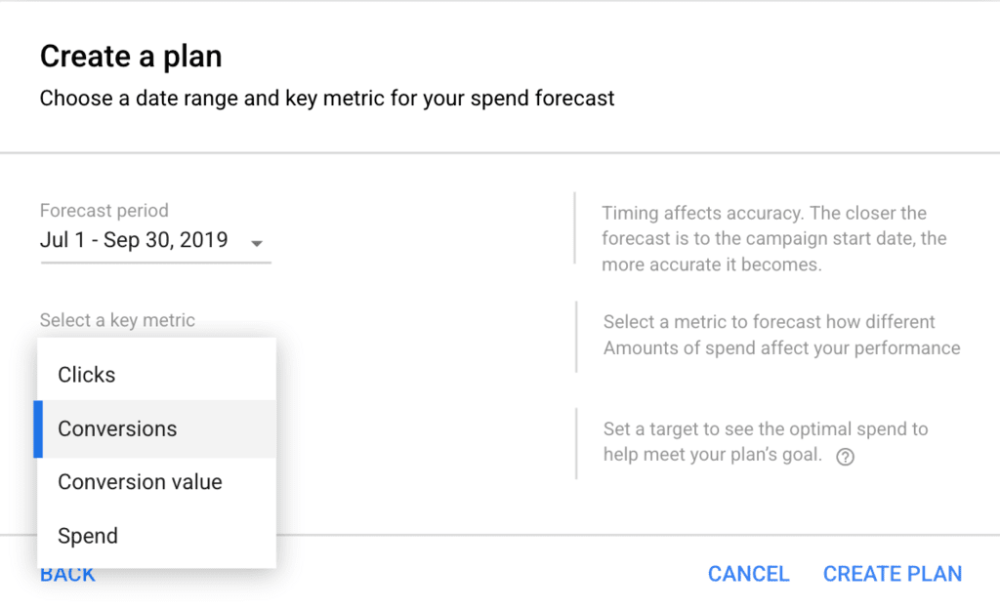
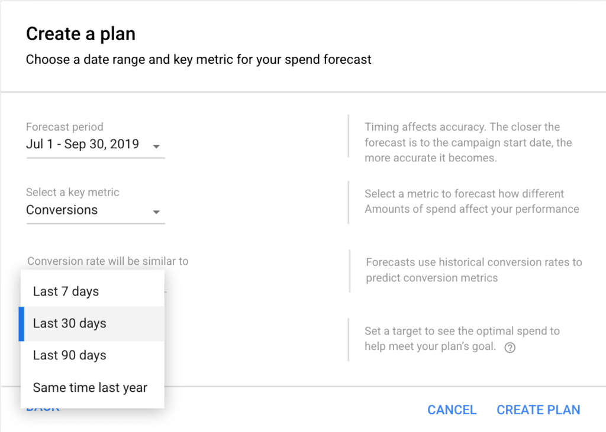
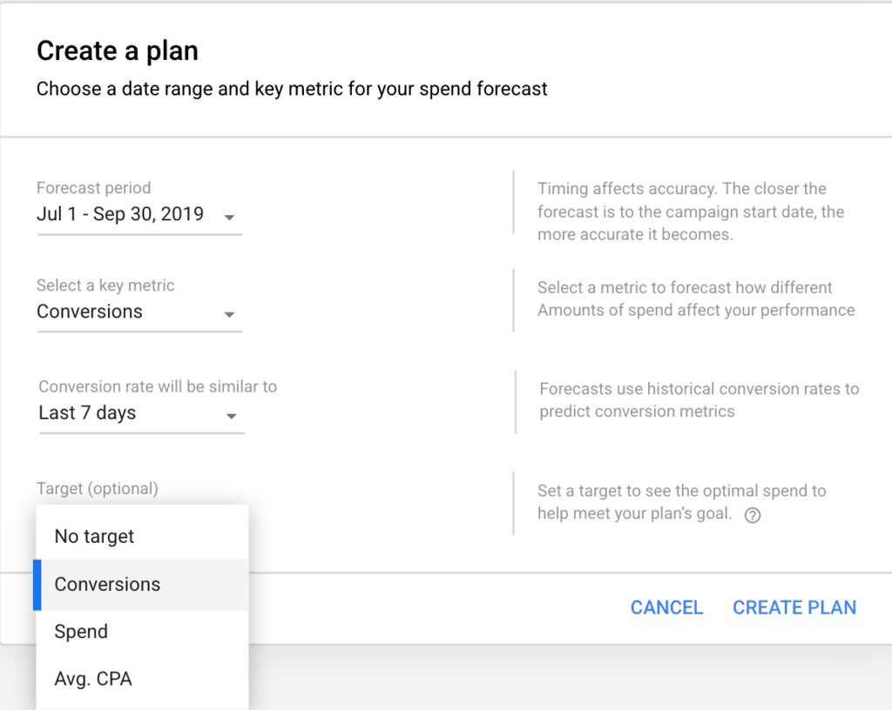
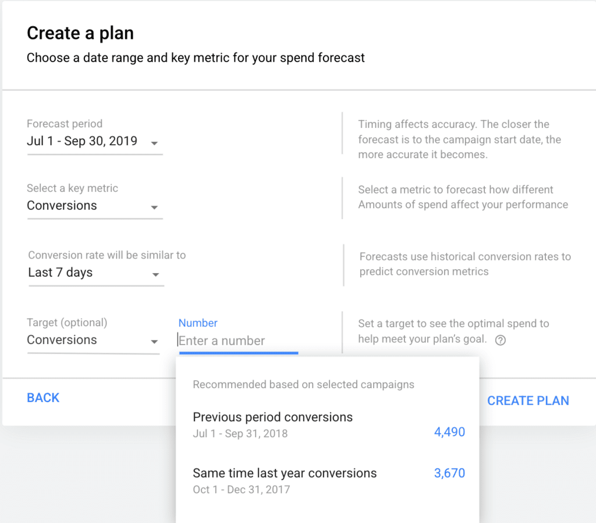
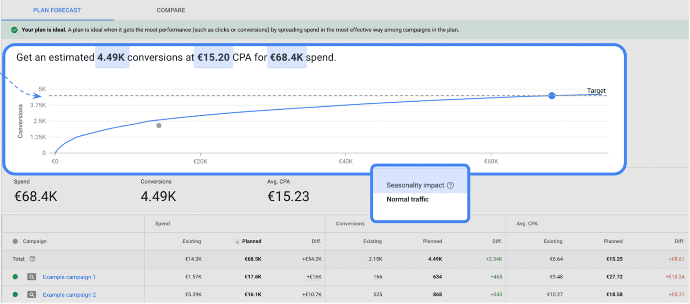

# Optimiza presupuestos con el Planificador de rendimiento

Tal vez no puedas predecir el futuro, pero, con el Planificador de rendimiento, puedes ajustar las campañas para prepararte mejor para superar cualquier obstáculo. Con el Planificador de rendimiento, puedes asegurarte de que tus campañas logren los objetivos, se alineen con un objetivo óptimo y consideren el crecimiento potencial del volumen.

Al final del módulo, tendrás las herramientas para explicar cómo las prácticas recomendadas del Planificador de rendimiento te pueden ayudar a lograr tus objetivos de marketing.

## ¿Qué es el Planificador de rendimiento?

El Planificador de rendimiento es una herramienta de Google Ads que te permite diseñar planes para períodos futuros de hasta 18 meses. Te ayuda a prever cómo los ajustes óptimos de objetivo y presupuesto pueden afectar positivamente las métricas clave y el retorno general. Usa el Planificador de rendimiento mensualmente para asegurarte de establecer presupuestos y objetivos de Ofertas inteligentes a nivel de la campaña apropiados de manera de captar demanda para tu empresa.

Con esta herramienta, puedes hacer lo siguiente:
- Consultar las previsiones de tus campañas
- Explorar los resultados ajustando la configuración de la campaña
- Comprender las oportunidades en los períodos estacionales
- Administrar los presupuestos en todas las cuentas y campañas

## ¿Cómo realiza previsiones el Planificador de rendimiento?
El Planificador de rendimiento toma en cuenta miles de millones de búsquedas y se actualiza cada 24 horas para brindarte previsiones lo más precisas posible. Esta herramienta simula subastas de anuncios relevantes durante los últimos siete a 10 días y considera variables como la estacionalidad, el incremento de las búsquedas, la actividad de la competencia y la página de destino.

Después de ejecutar simulaciones y recopilar datos, la precisión del Planificador de rendimiento se mide mediante la comparación de previsiones con el rendimiento final real. Luego, se usa el aprendizaje automático para definir mejor las previsiones.

## Verifica tus conocimientos
¿Cuáles son las tres formas en las que la planificación frecuente del presupuesto puede mejorar el rendimiento de las campañas?

| ❎ | ✅ |
|----|-----|
| | Prever el impacto de los diferentes presupuestos para entender cómo puede cambiar el rendimiento. |
| | Identificar oportunidades para aumentar las conversiones incrementales. |
| | Planificar en función de la estacionalidad y los períodos en los que aumentan las ventas o los clientes potenciales. |
| Comprender qué método de facturación puede ser el mejor para tu cuenta. | |

## Crea un plan nuevo en el Planificador de rendimiento
### Accede al Planificador de rendimiento
Navega al Planificador de rendimiento en Herramientas (Tools)> Planificación (Planning) > Planificador de rendimiento (Performance Planner) y, luego, haz clic en el ícono + para crear un plan nuevo.

### Selecciona las campañas con objetivos similares y usa el mismo presupuesto
El Planificador de rendimiento te ayuda a maximizar el rendimiento en un grupo de campañas o cuentas. Para lograr este objetivo, el rendimiento debe significar lo mismo en esas campañas o cuentas.

### Selecciona una métrica para maximizarla
Debes conocer tus opciones cuando crees tus planes. Selecciona Maximizar conversiones o clics en función de tu objetivo de marketing.

### Selecciona la ventana de visualización para el porcentaje de conversiones
Según la configuración predeterminada, los planes utilizan el porcentaje de conversiones de los últimos 7 días. Puedes elegir los últimos 30 o 90 días, o el mismo período del año anterior según tus expectativas para saber cómo influyen en la previsión.

### Selecciona un objetivo o umbral
Establece un objetivo para planificar tus metas, ya sea que se trate del CPA prom., el volumen de conversión o un importe de gasto. 

### Revisa el rendimiento pasado y úsalo como guía
El rendimiento del período anterior o del mismo período del año anterior puede ayudarte a decidir los objetivos de inversión, CPA prom. o volumen de conversión.

### Una vez que obtengas esta vista, prueba diferentes situaciones de presupuesto y objetivos
Puedes ajustar la inversión según las estadísticas de correlación de conversión o hacer clic en los puntos para saber cuánto invertiste en diferentes umbrales de CPA o de conversión.

Si esperas que se produzcan fluctuaciones adicionales en la demanda, estas afectan principalmente al costo, así que tenlo en cuenta cuando revises las previsiones.

## Conversiones incrementales
Para entender cuánto más podrías invertir para aumentar las conversiones incrementales, a la vez que mantienes un retorno de la inversión publicitaria (ROAS) estable, ajusta el valor de conversión por objetivo de inversión en el Planificador de rendimiento.

- El punto azul de la curva se optimiza en las campañas para mostrar cómo puedes generar el mayor valor posible en ese nivel de presupuesto.
- El punto que está debajo de la curva representa el rendimiento previsto según la configuración actual de la oferta y el presupuesto.

## Prácticas recomendadas
Revisa estas prácticas recomendadas para el Planificador de rendimiento.
- **Planifica con hasta 18 meses de antelación**
    - El Planificador de rendimiento te permite diseñar planes hasta con 18 meses de antelación en todos los tipos de campañas: de Búsqueda, de Shopping, locales, de Display, de video, de máximo rendimiento y de aplicaciones.
- **Realiza controles con frecuencia**
    - Luego de crear un plan de 18 meses, revísalo de forma mensual o trimestral para asegurarte de que se pueda implementar en función de los siete o 10 días anteriores. Los planes reflejarán cualquier cambio que ocurra en el mercado durante ese tiempo, además de los cambios típicos estacionales próximos. Puedes crear planes en el Planificador de rendimiento con más frecuencia de lo habitual para considerar los cambios impredecibles del mercado y tu empresa. Google no puede garantizar que las previsiones reflejarán otros escenarios de incertidumbre que generen cambios en el mercado.

## Demuestra lo que sabes
¿Cuáles de estas opciones son tres casos de uso importantes del Planificador de rendimiento?

| ❎ | ✅ |
|----|-----|
| Comprender qué productos tienen un mal rendimiento de ventas | |
| | Comprender las oportunidades en períodos estacionales futuros |
| | Explorar los resultados previstos de rendimiento ajustando la configuración de las campañas |
| | Administrar presupuestos asignados en todas las cuentas y campañas |

## Conclusiones clave

- El Planificador de rendimiento te permite crear planes de cara al futuro que son diferentes del estado diario de la cuenta. Con esta herramienta, puedes fomentar oportunidades de crecimiento, medir la oportunidad disponible y comprender las implicaciones de diferentes situaciones de oferta y presupuesto.
- Incluye el Planificador de rendimiento en tu rutina de planificación habitual. Evaluar coherentemente tu presupuesto es importante para desarrollar estrategias listas para el futuro y cumplir tus objetivos adaptándote a las condiciones dinámicas del mercado.
