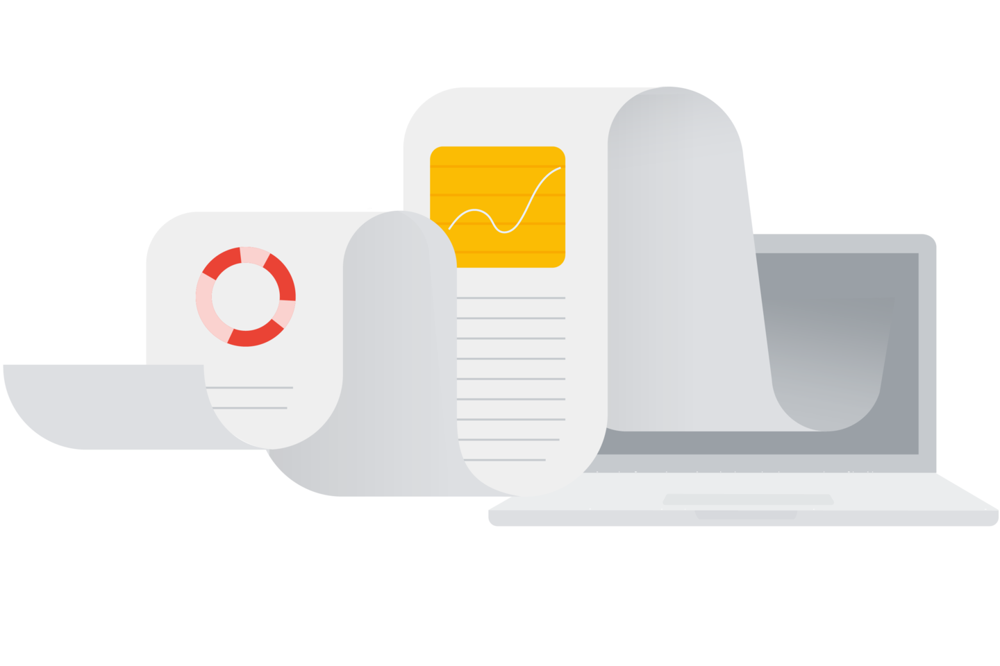
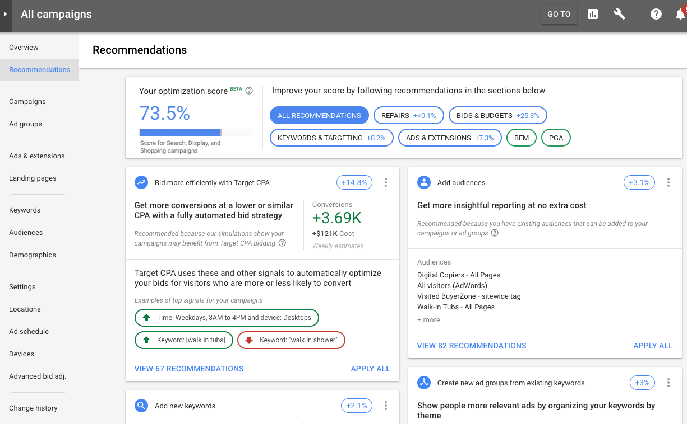

# Descubre el valor del nivel de optimización

¿Tienes todo listo para llevar tus campañas al siguiente nivel? Con el nivel de optimización, puedes descubrir fácilmente el potencial de las campañas discovery, de aplicaciones, de Búsqueda, de Shopping, de acción de video, de Display y de máximo rendimiento.

Una vez que completes este módulo, podrás usar el nivel de optimización para mejorar el rendimiento de las campañas.

## ¿Qué es el nivel de optimización?
El nivel de optimización es una estimación de la efectividad de la configuración de tu cuenta de Google Ads para lograr el rendimiento esperado. Un nivel de optimización es un valor entre 0 y 100, donde las puntuaciones más altas indican que una campaña o cuenta ya se optimiza con gran eficacia y tiene menos oportunidades de acción disponibles.

Este nivel utiliza una combinación de modelos estadísticos, simulaciones y aprendizajes automáticos para identificar el potencial de optimización de cada recomendación. Si una recomendación está más estrechamente relacionada con el rendimiento, se le da más ponderación en el nivel general. Las recomendaciones con un porcentaje de mejora más alto tienen un mayor impacto en el rendimiento de los anunciantes.

Junto con el nivel, verás una lista de recomendaciones que te permitirán optimizar tus campañas. En cada recomendación se indica en qué medida se verá afectado el nivel de optimización (en porcentajes) cuando la apliques.

El nivel de optimización se muestra únicamente para las campañas activas discovery, de Búsqueda, de Display, de acción de video, de Shopping, de aplicaciones y de máximo rendimiento.

## Usa el nivel de optimización para impulsar el éxito de tus campañas
- **Optimiza las cuentas**
    - El nivel de optimización de una cuenta es un excelente punto de partida cuando se buscan recomendaciones para mejorar el rendimiento. Además, esta función acelera el proceso de implementación de las optimizaciones, lo que te ahorra tiempo.
- **Prioriza las cuentas**
    - Si sigues las métricas del nivel de optimización de tu cuenta, puedes determinar qué campañas tienen un mayor potencial de mejora para priorizarlas durante la optimización.

## Analiza el nivel de optimización 
Para revisar tu nivel de optimización, abre la página Recomendaciones a nivel de la cuenta de administrador (MCC) o a nivel de una cuenta específica. Una vez allí, puedes explorar todas las funciones de tu nivel de optimización.

- **Margen de optimización**
    - En este ejemplo, el nivel de la cuenta es de un 73.5%, lo que significa que esta tiene un margen de optimización de un 26.5%. Puedes analizar las recomendaciones enumeradas para comprender dónde puedes generar el mayor impacto. 
- **Filtros**   
    - Recuerda que puedes filtrar por sección para ver recomendaciones específicas. Por ejemplo, si necesitas llegar a más clientes, consulta TODAS LAS RECOMENDACIONES (ALL RECOMMENDATIONS) para agregar más palabras clave que puedan aumentar las conversiones.
- **Aumento potencial del nivel**
    - En esta tarjeta, puedes ver que agregar públicos puede aumentar el nivel de optimización de esta cuenta en un 3.1%.
- **Aplicar todo**
    - Selecciona APLICAR TODO (APPLY ALL) para implementar todas las recomendaciones de una tarjeta específica.
- **Aplica automáticamente las recomendaciones**
    - Si habilitas la opción para aplicar ciertas recomendaciones de forma automática a la cuenta, puedes mejorar su rendimiento y ahorrar tiempo. Luego de hacerlo, esta función de Google Ads aplica recomendaciones de forma continua por ti desde la página Recomendaciones, a medida que se indican.

> **Sugerencia**: Puedes descartar las recomendaciones que no se alinean con tus objetivos. Sin embargo, ¿qué pasa si descartas una recomendación y después cambias de opinión? No hay problema. Puedes ver las recomendaciones de nuevo seleccionando el filtro Descartadas y eligiendo la opción para dejar de descartar. Además, si la recomendación resulta ser relevante de nuevo en el futuro, es posible que vuelva a aparecer.

## Conclusiones clave

- El nivel de optimización puede ayudarte a descubrir oportunidades de mejora y crecimiento para tus campañas.
- Esta herramienta dinámica, adaptable y en tiempo real puede garantizar que tus cuentas estén completamente optimizadas para lograr los objetivos que deseas.