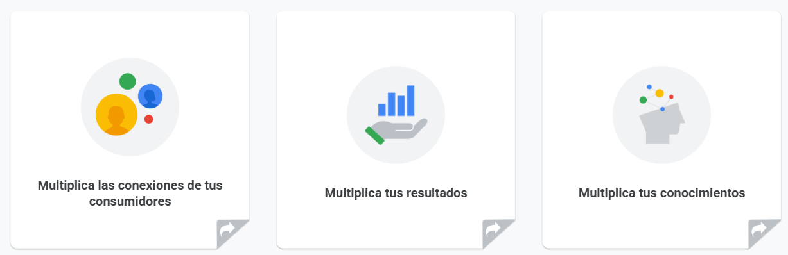
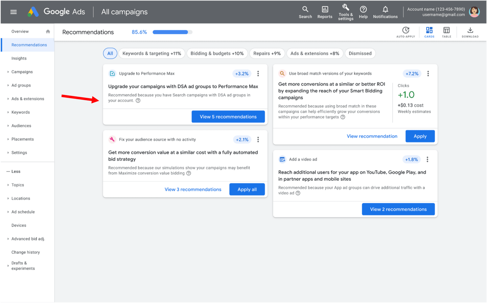
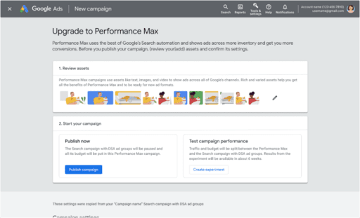
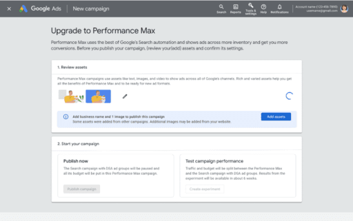
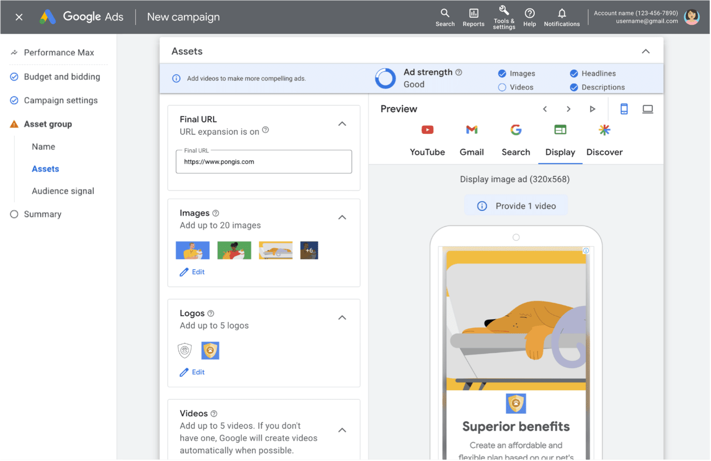
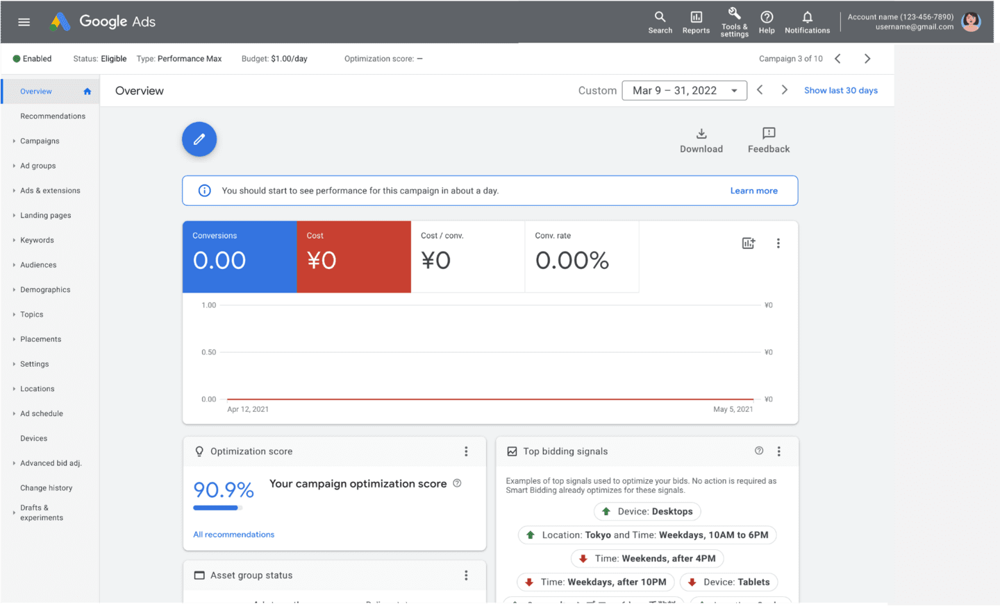
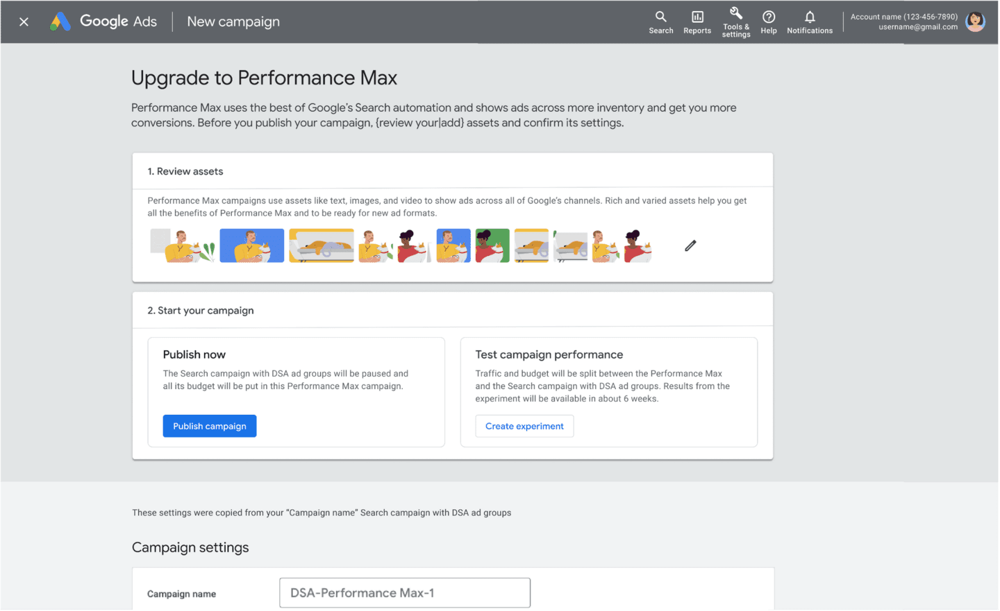
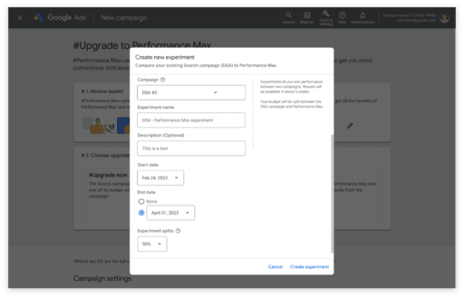
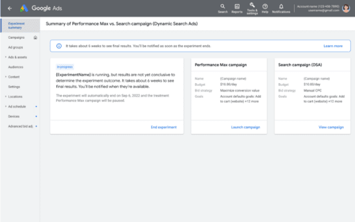
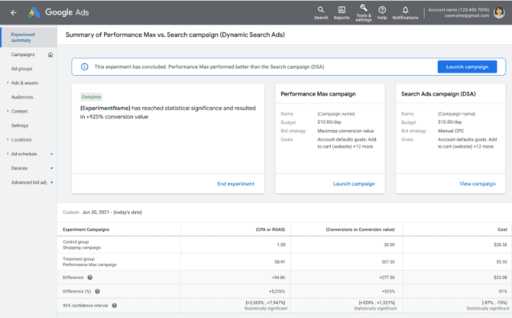

# Multiplica los resultados con las campañas de Búsqueda y de máximo rendimiento potenciadas por IA

Las campañas de Búsqueda y de máximo rendimiento son las campañas potenciadas por IA más eficaces de Google. Cuando se combinan ambas, los especialistas en marketing pueden aprovechar todo el potencial de la IA de Google para ayudar a cumplir los objetivos comerciales.

Al final de este módulo, tendrás las herramientas para lograr objetivos de marketing con las campañas de Búsqueda y de máximo rendimiento potenciadas por IA.

## La IA de Google es tu multiplicador de marketing
Los tiempos de incertidumbre pueden generar oportunidades inesperadas, sobre todo para las empresas que se mantienen ágiles y se adaptan rápidamente. La IA de Google puede ayudar a impulsar un crecimiento rentable, llegar a los anunciantes dondequiera que estén y crear nuevo valor.

- **Multiplica las conexiones de tus consumidores**
    - El comportamiento de los consumidores cambia rápidamente y es impredecible. Con las campañas de Búsqueda y de máximo rendimiento juntas, los especialistas en marketing pueden llegar a los consumidores en la etapa en que se encuentran y descubrir nuevos focos de demanda.
- **Multiplica tus resultados**
    - Si se piensa en el marketing como un motor de crecimiento rentable, las empresas pueden adoptar un enfoque más ágil con su presupuesto y liberar todo su potencial de crecimiento. Las empresas deben considerar cada dólar adicional invertido en términos del ROI que genera y considerar cómo pueden seguir utilizando esos dólares para lograr un mayor crecimiento
- **Multiplica tus conocimientos**
    - Los especialistas en marketing pueden aumentar sus conocimientos usando creatividades basadas en recursos para escalar y usando la página de estadísticas de Google Ads para prever nueva demanda. Usando los datos de los especialistas en marketing, la IA de Google ayuda a encontrar nuevos públicos.

## ¿Sabías que…?
Los anunciantes que usan campañas de máximo rendimiento obtienen un aumento promedio superior al 18% en las conversiones a un costo por acción similar. Durante el año pasado, esta métrica aumentó debido a los avances continuos en la IA de Google para ofertas, creatividades, concordancias de búsqueda y más.

> **Nota**: El aumento promedio del rendimiento se basa en estudios internos realizados para campañas sin feed de productos. Los resultados específicos pueden variar en función de los detalles de la campaña.

## Aquí se explica cómo obtener mejores resultados con las campañas de Búsqueda y de máximo rendimiento potenciadas por IA
A continuación, te mostramos cómo maximizar tu cobertura en las búsquedas y, al mismo tiempo, expandirte a otros canales para generar conversiones incrementales.

- **Búsqueda**
    - Usa la concordancia amplia, las Ofertas inteligentes y los anuncios de búsqueda responsivos para maximizar las conversiones en búsquedas relevantes.
- **Campañas de máximo rendimiento**
    - Usa todo el potencial de la IA de Google para multiplicar las conversiones en todo el inventario de Google Ads. Encuentra oportunidades de crecimiento desaprovechadas en búsquedas y canales nuevos para generar mejores resultados que permitan alcanzar tus objetivos.

## Si usas campañas de anuncios dinámicos de búsqueda, considera actualizar a campañas de máximo rendimiento
Hoy en día, existen dos tipos de campañas habilitadas para búsquedas sin palabras clave: anuncios dinámicos de búsqueda (DSA) y campaña de máximo rendimiento. Ambas campañas usan la IA de Google para impulsar el alcance incremental y ayudar a que tu negocio se expanda rápidamente. Más información sobre cada tipo de campaña.
- **Anuncios dinámicos de búsqueda** (DSA)
    - Los anuncios dinámicos de búsqueda (DSA) les proporcionan un valor significativo a los anunciantes. Los ayudan a captar más conversiones a partir de las búsquedas relevantes mediante la segmentación a escala basada en páginas de destino y la generación de creatividades para los anuncios de búsqueda.
- **Campañas de máximo rendimiento**
    - Con las campañas de máximo rendimiento, puedes obtener más conversiones por el mismo costo a través de otros canales además de la búsqueda. La actualización de DSA a campañas de máximo rendimiento te brinda la posibilidad de ejecutar campañas completamente automáticas como DSA más fácilmente a través de una plataforma de acceso para compra.

## ¿Cuáles son los beneficios de actualizar de DSA a campañas de máximo rendimiento?
Los especialistas en marketing que opten por actualizar sus campañas sin palabras clave pueden disfrutar de mejores resultados.
- **Mejor rendimiento**
    - Los anunciantes que actualizan sus campañas de DSA a campañas de máximo rendimiento obtienen un aumento promedio de más del 15% en las conversiones/valor de conversión con un CPA/ROAS similar, según datos internos de Google del 2023. La campaña de máximo rendimiento se centra exclusivamente en las estrategias de ofertas basadas en el valor y en la conversión, lo que le permite a la IA de Google encontrar más búsquedas para convertir.
    - Además, las campañas de máximo rendimiento optimizan de manera integral todos los canales desde una única campaña unificada, lo que puede ayudarte a establecer las ofertas correctas y obtener mejores resultados con tu presupuesto.
- **Mejor tecnología**
    - En las campañas de máximo rendimiento, la segmentación de los anuncios de búsqueda usa los recursos proporcionados por el anunciante para encontrar búsquedas con posibilidades de generar conversiones, lo que resulta particularmente beneficioso para los anunciantes que tienen páginas de destino o sitios web dispersos.
    - Además, con mejoras en la tecnología de segmentación del backend, las campañas de máximo rendimiento también permiten a los anunciantes llegar a más búsquedas de alta calidad en la Búsqueda en comparación con los DSA.
- **Creatividades adaptables**
    - Las campañas de máximo rendimiento van más allá de la tecnología de generación de títulos de los DSA, ya que usan recursos para crear anuncios muy relevantes para búsquedas. Gracias a la mayor relevancia de los anuncios, estas creatividades adaptables pueden conducir a conversiones adicionales.

## Aquí se explica cómo actualizar de los DSA a las campañas de máximo rendimiento
Si decides actualizar, sigue estas instrucciones y prácticas recomendadas.

**Nota**: Las funciones de Google Ads evolucionan con rapidez y algunos aspectos de la interfaz de usuario pueden ser distintos de lo que se muestra. Las capturas de pantalla tienen datos de muestra con fines ilustrativos.

### Paso 1
En la descripción general, selecciona la pestaña Recomendaciones (Recommendations). Luego, busca la recomendación para actualizar de los DSA a las campañas de máximo rendimiento.

### Paso 2
Google te ayudará a crear recursos automáticamente a partir de tu página de destino, anuncios y otros recursos. Luego, los precompletará por ti.

- Se utilizarán los recursos de imagen que hayas agregado a tus DSA.
- Si no tienes recursos de imagen, se extraerán imágenes relacionadas con las páginas de destino de los DSA.
- Si Google no puede encontrar ningún recurso de imagen en tus páginas de destino, anuncios u otras fuentes, deberás agregar los tuyos.

Luego, estará todo listo para que publiques tu campaña. También puedes editar la información precompletada.

### Paso 3
Google precompletará tantos recursos como sea posible, pero te pedirá que completes los recursos faltantes antes de publicar la campaña. Las campañas de máximo rendimiento tienen más requisitos de recursos en comparación con los DSA.

### Paso 4
Agregar recursos es similar a crear una campaña de máximo rendimiento.

### Paso 5
Selecciona Publicar. Luego, verás la campaña publicada.

### Paso 6
Para realizar una prueba A/B (si cumples con los requisitos para ello), selecciona Crear experimento (Create experiment).

Nota: Solo algunas campañas serán aptas para una prueba A/B según el volumen de conversión.

### Paso 7
Configura tu experimento para probar el rendimiento entre los DSA y las campañas de máximo rendimiento.

### Paso 8
Espera a que tu experimento termine de ejecutarse.

### Paso 9
Una vez que el experimento termine, ve a la pestaña Experimentos para ver los resultados.

## Conclusiones clave

- La IA de Google es un multiplicador de marketing que puede ayudarte a lograr lo siguiente:
    - Multiplicar las conexiones de tus anunciantes
    - Multiplicar tus resultados
    - Multiplicar tus conocimientos
- Los anunciantes que usan campañas de máximo rendimiento logran más conversiones a un costo por acción similar.