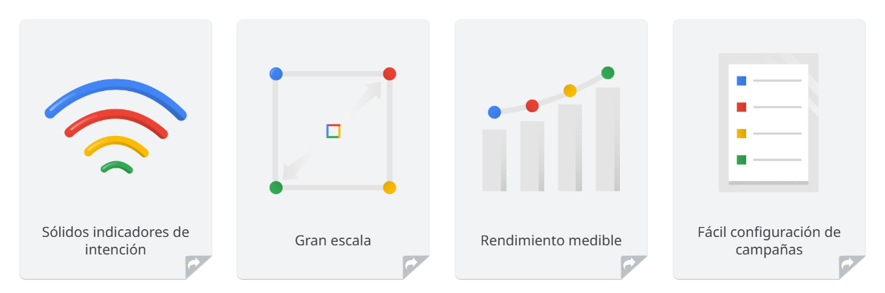
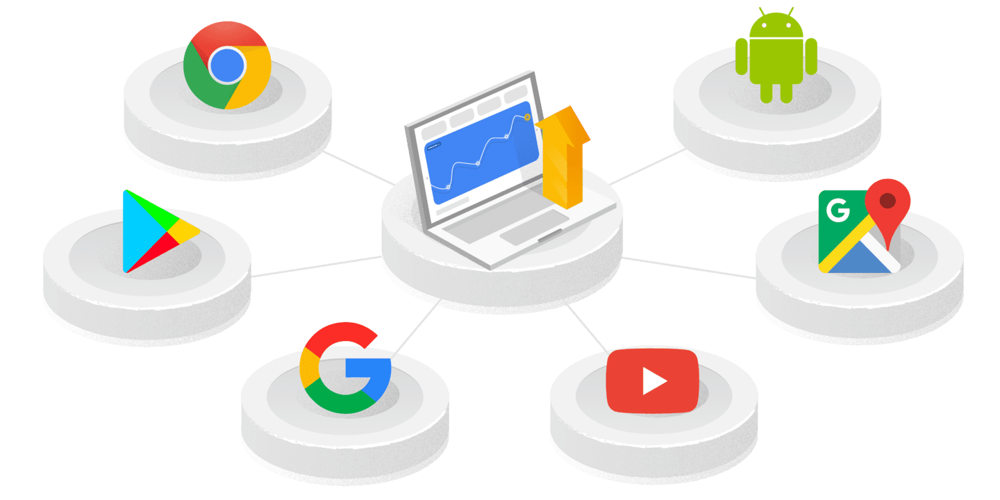

# Publicidad gráfica en Google Display ads

Con Google Display ads como tu aliado publicitario, puedes llegar a más del 90% de los usuarios de Internet a nivel global a través de más de tres millones de aplicaciones y sitios web. Este tipo de alcance te permite aprender sobre el comportamiento del consumidor, identificar públicos valiosos y generar participación con esos públicos con rapidez y frecuencia.

En este módulo aprenderás a resumir el valor de la publicidad gráfica en Google Display ads.

## ¿Cuál es el valor de Google Display ads?
Google Display ads te ayuda a mostrar publicidad relevante a medida que las personas navegan por la Web. Además, conecta tu negocio con tus clientes existentes y futuros. Con una variedad de opciones de ofertas, formatos de anuncio populares y transparencia en el rendimiento, Google Display ads genera resultados todos los días para miles de anunciantes en todo el mundo.

- **Sólidos indicadores de intención**
    - Google aprovecha los mejores indicadores de intención de su clase para colocar anuncios junto al contenido más relevante, lo que impulsa tus resultados de marketing.
- **Gran escala**
    - Publica anuncios y conéctate con tu público por medio de Gmail, YouTube y millones de otros sitios web.
- **Rendimiento medible**
    - Maximiza los resultados con el rendimiento medible de Google Display ads.
- **Fácil configuración de campañas**
    - Una vez que indiques tu objetivo de marketing, Google Display ads te ofrecerá las funciones y opciones que sean relevantes para lo que quieres lograr.

## Indicadores de intención y aprendizaje automático

Los indicadores de intención y el aprendizaje automático de Google permiten una mayor relevancia para lograr el resultado deseado a gran escala.

- **Compresión profunda da la actitud del usuario**
    - Google analiza la actividad de los usuarios en las propiedades que nos pertenecen y administramos, así como en más de tres millones de sitios web y socios de aplicaciones, para generar una comprensión clara de las preferencias de los usuarios.
- **Uso eficaz del aprendizaje automático**
    - Google utiliza capacidades avanzadas de aprendizaje automático para ofrecer procesos de automatización, ofertas y orientación de primer nivel a fin de llegar a los usuarios en el momento oportuno.
- **Estadísticas únicas en más de tres millones de sitios web y aplicaciones, incluido el acceso a seis propiedades con más de mil millones de usuarios**
    - La visualización de contexto en tiempo real, propiedad de Google, y el comportamiento de los usuarios en las propiedades que nos pertenecen y administramos, así como en toda la Web, nos permiten comprender de manera única la intención del usuario y nuestro conjunto completo de públicos. Llega a los usuarios en los momentos que importan.

## Te preguntarás quién usa Google Display ads
- **Pequeñas empresas**
    - Nadia es dueña de un café del vecindario y hace el trabajo de propietaria y especialista en marketing. Utiliza Google Display ads para dar a conocer su negocio, así como para obtener nuevos clientes.
- **Grandes empresas**
    - Isabel es la gerente de marketing digital en Tu Aventura, una tienda de bicicletas y equipo de ciclismo tanto en línea como en ubicaciones físicas en todo el mundo. Isabel utiliza Google Display ads para impulsar la acción y aumentar sus ventas.

## ¿Cómo comienzo?
Las campañas de Display te permiten establecer cómo, cuándo y dónde se muestran tus anuncios. Hay dos tipos de campañas de Display: campañas de Display estándar y Campañas inteligentes de la Red de Display.