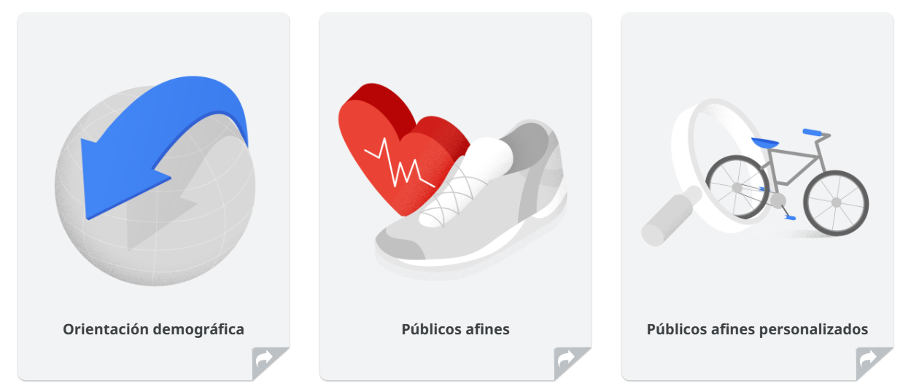

# Generar conocimiento de la marca
Cuando quieras llegar a un público amplio y maximizar la exposición de tu marca, te recomendamos que selecciones generar conocimiento como el objetivo de marketing de tu campaña de Display.

En este módulo aprenderás a resumir las opciones de orientación de los anuncios gráficos de Google que te ayudarán a generar conocimiento de tu marca.

## Generar conocimiento de la marca: la historia de Isabel

Isabel está expandiendo su oferta actual de productos con el lanzamiento de una nueva línea de bicicletas, por lo que desea mostrarla a la mayor cantidad de usuarios posible.

Veamos las opciones de orientación disponibles de Google Display ads que la ayudarán a generar conocimiento de su marca.

- **Orientación demográfica**
    - La orientación demográfica te permite mostrar anuncios a los usuarios en función de una combinación de datos inferidos y declarados. Puedes orientar tus anuncios según la edad, el género y el estado parental.
    - Por ejemplo, Isabel quiere llegar a hombres y mujeres de 25 a 45 años.
- **Públicos afines**
    - Con los públicos afines, puedes llegar a públicos similares a los de la TV a partir de una imagen integral de sus estilos de vida, intereses y pasiones. Elige entre más de 100 segmentos basados en el comportamiento en línea. El algoritmo de primer nivel de Google distingue a los usuarios que realmente se apasionan por un tema de los que simplemente están interesados.
    - Por ejemplo, Isabel quiere llegar a los aficionados de la salud y la actividad física.
- **Públicos afines personalizados**
    - Si ninguno de nuestros públicos afines listos para usar satisface tus necesidades, crea los tuyos con los públicos afines personalizados. Esta función te permite definir públicos objetivo personalizados y te da un alcance sustancial con respecto a nichos de usuarios.
    - Por ejemplo, Isabel desea encontrar personas interesadas en actividades al aire libre, como andar en bicicleta, en lugar de aficionados en general a la salud y la actividad física.

## Verificación de conocimientos
¿Cuál de las siguientes opciones de orientación ayudará mejor a Isabel a llegar a un conjunto específico de usuarios que probablemente estén en un rango de edad en particular?

| ❎ | ✅ |
|----|-----|
| Público afín |  |
| Público afín persoalizado |  |
|  | **Demográfica**  |

La orientación demográfica ayudará mejor a Isabel a llegar a un conjunto específico de usuarios que probablemente se encuentren en un rango de edad particular, según los datos inferidos y declarados.