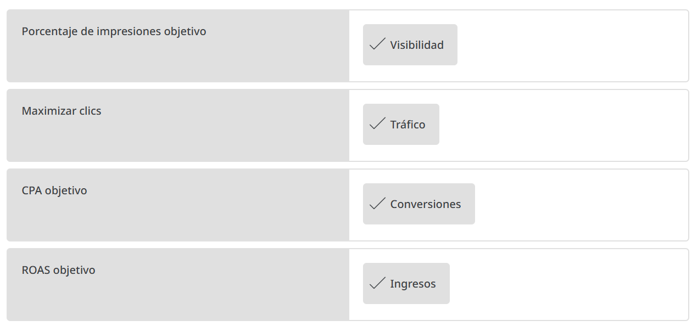

# Elige la estrategia de oferta correcta
Es importante elegir una estrategia de oferta que refleje tus objetivos de marketing. Google Ads ofrece varias estrategias de oferta entre las cuales elegir. La estrategia que elijas dependerá de las redes que se incluyen en la segmentación de tu campaña y si deseas enfocarte en mejorar los clics, la visibilidad, las conversiones, etcétera.

En este módulo, aprenderás a identificar la estrategia de oferta correcta en función de tus objetivos de marketing.

## Conoce a Isabel

Isabel es la gerente de marketing digital en Tu Aventura, una tienda de bicicletas y equipo de ciclismo tanto en línea como en ubicaciones físicas en todo el mundo. Quiere aumentar la cantidad de bicicletas que su empresa vende en línea, por lo que es muy importante para ella hacer un seguimiento de las conversiones.

Sin embargo, hay muchas estrategias de oferta para elegir. Profundicemos en las diferentes estrategias de ofertas automáticas disponibles para ayudar a Isabel a elegir la correcta.

## Estrategias de oferta basadas en el reconocimiento
Elige esta estrategia de oferta si deseas asegurarte de que tu anuncio sea visible para ciertas búsquedas y en determinadas ubicaciones de la página.
- **Objetivo**
    - Visibilidad
- **Estrategias de oferta entre las cuáles elegir**
    - Porcentaje de impresiones objetivo: Esto garantiza que tus anuncios alcancen un porcentaje de impresiones específico para una ubicación determinada en la página de resultados de búsqueda: en cualquier lugar, en la parte superior de la página o en la parte superior absoluta de la página.
- **Caso de uso**
    - Permite aumentar el reconocimiento de tu marca y de las campañas que incluyen términos de la marca.

## Estrategias de oferta centradas en la consideración
Elige esta estrategia de oferta si deseas generar la mayor cantidad de clics posible dentro de un nivel establecido de inversión.
- **Objetivo**
    - Clics
- **Estrategias de oferta entre las cuáles elegir**
    - Maximizar clics: Establece ofertas para obtener la mayor cantidad de clics posible dentro del importe de inversión objetivo que elijas.
- **Caso de uso**
    - Campañas con presupuesto limitado enfocadas en generar clics
    - Generar más volumen de clics
    - Maximizar el tráfico cuando se recibe presupuesto adicional
    - Palabras clave del embudo superior que tienen un valor de contribución alto en la conversión

## Estrategias de oferta centradas en las conversiones
Elige una de estas estrategias de oferta si realizas el seguimiento de las acciones posteriores al clic, valoras las conversiones por igual y buscas maximizar la cantidad de conversiones.

- **Objetivo**
    - Conversiones
- **Estrategias de oferta entre las cuáles elegir**
    - Maximizar conversiones (sin CPA objetivo): Genera tanto volumen de conversiones como sea posible con tu presupuesto. No es necesario que proporciones un objetivo específico de costo por clic (CPC), costo por adquisición (CPA) o retorno de la inversión publicitaria (ROAS).
    - Maximizar conversiones (con CPA objetivo): Esta estrategia establece ofertas automáticamente para ayudarte a aumentar las conversiones y, al mismo tiempo, alcanzar tu objetivo de costo por adquisición promedio.
- **Caso de uso**
    - Maximizar conversiones (sin CPA objetivo): 
        - Anunciantes que desean maximizar la cantidad de conversiones de una campaña Anunciantes que desean invertir un presupuesto fijo y no tienen un objetivo de CPA/ROAS explícito
    - Maximizar conversiones (con CPA objetivo):
        - Maximizar la cantidad de conversiones sin considerar el valor del pedido
        - Nota: Para una campaña de Display con CPA objetivo, puedes elegir la facturación de pago por conversiones.

> **Nota**: Debes hacer un seguimiento de las conversiones para que las estrategias de oferta centradas en las conversiones funcionen correctamente, con la excepción del CPCA en Display.

## Estrategias de ofertas basadas en el valor
Elige esta estrategia de oferta si no valoras de igual forma todos los clientes o las conversiones, estás haciendo un seguimiento del valor (p. ej., ingresos, ganancias, valores representativos) con las conversiones y deseas generar el máximo valor posible con un objetivo de ROI o un presupuesto específicos.

- **Objetivo**
    - Ingresos
- **Estrategias de oferta entre las cuáles elegir**
    - Maximizar valor de conversión con ROAS objetivo: Establece ofertas automáticamente para ayudarte a obtener el valor de conversión más alto posible según el retorno de la inversión publicitaria (ROAS) objetivo que configures.
    - Maximizar valor de conversión (sin ROAS objetivo): Establece ofertas automáticamente para ayudarte a obtener el valor de conversión más alto posible según el presupuesto que configures.
- **Caso de uso**
    - Optimizar las ofertas automáticamente para maximizar los ingresos dentro de un ROAS objetivo

> **Nota**: Maximizar conversiones (con o sin CPA objetivo) y Maximizar valor de conversión (con o sin ROAS objetivo) se incluyen específicamente en las Ofertas inteligentes de Google Ads. Son estrategias de oferta basadas en el valor y las conversiones que aprovechan un conjunto exclusivo de indicadores para ofertar en el momento de la subasta.

## Resumen
Ahora que sabes identificar la estrategia de oferta correcta en función de tus objetivos de marketing, exploremos más recursos.

## Verificación de conocimientos

