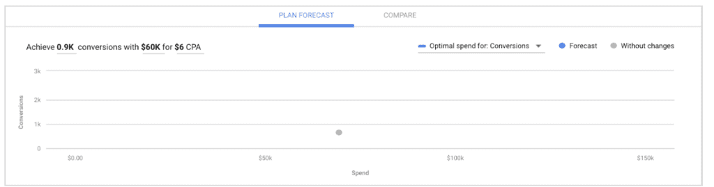
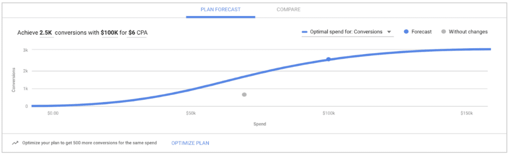
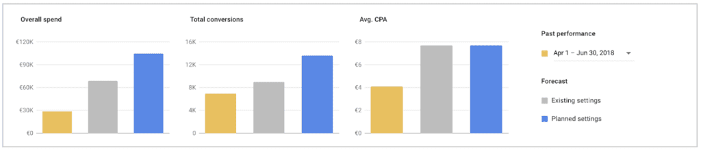

# Por qué deberías organizarte para mejorar el rendimiento con el Planificador de rendimiento
En este módulo, conocerás la importancia de usar el Planificador de rendimiento de Google Ads para sacar el mayor provecho a tu inversión en Google Ads y maximizar tu rendimiento.

## La planificación es el primer paso fundamental para alcanzar el éxito con Google Ads

El marketing digital está en constante evolución, lo que ayuda a los negocios como el tuyo a conectarse con más clientes. Si planificas tus presupuestos de Google Ads de forma mensual y por adelantado, puedes asegurarte de que, cuando las personas necesiten productos o información, tus anuncios se muestren en el momento preciso para maximizar las conversiones y alcanzar tus indicadores clave de rendimiento (KPI).

Si planificas tus presupuestos de Google Ads por adelantado, puedes hacer lo siguiente:
- Conocer el potencial de inversión futura de las campañas actuales de Google Ads para impulsar decisiones de presupuesto
- Aprovechar la estacionalidad para captar oportunidades incrementales
- Establecer ofertas y presupuestos óptimos en tus campañas para ayudarte a garantizar que se maximice el rendimiento del ROI
- Encontrar oportunidades nuevas para aumentar tus volúmenes de ventas con Google Ads

## ¿Alguna vez te has hecho estas preguntas?

> **Sugerencia**: El Planificador de rendimiento es nuestra herramienta más reciente en Google Ads. Te ayudará a responder las preguntas anteriores y determinar el presupuesto publicitario que necesitas para alcanzar tus objetivos de marketing.

## ¿Qué es el Planificador de rendimiento de Google Ads?
El Planificador de rendimiento es una nueva herramienta de previsión que utiliza el aprendizaje automático para mostrar las posibilidades de tus campañas de Google Ads. Con esta herramienta, puedes explorar previsiones para los próximos presupuestos mensuales, trimestrales y anuales de tus campañas actuales, a la vez que ayuda a mejorar tu retorno de la inversión.

## ¿Cómo funciona el Planificador de rendimiento?
El Planificador de rendimiento determina las ofertas óptimas y las asignaciones de presupuesto diario promedio en todas tus campañas para ayudarte a aumentar la cantidad de conversiones que puedes obtener en cualquier situación futura de inversión. Utiliza el siguiente proceso:

- El Planificador de rendimiento generará una previsión de lo que lograrán tus campañas en un período futuro si no haces cambios en las campañas actuales. Esta previsión se representa con el punto gris.

- Con las estadísticas y los datos de estacionalidad de Google, el Planificador de rendimiento predecirá los resultados si utilizas ofertas óptimas y presupuestos diarios promedio en todas tus campañas para maximizar la cantidad de conversiones en cualquier situación futura de inversión. Estos resultados se representan con una línea azul.

- Cuando seleccionas un punto de inversión en la línea azul, el Planificador de rendimiento mejora tu ROI reasignando la inversión entre las campañas a través del ajuste de las ofertas y los presupuestos diarios promedio. Consulta estos cambios en la tabla de las campañas o descarga un archivo CSV.

## ¿Cómo realiza el Planificador de rendimiento previsiones del rendimiento de las campañas?
El Planificador de rendimiento utiliza una combinación de aprendizaje automático y el historial de la cuenta para generar previsiones. En las herramientas de Google Ads, las previsiones deben cumplir cierto nivel de exactitud. Debido a esto, el intervalo de confianza de las previsiones es probablemente mayor que el de otras herramientas de previsión disponibles.
- **Previsión**
    - Nuestro motor de previsión utiliza las subastas de anuncios de la Búsqueda de Google (compuestas por miles de millones de búsquedas semanales).
- **Simulación**
    - Nuestro motor de previsión simula subastas de anuncios relevantes con variables de nivel de búsqueda, incluidas la estacionalidad, la tasa de clics, la competencia, la página de destino y la hora del día.
- **Aprendizaje automático**
    - Usamos el aprendizaje automático para optimizar las previsiones y lograr un mayor nivel de precisión.
- **Validación**
    - Realizamos mediciones de precisión futuras y retroactivas para miles de muestras de campañas, en períodos de 1, 7, 30 y 90 días, a fin de asegurarnos de realizar recomendaciones válidas.

> **Nota**: El Planificador de rendimiento es distinto de la página Recomendaciones. En la página Recomendaciones, puedes aplicar sugerencias de optimización que ayudarán a mejorar tus campañas. Por otro lado, el Planificador de rendimiento es la herramienta ideal para decidir qué presupuesto necesitas para alcanzar tus objetivos de marketing.

## ¿Por qué usar el Planificador de rendimiento en Google Ads en lugar de los métodos de previsión tradicionales?
El Planificador de rendimiento destaca las oportunidades de crecimiento para tus campañas siempre activas de Google Ads. Tener los presupuestos y las ofertas óptimos es fundamental para aprovechar al máximo tu presupuesto de marketing y hacer crecer tu negocio con Google Ads.
- **Obten previsiones exactas**
    - Las previsiones se basan en datos de Google y el historial de rendimiento de tu cuenta y, luego, se validan con aprendizaje automático. Eso significa que los planes del Planificador de rendimiento tienen más probabilidades de alcanzar los KPI que los métodos de estimación previos.
- **Obten beneficios del aprendizaje automático**
    - El Planificador de rendimiento te ayuda a descubrir los mejores presupuestos y ofertas a fin de que puedas generar la mayor cantidad de conversiones para cualquier situación de inversión.