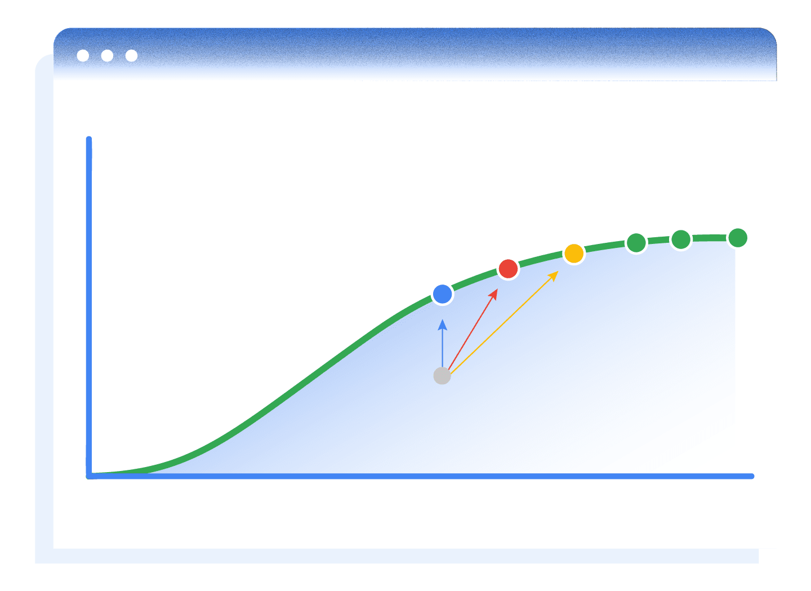

# Cómo usar el Planificador de rendimiento
En este módulo, aprenderás a describir los pasos del proceso de planificación de presupuesto, a usar el Planificador de rendimiento para maximizar tu retorno de la inversión y a explorar previsiones de situaciones de presupuesto.

## Cómo usar el Planificador de rendimiento
- **Aprender**
    - Crea un nuevo plan de presupuesto a fin de conocer cuáles son los mejores presupuestos y ofertas para tus campañas y generar conversiones incrementales.
- **Explorar**
    - Descubre más optimizaciones y obtén previsiones sobre cómo puedes hacer crecer tu negocio con Google Ads.
- **Actuar**
    - Revisa e implementa los cambios recomendados en tu plan del Planificador de rendimiento.
- **Repetir**
    - Asegúrate de reaccionar ante factores externos y realizar optimizaciones según las métricas objetivo definidas. Usa el Planificador de rendimiento mensualmente para lograr los mejores resultados.

## Las ofertas y los presupuestos óptimos son fundamentales para aprovechar al máximo tu presupuesto de marketing
1. Las conversiones adicionales que puedes generar con la misma inversión mediante el Planificador de rendimiento
2. La cantidad incremental de conversiones que puedes alcanzar y el importe máximo que puedes invertir sin disminuir el retorno (mantén tu CPA actual)
3. La cantidad incremental de conversiones que puedes obtener y el importe máximo que puedes invertir según tu meta de CPA objetivo (para que tu negocio siga siendo rentable)
4. Situaciones de inversión adicional y conversiones resultantes con metas de CPA objetivo más altas (reduce la rentabilidad para aumentar el volumen de conversiones totales)

El Planificador de rendimiento te ayuda a mejorar el retorno de la inversión, de manera que puedas generar más conversiones dentro de tu CPA objetivo. El siguiente es un ejemplo de los planes que puedes crear con el Planificador de rendimiento en las situaciones anteriores.

|                | Costo        | Conversiones | CPA       | Eficiencia                 |
|----------------|--------------|--------------|-----------|-----------------------------|
| **Actual**     | USD 7.7 mill.| 96,000       | USD 81    |                             |
| **Opción 1**   | USD 11.2 mill.| 142,000     | USD 79    | Mejora del CPA en USD 2     |
| **Opción 2**   | USD 7.7 mill.| 128,000     | USD 60    | Mejora del CPA en USD 21    |
| **Opción 3**   | USD 13.2 mill.| 160,000     | USD 82    | Aumento del CPA en USD 1    |

> **Sugerencia**: Según 250 ID de cliente aleatorios de Google Ads,* el Planificador de rendimiento destacó cómo conseguir un aumento promedio del 43% en las conversiones (por la misma inversión) reasignando ofertas y presupuestos entre las campañas. También se determinó que destaca cómo aumentar las conversiones en un 80% para el mismo CPA (sin disminuir el retorno).

## ¿Por qué debo utilizar el Planificador de rendimiento todos los meses?

La estacionalidad, la fluctuación de las subastas y la competencia hacen que las campañas de Google Ads deban planificarse y optimizarse por lo menos mensualmente.

Usa el Planificador de rendimiento todos los meses para optimizar tus presupuestos y ofertas, de manera que puedas generar más conversiones por la misma inversión.

## Prácticas recomendadas
- **Crea planes para cada objetivo de marketing**
    - No agregues todas las campañas de marca y genéricas al mismo plan. Esto se debe a que las distintas campañas con frecuencia tienen objetivos de marketing diferentes. Las conversiones incrementales se alcanzan creando planes distintos para cada objetivo de marketing.
- **Establece ofertas y presupuestos con conversiones que no son de último clic**
    - Según la configuración predeterminada, el Planificador de rendimiento realizará una previsión de las conversiones según la información que se incluya en la columna Conversiones del frontend de Google Ads. Para asignar presupuestos que generen conversiones incrementales, establece ofertas y presupuestos con conversiones que no son de último clic en la columna Conversiones.
- **Revisa tu plan con regularidad**
    - Las previsiones mejoran cuando los planes se generan cerca de la fecha de publicación real. Asegúrate de revisar tu plan con regularidad antes de implementarlo.

## Verificación de conocimientos
¿Con qué frecuencia debes repetir el proceso de planificación de presupuesto?

| ❎ | ✅ |
|----|-----|
| Anual | |
| Diaria | |
| | **Mensual** | 
| Semanal | |  