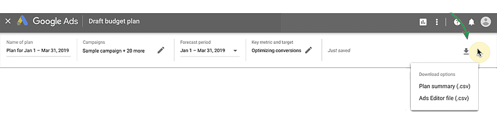

# Toma medidas con el Planificador de rendimiento
En este módulo, aprenderás a usar el Planificador de rendimiento para obtener previsiones e implementar los planes de presupuesto que creaste en Google Ads. Además, descubrirás prácticas recomendadas de planificación de presupuesto que te ayudarán a encontrar nuevas oportunidades de crecimiento.

## ¿Qué cambios recomendará el Planificador de rendimiento?
Una vez que uses el Planificador de rendimiento para crear un plan con una fecha límite, campañas, presupuesto, volumen de conversiones objetivo y costo por adquisición (CPA) objetivo para los próximos períodos, la herramienta proporcionará una de las siguientes recomendaciones. Estas son parámetros de configuración de campaña que se prevé que generarán la mayor cantidad de conversiones y el retorno de la inversión más eficiente según tu presupuesto objetivo.

- Campañas de costo por clic (CPC) manuales o CPC avanzado en la Búsqueda
    - Presupuesto diario promedio recomendado y escala de oferta de la campaña (un escalamiento de 1.5 significa un 50% más de escala de oferta)
- Campañas de Maximizar clics o Maximizar conversiones en la Búsqueda
    - Presupuesto diario promedio recomendado
- Campañas de CPA objetivo o de retorno de la inversión publicitaria (ROAS) objetivo en la Búsqueda
    - Presupuesto diario promedio recomendado, CPA objetivo a nivel de la campaña o ROAS objetivo a nivel de la campaña

> **Nota**: El Planificador de rendimiento es una herramienta de planificación, por lo que no realiza optimizaciones en el frontend de Google Ads para obtener los KPI previstos. Es posible que existan discrepancias en las previsiones del Planificador de rendimiento debido a factores externos impredecibles en un entorno de subasta dinámico, por lo que es importante supervisar continuamente el rendimiento y realizar optimizaciones para lograr los objetivos de rendimiento.

## ¿Cómo puedo ver e implementar los cambios recomendados?
El Planificador de rendimiento permite descargar archivos CSV con las cifras recomendadas para la escala de oferta, el CPA objetivo, el ROAS objetivo y el presupuesto diario promedio.

Puedes aplicar manualmente estas sugerencias a través de la interfaz de administración de campañas de Google Ads, o bien descargar un archivo de Google Ads Editor y subirlo a esa app para ver y aplicar los cambios recomendados.

## Prácticas recomendadas para el Planificador de rendimiento
- **Usa conversiones de atribución que no es de último clic**
    - El Planificador de rendimiento realiza previsiones para los tipos de conversión que tienen activado el parámetro de configuración Incluir en Conversiones que se encuentra en la columna Conversiones. Para asignar presupuestos que generen conversiones incrementales, incluye conversiones de atribución que no es de último clic en la columna Incluir en Conversiones.
- **Crea planes distintos para campañas que tienen objetivos de marketing distintos**
    - Se recomienda separar las campañas con diferentes objetivos de marketing en distintos planes del Planificador de rendimiento, de manera que la inversión no se reasigne entre dos objetivos de marketing distintos. En lugar de eso, agrupa las campañas por objetivo de marketing o presupuesto.
    - Por ejemplo, podrías dividir las campañas enfocadas en la consideración y la intención separando las campañas de Búsqueda genéricas (por ejemplo, una campaña que contenga la palabra clave “venta de todoterreno”) y las campañas de Búsqueda de marca (como una campaña que contenga la palabra clave “comprar todoterreno Landriver”) en planes separados.
- **Usa la función de objetivos de rendimiento**
    - Es posible que existan discrepancias en las previsiones del Planificador de rendimiento debido a factores externos impredecibles en un entorno de subasta dinámico. Por esto, es importante hacer un seguimiento continuo del rendimiento y optimizarlo. Usa la función de objetivos de rendimiento para supervisar los objetivos establecidos en el Planificador de rendimiento y recibe alertas y recomendaciones cuando una campaña no se comporte según lo previsto.
- **Usa el nivel de optimización de la página recomendados para mejorar tus campañas**
    - El Planificador de rendimiento se utiliza para realizar previsiones de períodos futuros. Puedes usar sus recomendaciones como una guía para asegurarte de que la estacionalidad y la reasignación de presupuesto se consideren en períodos futuros a fin de evitar que tus campañas estén “Limitadas por el presupuesto”.

## Aquí te presentamos algunos factores adicionales que deberías revisar mientras planificas el presupuesto
Repite el proceso de planificación mensualmente a fin de encontrar oportunidades de crecimiento en Google Ads y realizar optimizaciones para lograr tus métricas objetivo.

- **Estacionalidad**
    - Aprovecha las tendencias estacionales durante todo el año.
- **Participación de mercado**
    - Anticípate a la fluctuación de las subastas debido a la actividad de otros negocios y factores externos.
- **Crecimiento**
    - Usa el Planificador de rendimiento para comparar períodos anteriores y ver una previsión de las posibilidades de crecimiento que puedes generar con Google Ads.

## Resumen
En este curso, aprendiste sobre el valor de planificar para tener éxito y de qué forma el Planificador de rendimiento puede ayudarte a maximizar tu retorno de la inversión.

## Verifica tus conocimientos
¿Cuál es el objetivo principal de la herramienta Planificador de rendimiento de Google Ads?

| ❎ | ✅ |
|----|-----|
| Te ayuda a seleccionar tu estrategia de oferta futura. | |
| Te ayuda a obtener previsiones y garantizar un retorno de la inversión basado en presupuestos futuros. | |
| Te ayuda a obtener una previsión de cuál debe ser tu presupuesto mínimo en todas las campañas. | |
| | **Te ayuda a obtener previsiones y determinar tus presupuestos, a la vez que mejora el retorno de la inversión**. |

Se recomienda separar las campañas con distintos objetivos de marketing en diferentes planes del Planificador de rendimiento, de manera que la inversión no se reasigne entre dos objetivos o presupuestos de marketing diferentes.

| ❎ | ✅ |
|----|-----|
| Falso | |
|  | **Verdadero** |